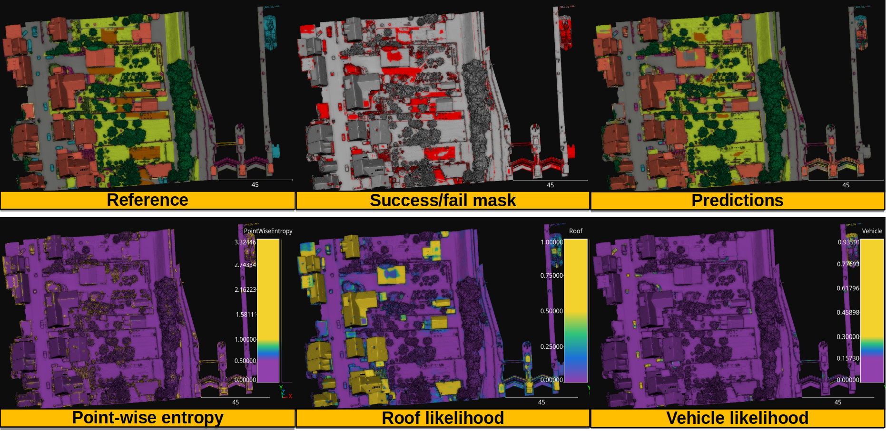

.. _example_hessig_rf:

Random forest for point-wise classification in the Hessigheim March2018 dataset
************************************************************************************

Data
=======

The point clouds used in this example are available in the
`official webpage of the dataset <https://ifpwww.ifp.uni-stuttgart.de/benchmark/hessigheim/subscribe.aspx>`_.

JSON
=========

The many JSON files and the bash script used to launch them in the
`FinisTerrae-III supercomputer of the Galicia supercomputing center (CESGA) <https://cesga-docs.gitlab.io/ft3-user-guide/index.html>`_
are
shown below. Note that the bash script for the FinisTerra-III is written to
work with a
`slurm workload manager <https://slurm.schedmd.com/documentation.html>`_.

Data mining JSON
-------------------

The JSON below can be used to compute geometric and height features as well as
smoothed features derived from reflectance and color information.

.. code-block:: json

    {
      "in_pcloud": [
        "/mnt/netapp2/Store_uscciaep/lidar_data/hessigheim/data/Mar18_train.laz",
        "/mnt/netapp2/Store_uscciaep/lidar_data/hessigheim/data/Mar18_val.laz"
      ],
      "out_pcloud": [
        "/mnt/netapp2/Store_uscciaep/lidar_data/hessigheim/vl3d/mined/Mar18_train_mined_*",
        "/mnt/netapp2/Store_uscciaep/lidar_data/hessigheim/vl3d/mined/Mar18_val_mined_*"
      ],
      "sequential_pipeline": [
        {
          "miner": "HSVFromRGB",
          "hue_unit": "radians",
          "frenames": ["HSV_Hrad", "HSV_S", "HSV_V"]
        },
        {
          "miner": "HeightFeatures",
          "support_chunk_size": 200,
          "support_subchunk_size": 20,
          "pwise_chunk_size": 10000,
          "nthreads": 10,
          "neighborhood": {
            "type": "Rectangular2D",
            "radius": 50.0,
            "separation_factor": 0.35
          },
          "outlier_filter": null,
          "fnames": ["floor_distance"]
        },
        {
          "miner": "SmoothFeatures",
          "chunk_size": 1000000,
          "subchunk_size": 1000,
          "neighborhood": {
            "type": "sphere",
            "radius": 0.25
          },
          "input_fnames": ["Reflectance", "HSV_Hrad", "HSV_S", "HSV_V"],
          "fnames": ["mean"],
          "nthreads": 24
        },
        {
          "miner": "SmoothFeatures",
          "chunk_size": 1000000,
          "subchunk_size": 1000,
          "neighborhood": {
            "type": "sphere",
            "radius": 1.0
          },
          "input_fnames": ["Reflectance", "HSV_Hrad", "HSV_S", "HSV_V"],
          "fnames": ["mean"],
          "nthreads": 16
        },
        {
          "miner": "SmoothFeatures",
          "chunk_size": 1000000,
          "subchunk_size": 1000,
          "neighborhood": {
            "type": "sphere",
            "radius": 3.0
          },
          "input_fnames": ["Reflectance", "HSV_Hrad", "HSV_S", "HSV_V"],
          "fnames": ["mean"],
          "nthreads": 12
        },
        {
          "miner": "GeometricFeatures",
          "radius": 0.125,
          "fnames": ["linearity", "planarity", "sphericity", "surface_variation", "omnivariance", "verticality", "anisotropy", "eigenentropy", "eigenvalue_sum"]
        },
        {
          "miner": "GeometricFeatures",
          "radius": 0.25,
          "fnames": ["linearity", "planarity", "sphericity", "surface_variation", "omnivariance", "verticality", "anisotropy", "eigenentropy", "eigenvalue_sum"]
        },
        {
          "miner": "GeometricFeatures",
          "radius": 0.5,
          "fnames": ["linearity", "planarity", "sphericity", "surface_variation", "omnivariance", "verticality", "anisotropy", "eigenentropy", "eigenvalue_sum"]
        },
        {
          "miner": "GeometricFeatures",
          "radius": 0.75,
          "fnames": ["linearity", "planarity", "sphericity", "surface_variation", "omnivariance", "verticality", "anisotropy", "eigenentropy", "eigenvalue_sum"]
        },
        {
          "miner": "GeometricFeatures",
          "radius": 1.0,
          "fnames": ["linearity", "planarity", "sphericity", "surface_variation", "omnivariance", "verticality", "anisotropy", "eigenentropy", "eigenvalue_sum"]
        },
        {
          "miner": "GeometricFeatures",
          "radius": 2.0,
          "fnames": ["linearity", "planarity", "sphericity", "surface_variation", "omnivariance", "verticality", "anisotropy", "eigenentropy", "eigenvalue_sum"]
        },
        {
          "miner": "GeometricFeatures",
          "radius": 3.0,
          "fnames": ["linearity", "planarity", "sphericity", "surface_variation", "omnivariance", "verticality", "anisotropy", "eigenentropy", "eigenvalue_sum"]
        },
        {
          "miner": "GeometricFeatures",
          "radius": 5.0,
          "fnames": ["linearity", "planarity", "sphericity", "surface_variation", "omnivariance", "verticality", "anisotropy", "eigenentropy", "eigenvalue_sum"]
        },

        {
          "writer": "Writer",
          "out_pcloud": "*feats.las"
        }
      ]
    }

Training JSON
---------------

The training JSON considers geometric, height, reflectance, and color features
to train a random forest classifier with an auto validation training strategy.
The trained model is exported together with the data imputation components
to a predictive pipeline.

.. code-block:: json

    {
      "in_pcloud": [
        "/mnt/netapp2/Store_uscciaep/lidar_data/hessigheim/vl3d/mined/Mar18_train_mined_feats.las"
      ],
      "out_pcloud": [
        "/mnt/netapp2/Store_uscciaep/lidar_data/hessigheim/vl3d/rf_hessig/*"
      ],
      "sequential_pipeline": [
        {
          "imputer": "UnivariateImputer",
          "fnames": [
            "Reflectance", "HSV_Hrad", "HSV_S", "HSV_V",
            "Reflectance_mean_r0.25", "Reflectance_mean_r1.0", "Reflectance_mean_r3.0",
            "HSV_Hrad_mean_r0.25", "HSV_Hrad_mean_r1.0", "HSV_Hrad_mean_r3.0",
            "HSV_S_mean_r0.25", "HSV_S_mean_r1.0", "HSV_S_mean_r3.0",
            "HSV_V_mean_r0.25", "HSV_V_mean_r1.0", "HSV_V_mean_r3.0",
            "floor_distance_r50.0_sep0.35", "linearity_r0.125", "planarity_r0.125",
            "sphericity_r0.125", "surface_variation_r0.125", "omnivariance_r0.125",
            "verticality_r0.125", "anisotropy_r0.125", "eigenentropy_r0.125",
            "eigenvalue_sum_r0.125", "linearity_r0.25", "planarity_r0.25",
            "sphericity_r0.25", "surface_variation_r0.25", "omnivariance_r0.25",
            "verticality_r0.25", "anisotropy_r0.25", "eigenentropy_r0.25",
            "eigenvalue_sum_r0.25", "linearity_r0.5", "planarity_r0.5",
            "sphericity_r0.5", "surface_variation_r0.5", "omnivariance_r0.5",
            "verticality_r0.5", "anisotropy_r0.5", "eigenentropy_r0.5",
            "eigenvalue_sum_r0.5", "linearity_r0.75", "planarity_r0.75",
            "sphericity_r0.75", "surface_variation_r0.75", "omnivariance_r0.75",
            "verticality_r0.75", "anisotropy_r0.75", "eigenentropy_r0.75",
            "eigenvalue_sum_r0.75", "linearity_r1.0", "planarity_r1.0",
            "sphericity_r1.0", "surface_variation_r1.0", "omnivariance_r1.0",
            "verticality_r1.0", "anisotropy_r1.0", "eigenentropy_r1.0",
            "eigenvalue_sum_r1.0", "linearity_r2.0", "planarity_r2.0",
            "sphericity_r2.0", "surface_variation_r2.0", "omnivariance_r2.0",
            "verticality_r2.0", "anisotropy_r2.0", "eigenentropy_r2.0",
            "eigenvalue_sum_r2.0", "linearity_r3.0", "planarity_r3.0",
            "sphericity_r3.0", "surface_variation_r3.0", "omnivariance_r3.0",
            "verticality_r3.0", "anisotropy_r3.0", "eigenentropy_r3.0",
            "eigenvalue_sum_r3.0", "linearity_r5.0", "planarity_r5.0",
            "sphericity_r5.0", "surface_variation_r5.0", "omnivariance_r5.0",
            "verticality_r5.0", "anisotropy_r5.0", "eigenentropy_r5.0",
            "eigenvalue_sum_r5.0"
          ],
          "target_val": "NaN",
          "strategy": "mean",
          "constant_val": 0
        },
        {
          "train": "RandomForestClassifier",
          "fnames": [
            "Reflectance", "HSV_Hrad", "HSV_S", "HSV_V",
            "Reflectance_mean_r0.25", "Reflectance_mean_r1.0", "Reflectance_mean_r3.0",
            "HSV_Hrad_mean_r0.25", "HSV_Hrad_mean_r1.0", "HSV_Hrad_mean_r3.0",
            "HSV_S_mean_r0.25", "HSV_S_mean_r1.0", "HSV_S_mean_r3.0",
            "HSV_V_mean_r0.25", "HSV_V_mean_r1.0", "HSV_V_mean_r3.0",
            "floor_distance_r50.0_sep0.35", "linearity_r0.125", "planarity_r0.125",
            "sphericity_r0.125", "surface_variation_r0.125", "omnivariance_r0.125",
            "verticality_r0.125", "anisotropy_r0.125", "eigenentropy_r0.125",
            "eigenvalue_sum_r0.125", "linearity_r0.25", "planarity_r0.25",
            "sphericity_r0.25", "surface_variation_r0.25", "omnivariance_r0.25",
            "verticality_r0.25", "anisotropy_r0.25", "eigenentropy_r0.25",
            "eigenvalue_sum_r0.25", "linearity_r0.5", "planarity_r0.5",
            "sphericity_r0.5", "surface_variation_r0.5", "omnivariance_r0.5",
            "verticality_r0.5", "anisotropy_r0.5", "eigenentropy_r0.5",
            "eigenvalue_sum_r0.5", "linearity_r0.75", "planarity_r0.75",
            "sphericity_r0.75", "surface_variation_r0.75", "omnivariance_r0.75",
            "verticality_r0.75", "anisotropy_r0.75", "eigenentropy_r0.75",
            "eigenvalue_sum_r0.75", "linearity_r1.0", "planarity_r1.0",
            "sphericity_r1.0", "surface_variation_r1.0", "omnivariance_r1.0",
            "verticality_r1.0", "anisotropy_r1.0", "eigenentropy_r1.0",
            "eigenvalue_sum_r1.0", "linearity_r2.0", "planarity_r2.0",
            "sphericity_r2.0", "surface_variation_r2.0", "omnivariance_r2.0",
            "verticality_r2.0",	"anisotropy_r2.0", "eigenentropy_r2.0",
            "eigenvalue_sum_r2.0", "linearity_r3.0", "planarity_r3.0",
            "sphericity_r3.0", "surface_variation_r3.0", "omnivariance_r3.0",
            "verticality_r3.0", "anisotropy_r3.0", "eigenentropy_r3.0",
            "eigenvalue_sum_r3.0", "linearity_r5.0", "planarity_r5.0",
            "sphericity_r5.0", "surface_variation_r5.0", "omnivariance_r5.0",
            "verticality_r5.0", "anisotropy_r5.0", "eigenentropy_r5.0",
            "eigenvalue_sum_r5.0"
          ],
          "training_type": "autoval",
          "random_seed": null,
          "shuffle_points": true,
          "num_folds": 5,
          "model_args": {
            "n_estimators": 360,
            "criterion": "entropy",
            "max_depth": 25,
            "min_samples_split": 32,
            "min_samples_leaf": 8,
            "min_weight_fraction_leaf": 0.0,
            "max_features": "sqrt",
            "max_leaf_nodes": null,
            "min_impurity_decrease": 0.0,
            "bootstrap": true,
            "oob_score": false,
            "n_jobs": 32,
            "warm_start": false,
            "class_weight": "balanced_subsample",
            "ccp_alpha": 0.0,
            "max_samples": 0.3
          },
          "autoval_metrics": ["OA", "P", "R", "F1", "IoU", "wP", "wR", "wF1", "wIoU", "MCC", "Kappa"],
          "stratkfold_report_path": "*report/RF_stratkfold_report.log",
          "stratkfold_plot_path": "*plot/RF_stratkfold_plot.svg",
          "importance_report_path": "*report/RF_importance.log",
          "importance_report_permutation": false,
          "decision_plot_path": "*plot/RF_decision.svg",
          "decision_plot_trees": 3,
          "decision_plot_max_depth": 5
        },
        {
          "writer": "PredictivePipelineWriter",
          "out_pipeline": "*pipe/rf_hessig.pipe",
          "include_writer": false,
          "include_imputer": true,
          "include_feature_transformer": false,
          "include_miner": false
        }
      ]
    }

Classification JSON
----------------------

The classification JSON applies the predictive pipeline to previously unseen
data to assess the model and the uncertainties.

.. code-block:: json

    {
      "in_pcloud": [
        "/mnt/netapp2/Store_uscciaep/lidar_data/hessigheim/vl3d/mined/Mar18_val_mined_feats.las"
      ],
      "out_pcloud": [
        "/mnt/netapp2/Store_uscciaep/lidar_data/hessigheim/vl3d/rf_hessig/validation/*"
      ],
      "sequential_pipeline": [
        {
          "predict": "PredictivePipeline",
          "model_path": "/mnt/netapp2/Store_uscciaep/lidar_data/hessigheim/vl3d/rf_hessig/pipe/rf_hessig.pipe"
        },
        {
          "writer": "ClassifiedPcloudWriter",
          "out_pcloud": "*predicted.las"
        },
        {
          "eval": "ClassificationEvaluator",
          "class_names": ["Low vegetation", "Impervious surface", "Vehicle", "Urban furniture", "Roof", "Facade", "Shrub", "Tree", "Soil/Gravel", "Vertical surface", "Chimney"],
          "metrics": ["OA", "P", "R", "F1", "IoU", "wP", "wR", "wF1", "wIoU", "MCC", "Kappa"],
          "class_metrics": ["P", "R", "F1", "IoU"],
          "report_path": "*report/global_eval.log",
          "class_report_path": "*report/class_eval.log",
          "confusion_matrix_report_path" : "*report/confusion_matrix.log",
          "confusion_matrix_plot_path" : "*plot/confusion_matrix.svg",
          "class_distribution_report_path": "*report/class_distribution.log",
          "class_distribution_plot_path": "*plot/class_distribution.svg"
        },
        {
            "eval": "ClassificationUncertaintyEvaluator",
            "class_names": ["Low vegetation", "Impervious surface", "Vehicle", "Urban furniture", "Roof", "Facade", "Shrub", "Tree", "Soil/Gravel", "Vertical surface", "Chimney"],
            "include_probabilities": true,
            "include_weighted_entropy": true,
            "include_clusters": true,
            "weight_by_predictions": false,
            "num_clusters": 10,
            "clustering_max_iters": 128,
            "clustering_batch_size": 1000000,
            "clustering_entropy_weights": true,
            "clustering_reduce_function": "mean",
            "gaussian_kernel_points": 256,
            "report_path": "*uncertainty/uncertainty.las",
            "plot_path": "*uncertainty/"
        }
      ]
    }

Bash script for slurm
-------------------------

The bash script below can be used at CESGA to queue a node with 32 cores and
246 GB RAM to execute the data mining, training, and classification JSONs with
a maximum expected time of 48 hours.

.. code-block:: bash

    #!/bin/bash
    #SBATCH -N 1
    #SBATCH -n 1
    #SBATCH -c 32
    #SBATCH -t 48:00:00
    #SBATCH --mem 246GB
    #SBATCH --mail-type=begin
    #SBATCH --mail-type=end
    #SBATCH --mail-user=albertoesmp@gmail.com

    # Author: Alberto M. Esmoris Pena
    #
    # Brief:    Script to use VL3D framework at CESGA'S FT-III
    #           For urban semantic segmentation on the Hessigheim
    #           dataset.

    # ---  VARIABLES  --- #
    # ------------------- #
    VL3D_DIR='/home/usc/ci/aep/git/virtualearn3d/'
    VL3D_SCRIPT='/home/usc/ci/aep/git/virtualearn3d/vl3d.py'
    MINE_SPEC='/home/usc/ci/aep/git/virtualearn3d/cesga/hessigheim/rf_hessig_mine.json'
    TRAINING_SPEC='/home/usc/ci/aep/git/virtualearn3d/cesga/hessigheim/rf_hessig_train.json'
    PREDICTIVE_SPEC='/home/usc/ci/aep/git/virtualearn3d/cesga/hessigheim/rf_hessig_predict.json'

    # ---  EXECUTION  --- #
    # ------------------- #
    # LOAD MODULES
    module load cesga/system python/3.10
    conda activate /mnt/netapp2/Store_uscciaep/vl3d_conda_env

    # RUN SCRIPTS
    cd "${VL3D_DIR}"
    srun python ${VL3D_SCRIPT} --pipeline ${MINE_SPEC}
    srun python ${VL3D_SCRIPT} --pipeline ${TRAINING_SPEC}
    srun python ${VL3D_SCRIPT} --pipeline ${PREDICTIVE_SPEC}

Quantification
=================

The table below shows the class-wise evaluation metrics.

.. csv-table::
    :file: ../../csv/rf_hessig_class_eval.csv
    :widths: 30 17 17 17 17
    :header-rows: 1

The table below shows the global evaluation metrics.

.. csv-table::
    :file: ../../csv/rf_hessig_global_eval.csv
    :widths: 9 9 9 9 9 9 9 9 9 9 9
    :header-rows: 1

Visualization
===============

The figure below shows the results of the previously explained pipelines.

        likelihoods.

    Visualization of the reference and predictions together with the binary
    fail/success mask. Also, the point-wise entropy and the likelihood for the
    roof and vehicle classes.

Application
==============

This example has two main applications:

#.  **Baseline model** for urban semantic segmentation in 3D point clouds with
    machine learning.

#.  Exploring the **adequateness of a given set of features** for urban
    semantic segmentation. Since the machine learning model does not derive
    features but uses given features, it can be used to assess how well
    different sets of features perform.
