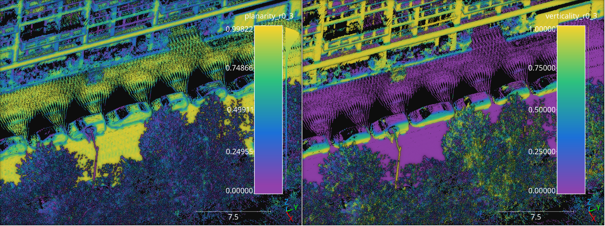
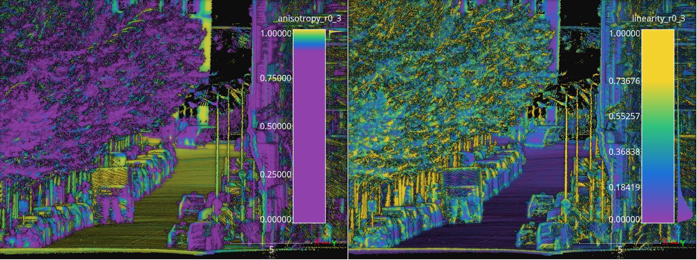
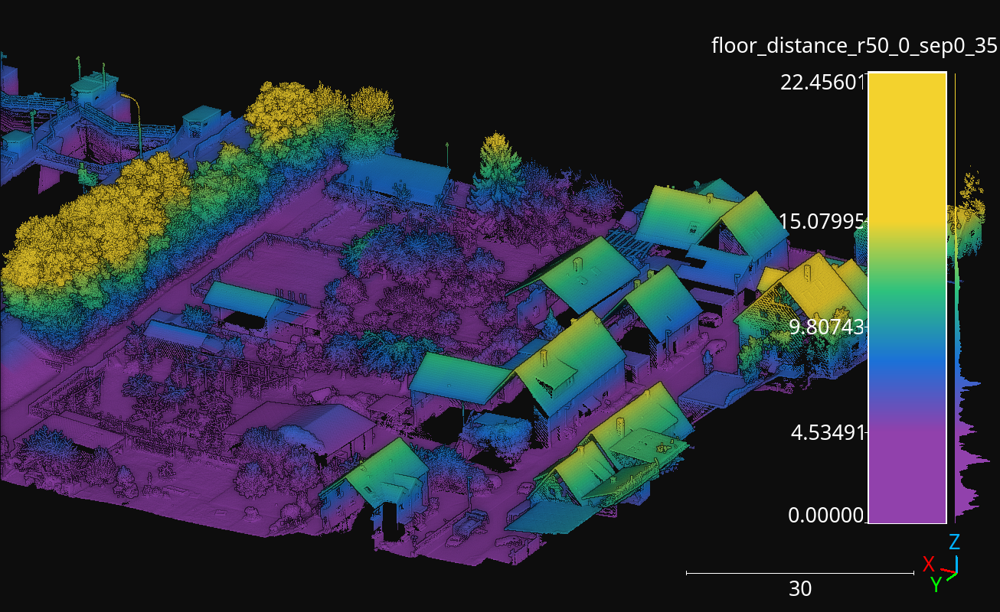
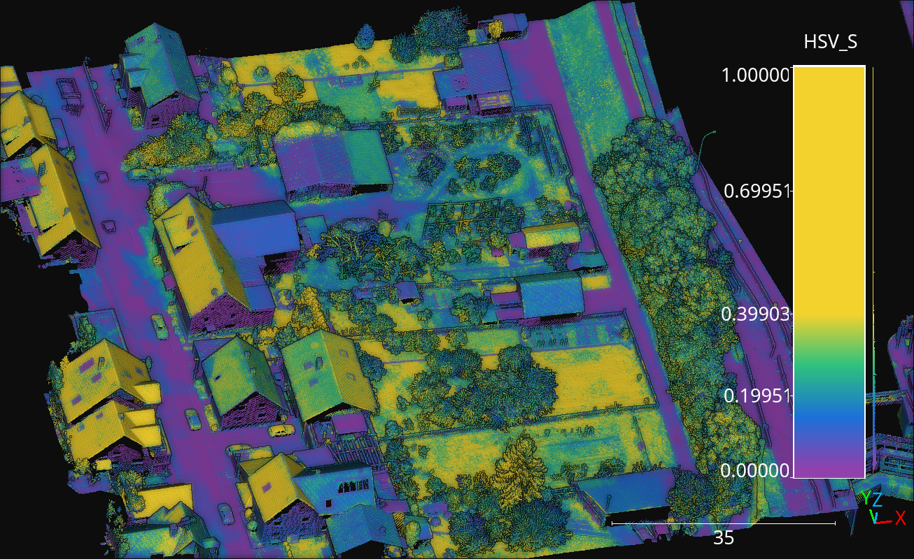
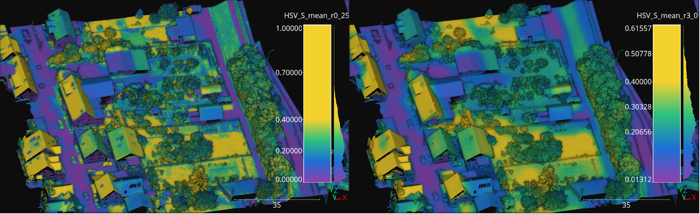

.. _Data mining page:

Data mining
**************

Data miners are components that receive an input point cloud and extract
features characterizing it, typically in a point-wise fashion.
Data miners (:class:`.Miner`) can be included inside pipelines to generate
features that can later be used to train a machine learning model to perform
a classification or regression task on the points.

.. _Geometric features miner:

Geometric features miner
==========================

The :class:`.GeomFeatsMiner` uses
`Jakteristics <https://jakteristics.readthedocs.io/en/latest/installation.html>`_
as backend to compute point-wise geometric features. The point-wise features
are computed considering spherical neighborhoods of a given radius. The JSON
below shows how to define a :class:`.GeomFeatsMiner`.

.. code-block:: json

    {
        "miner": "GeometricFeatures",
        "in_pcloud": null,
        "out_pcloud": null,
        "radius": 0.3,
        "fnames": ["linearity", "planarity", "surface_variation", "verticality", "anisotropy"],
        "frenames": ["linearity_r0_3", "planarity_r0_3", "surface_variation_r0_3", "verticality_r0_3", "anisotropy_r0_3"],
        "nthreads": -1
    }

The JSON above defines a :class:`.GeomFeatsMiner` that computes the linearity,
planarity, surface variation, verticality, and anisotropy geometric features
considering a :math:`30\,\mathrm{cm}` radius for the spherical neighborhood.
The computed features will be named from the feature names and the neighborhood
radius. Parallel regions will be computed using all available threads.

**Arguments**

-- ``in_pcloud``
    When the data miner is used outside a pipeline, this argument can be used
    to specify which point cloud must be loaded to compute the geometric
    features on it. In pipelines, the input point cloud is considered to be
    the point cloud at the current pipeline's state.

-- ``out_pcloud``
    When the data miner is used outside a pipeline, this argument can be used
    to specify where to write the output point cloud with the computed
    geometric features. Otherwise, it is better to use a Writer to export the
    point cloud after the data mining.

-- ``radius``
    The radius for the spherical neighborhood.

-- ``fnames``
    The list with the names of the features that must be computed. Supported
    features are:
    ``["eigenvalue_sum", "omnivariance", "eigenentropy", "anisotropy",
    "planarity", "linearity", "PCA1", "PCA2", "surface_variation",
    "sphericity", "verticality"]``

-- ``frenames``
    The list of names for the generated features. If it is not given, then
    the generated features will be automatically named.

-- ``nthreads``
    How many threads use to compute parallel regions. The value -1 means as
    many threads as supported in parallel (typically including virtual cores).

**Output**

The figure below represents the planarity and verticality features mined for
a spherical neighborhood with :math:`30\,\mathrm{cm}` radius. The point cloud
for this example corresponds to the `Paris` point cloud from the
`Paris-Lille-3D dataset <https://npm3d.fr/paris-lille-3d>`_.

    Visualization of the planarity (left) and verticality (right) computed in
    the `Paris` point cloud from the Paris-Lille-3D dataset using
    spherical negibhorhoods with :math:`30\,\mathrm{cm}` radius.

Covariance features miner
============================

The :class:`.CovarFeatsMiner` uses
`PDAL <https://pdal.io/en/2.6.0/stages/filters.covariancefeatures.html#filters-covariancefeatures>`_
as backend to compute point-wise geometric features. It can be used to compute
features on either spherical neighborhoods or k-nearest neighbors (knn)
neighborhoods. The JSON below shows how
to define a :class:`.CovarFeatsMiner`.

.. code-block:: json

    {
        "miner": "CovarianceFeatures",
        "neighborhood": "spherical",
        "radius": 0.3,
        "min_neighs": 3,
        "mode": "Raw",
        "optimize": false,
        "fnames": ["Linearity", "Planarity", "SurfaceVariation", "Verticality", "Anisotropy"],
        "frenames": ["linearity_r0_3", "planarity_r0_3", "surface_variation_r0_3", "verticality_r0_3", "anisotropy_r0_3"],
        "nthreads": 12
    }

The JSON above defines a :class:`.CovarFeatsMiner` that computes the linearity,
planarity, surface variation, verticality, and anisotropy features
considering a spherical neighborhood with :math:`30\,\mathrm{cm}` radius. The
computed features will be named from the feature names and the neighborhood
radius. Exactly 12 threads will be used for the computations.

**Arguments**

-- ``neighborhood``
    Either ``"spherical"`` to use a spherical neighborhood or ``"knn"`` to use
    a k-nearest neighbors neighborhood.

-- ``radius``
    The radius for the spherical neighborhood.

-- ``min_neighs``
    The minimum number of neighbors that is acceptable. When using ``"knn"``
    neighborhood, ``min_neighs`` defines :math:`k`.

-- ``mode``
    A string specifying how to compute the features:

    ``"SQRT"`` will consider the square root of the eigenvalues.
    ``"Normalized"`` will normalize the eigenvalues so they sum to one.
    ``"Raw"`` will directly use the raw eigenvalues.

-- ``optimize``
    When set to true the neighborhood configuration will be automatically
    determined at the expense of increasing the execution time. When set to
    false, nothing will happen.

    See `PDAL documentation on optimal neighborhood filter <https://pdal.io/en/2.6.0/stages/filters.optimalneighborhood.html#filters-optimalneighborhood>`_
    for further details.

-- ``fnames``
    The list with the names of the features that must be computed. Supported
    features are:
    ``["Anisotropy", "DemantkeVerticality", "Density", "Eigenentropy",
    "Linearity", "Omnivariance", "Planarity", "Scattering", "EigenvalueSum",
    "SurfaceVariation", "Verticality"]``

    See `PDAL documentation on covariance features <https://pdal.io/en/2.6.0/stages/filters.covariancefeatures.html#filters-covariancefeatures>`_
    for further details.

-- ``frenames``
    The list of names for the generated features. If it is not given, then
    the generated features will be automatically named.

-- ``nthreads``
    How many threads use to compute parallel regions. The value -1 means as
    many threads as supported in parallel (typically including virtual cores).

**Output**

The figure below represents the anisotropy and linearity features mined for
a spherical neighborhood with :math:`30\,\mathrm{cm}` radius. The point cloud
for this example correponds to the Paris point cloud from the
`Paris-Lille-3D dataset <https://npm3d.fr/paris-lille-3d>`_.

    Visualization of the anisotropy (left) and linearity (right) computed
    in the Paris point cloud from the `Paris-Lille-3D` dataset using spherical
    neighborhoods with :math:`30\,\mathrm{cm}` radius.

Height features miner
========================

The :class:`.HeightFeatsMiner` supports the computation of height-based
features. These features assume that the :math:`z` axis corresponds to the
vertical axis and derive features depending on the :math:`z` values of
many neighborhoods. The neighborhoods are centered on support points. Finally,
each point in the point cloud will take the features from the closest support
point. The JSON below shows how to define a :class:`.HeightFeatsMiner`:

.. code-block:: json

    {
        "miner": "HeightFeatures",
        "support_chunk_size": 50,
        "support_subchunk_size": 10,
        "pwise_chunk_size": 1000,
        "nthreads": 12,
        "neighborhood": {
            "type": "Rectangular2D",
            "radius": 50.0,
            "separation_factor": 0.35
        },
        "outlier_filter": null,
        "fnames": ["floor_distance", "ceil_distance"],
    }

The JSON above defines a :class:`.HeightFeatsMiner` that computes the distance
to the floor (lowest point) and to the ceil (highest point). It considers
a rectangular neighborhood for the support points with side length
:math:`50 \times 2 = 100` meters. Not outlier filter is applied.

**Arguments**

-- ``support_chunk_size``
    The number of support points per chunk for parallel computations.

-- ``support_subchunk_size``
    The number of simultaneous neighborhoods considered when computing a chunk.
    It can be used to prevent memory exhaustion scenarios.

-- ``pwise_chunk_size``
    The number of points per chunk when computing the height features for the
    points in the point cloud (not the support points).

-- ``nthreads``
    How many threads must be used for parallel computations (-1 means as many
    threads as available cores).

-- ``neighborhood``
    The neighborhood definition. The type can be either ``"Rectangular2D"``
    (in which case ``"k"`` must be given) or ``"Cylinder"`` (in which case
    ``"radius"`` must be given).

-- ``outlier_filter``
    The strategy to filter outlier points (it can be None). Supported
    strategies are ``"IQR"`` and ``"stdev"``. The ``"IQR"`` strategy considers
    the interquartile range and discards any height value outside
    :math:`[Q_1-3\mathrm{IQR}/2, Q_3+3\mathrm{IQR}/2]`. The ``"stdev"``
    strategy discards any height value outside
    :math:`[\mu - 3\sigma, \mu + 3\sigma]` where :math:`\mu` is the mean and
    :math:`\sigma` is the standard deviation.

-- ``fnames``
    The name of the height features that must be computed. Supported height
    features are:
    ``["floor_coordinate", "floor_distance", "ceil_coordinate",
    "ceil_distance", "height_range", "mean_height", "median_height",
    "height_quartiles", "height_deciles", "height_variance",
    "height_stdev", "height_skewness", "height_kurtosis"]``

**Output**

The figure below represents the floor distance mined for a spherical
Rectangular2D neighborhood with :math:`50` meters radius. The point cloud from
this example corresponds to the March2018 validation point cloud from the
`Hessigheim dataset <https://ifpwww.ifp.uni-stuttgart.de/benchmark/hessigheim/default.aspx>`_.

    Visualization of the floor distance height feature computed for the
    Hessigheim March2018 validation point cloud using using a Rectangular2D
    neighborhood with :math:`50\,\mathrm{m}` radius.

HSV from RGB miner
=====================

The :class:`.HSVFromRGBMiner` can be used when red, green, and blue color channels
are available for the points in the point cloud. It will generate the
corresponding hue (H), saturation (S), and value (V) components derived from
the available RGB information. The JSON below shows how to define a
:class:`.HSVFromRGBMiner`:

.. code-block:: json

    {
        "miner": "HSVFromRGB",
        "hue_unit": "radians",
        "frenames": ["HSV_Hrad", "HSV_S", "HSV_V"]
    }

The JSON above defines a :class:`.HSVFromRGBMiner` that computes the HSV
representation of the original RGB color components.

**Arguments**

-- ``hue_unit``
    The unit for the hue (H) component. It can be either ``"radians"`` or
    ``"degrees"``.

-- ``frenames``
    The name for the output features. If not given, they will be
    ``["HSV_H", "HSV_S", "HSV_V"]`` by default.

**Output**

The figure below represents the saturation (S) computed for the March2018
validation point cloud from the
`Hessigheim dataset <https://ifpwww.ifp.uni-stuttgart.de/benchmark/hessigheim/default.aspx>`_.

    Figure representing the saturation (S) in the March2018 validation point
    cloud of the Hessigheim dataset.

Smooth features miner
========================

The :class:`.SmoothFeatsMiner` can be used to derive smooth features from
already available features. The mean, weighted mean, and Guassian
Radial Basis Function (RBF) strategies can be used for this purpose. The JSON
below shows how to define a :class:`.SmoothFeatsMiner`:

.. code-block:: json

    {
        "miner": "SmoothFeatures",
        "nan_policy": "propagate",
        "chunk_size": 1000000,
        "subchunk_size": 1000,
        "neighborhood": {
            "type": "sphere",
            "radius": 0.25
        },
        "input_fnames": ["Reflectance", "HSV_Hrad", "HSV_S", "HSV_V"],
        "fnames": ["mean"],
        "nthreads": 12
    }

The JSON above defines a :class:`.SmoothFeatsMiner` that computes the smooth
reflectance, and HSV components considering a spherical neighborhood with
:math:`25\,\mathrm{cm}` radius. The strategy consists of computing the mean
value for each neighborhood. The computations are run in parallel using 12
threads.

**Arguments**

-- ``nan_policy``
    It can be ``"propagate"`` (default) so NaN features will be included
    in computations (potentially leading to NaN smooth features).
    Alternatively, it can be ``"replace"`` so NaN values are replaced with the
    feature-wise mean for each neighborhood. However, using ``"replace"`` leads
    to longer executions times. Therefore, ``"propagate"`` should be used
    always that NaN handling is not necessary.

-- ``chunk_size``
    How many points per chunk must be considered for parallel computations.

-- ``subchunk_size``
    How many neighborhoods per iteration must be considered when computing a
    chunk. It can be useful to prevent memory exhaustion scenarios.

-- ``neighborhood``
    The definition of the neighborhood to be used. Supported neighborhoods are
    ``"knn"`` (for which a ``"k"`` value must be given), and ``"sphere"``
    (for which a ``"radius"`` value must be given).

-- ``weighted_mean_omega``
    The :math:`\omega` parameter for the weighted mean strategy (see
    :class:`.SmoothFeatsMiner` for a description of the maths).

-- ``gaussian_rbf_omega``
    The :math:`\omega` parameter for the Gaussian RBF strategy (see
    :class:`.SmoothFeatsMiner` for a description of the maths).

-- ``input_fnames``
    The names of the features that must be smoothed.

-- ``fnames``
    The names of the smoothing strategies to be used. Supported strategies are
    ``"mean"``, ``"weighted_mean"``, and ``"gaussian_rbf"``.

-- ``frenames``
    The desired names for the generated output features. If not given, the
    names will be automatically derived.

-- ``nthreads``
    The number of threads to be used for parallel computations (-1 means as
    many threads as available cores).

**Output**

The figure below represents the smoothed saturation computed for a two
spherical neighborhoods with :math:`25\,\mathrm{cm}` and :math:`3\,\mathrm{m}`
radius, respectively. The point cloud is the March2018 validation one from the
`Hessigheim dataset <https://ifpwww.ifp.uni-stuttgart.de/benchmark/hessigheim/default.aspx>`_.

        spherical neighborhoods.

    Figure representing the smoothed saturation for two different spherical
    neighborhoods with :math:`25\,\mathrm{cm}` and :math:`3\,\mathrm{m}`
    radius, respectively.

Take closest miner
=====================

The :class:`.TakeClosestMiner` can be used to derive features from another
point cloud. It works by defining a pool of point clouds such that the closest
neighbor between the input point cloud and any point cloud in the pool will be
considered. Then, the features for each point will be taken from its closest
neighbor.

.. code-block:: json

    {
        "miner": "TakeClosestMiner",
        "fnames": [
            "HSV_Hrad", "HSV_S", "HSV_V",
            "floor_distance_r50.0_sep0.35",
            "eigenvalue_sum_r0.3", "omnivariance_r0.3", "eigenentropy_r0.3",
            "anisotropy_r0.3", "planarity_r0.3", "linearity_r0.3",
            "PCA1_r0.3", "PCA2_r0.3",
            "surface_variation_r0.3", "sphericity_r0.3", "verticality_r0.3",
        ],
        "pcloud_pool": [
            "/home/point_clouds/point_cloud_A.laz",
            "/home/point_clouds/point_cloud_B.laz",
            "/home/point_clouds/point_cloud_C.laz"
        ],
        "distance_upper_bound": 0.1,
        "nthreads": 12
    }

The JSON above defines a :class:`.TakeClosestMiner` that finds the features of
the closest point in a pool of three point clouds. Neighbors further than
:math:`0.1\,\mathrm{m}` will not be considered, even if they are the closest
neighbor.

**Arguments**

-- ``fnames``
    The names of the features that must be taken from the closest neighbor in
    the pool.

-- ``frenames``
    An optional list with the name of the output features. When not given, the
    output features will be named as specified by ``fnames``.

-- ``y_default``
    An optional value to be considered as the default label/class. If not
    given, it will be the max integer supported by the system.

-- ``pcloud_pool``
    A list with the paths to the point clouds composing the pool.

-- ``distance_upper_bound``
    The max distance threshold. Neighbors further than this distance will be
    ignored.

-- ``nthreads``
    The number of threads for parallel queries.

**Output**

The generated output is a point cloud where the features correspond to the
closest neighbor in the pool, assuming there is at least one neighbor that
is closer than the ``distance upper bound``.
