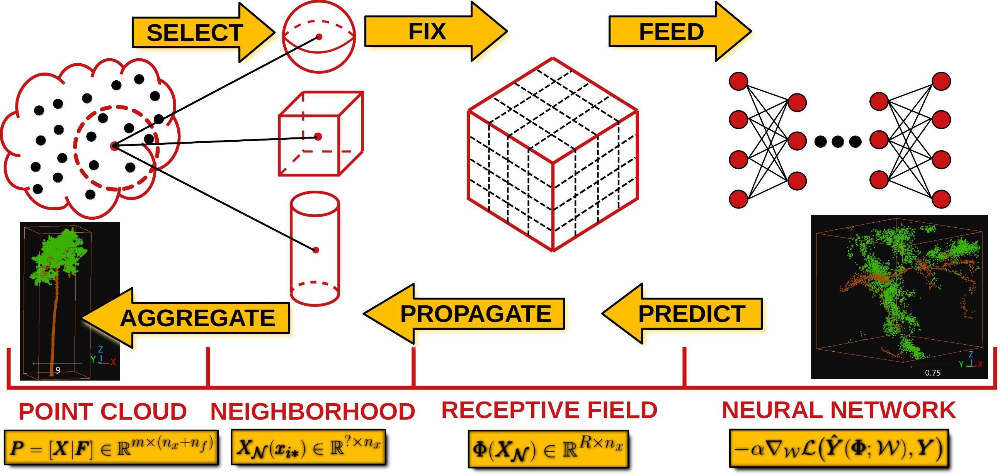

.. _Deep learning page:

Deep learning
*****************

Deep learning models can be seen as a subset of machine learning models,
typically based on artificial neural networks. Using deep learning models
for point cloud processing often demands top-level hardware. Users interested
in these models are strongly encouraged to have a computer with no less than
:math:`128\,\mathrm{GB}` of RAM, a manycore processor (with many **real**
cores for efficient parallel processing), and a top-level coprocessor like a
GPU or a TPU. It is worth mentioning that training deep learning models for
dense point clouds is not feasible with a typical CPU, so the coprocessor is a
must. However, using an already trained deep learning model might be possible
without a coprocessor, provided the system has a top-level CPU and high amounts
of RAM.

The deep learning models in the VL3D framework are based on the strategy
represented in the figure below. First, it is necessary to **select** a set of
neighborhoods that represents the input point cloud. These can overlap between
themselves, i.e., the same point can be in more than one neighborhood.
The neighborhoods can be defined as spheres, voxels, cylinders, or many more.
Now, note that each neighborhood can contain a different number of points.
In the VL3D framework, the input neighborhoods must be transformed into
**fixed-size** representations (in terms of the number of points) that will be
later grouped into batches to be **fed into the neural network**.

Once the neural network has computed the output, it will be **propagated** back
from the fixed-size receptive fields to the original neighborhoods, for
example, through a nearest-neighbor strategy. As there might be many outputs
for the same point, the values in the neighborhoods are **aggregated** (also
reduced), so there is one final value per point in the original point cloud
(provided that the input neighborhoods cover the entire point cloud).

        framework.

    Visualization of the deep learning strategy used by the VL3D framework.

The VL3D framework uses `Keras <https://keras.io/api/>`_ and
`TensorFlow <https://www.tensorflow.org/api_docs/python/tf>`_ as the deep
learning backend. The usage of deep learning models is documented below.
However, for this documentation users are expected to be already familiar
with the framework, especially with how to define pipelines. If that is not
the case, we strongly encourage you to read the
:ref:`documentation about pipelines <Pipelines page>` before.

Models
========

PointNet-based point-wise classifier
---------------------------------------

The :class:`PointNetPwiseClassifier`.

.. code-block:: json

    {
        "train": "PointNetPwiseClassifier",
        "fnames": ["AUTO"],
        "training_type": "base",
        "random_seed": null,
        "model_args": {
            "num_classes": 5,
            "class_names": ["Ground", "Vegetation", "Building", "Urban furniture", "Vehicle"],
            "num_pwise_feats": 16,
            "pre_processing": {
                "pre_processor": "furthest_point_subsampling",
                "support_chunk_size": 2000,
                "_training_class_distribution": [1000, 1000, 1000, 1000, 1000],
                "center_on_pcloud": true,
                "num_points": 4096,
                "num_encoding_neighbors": 1,
                "fast": false,
                "neighborhood": {
                    "type": "rectangular3D",
                    "radius": 5.0,
                    "separation_factor": 0.8
                },
                "nthreads": 12,
                "training_receptive_fields_distribution_report_path": "*/training_eval/training_receptive_fields_distribution.log",
                "training_receptive_fields_distribution_plot_path": "*/training_eval/training_receptive_fields_distribution.svg",
                "training_receptive_fields_dir": "*/training_eval/training_receptive_fields/",
                "receptive_fields_distribution_report_path": "*/training_eval/receptive_fields_distribution.log",
                "receptive_fields_distribution_plot_path": "*/training_eval/receptive_fields_distribution.svg",
                "receptive_fields_dir": "*/training_eval/receptive_fields/",
                "training_support_points_report_path": "*/training_eval/training_support_points.laz",
                "support_points_report_path": "*/training_eval/support_points.laz"
            },
            "kernel_initializer": "he_normal",
            "pretransf_feats_spec": [
                {
                    "filters": 32,
                    "name": "prefeats32_A"
                },
                {
                    "filters": 32,
                    "name": "prefeats_32B"
                },
                {
                    "filters": 64,
                    "name": "prefeats_64"
                },
                {
                    "filters": 128,
                    "name": "prefeats_128"
                }
            ],
            "postransf_feats_spec": [
                {
                    "filters": 128,
                    "name": "posfeats_128"
                },
                {
                    "filters": 256,
                    "name": "posfeats_256"
                },
                {
                    "filters": 64,
                    "name": "posfeats_end_64"
                }
            ],
            "tnet_pre_filters_spec": [32, 64, 128],
            "tnet_post_filters_spec": [128, 64, 32],
            "model_handling": {
                "summary_report_path": "*/model_summary.log",
                "training_history_dir": "*/training_eval/history",
                "class_weight": [0.25, 0.5, 0.5, 1, 1],
                "training_epochs": 200,
                "batch_size": 16,
                "checkpoint_path": "*/checkpoint.model",
                "checkpoint_monitor": "loss",
                "learning_rate_on_plateau": {
                    "monitor": "loss",
                    "mode": "min",
                    "factor": 0.1,
                    "patience": 2000,
                    "cooldown": 5,
                    "min_delta": 0.01,
                    "min_lr": 1e-6
                },
                "early_stopping": {
                    "monitor": "loss",
                    "mode": "min",
                    "min_delta": 0.01,
                    "patience": 5000
                }
            },
            "compilation_args": {
                "optimizer": {
                    "algorithm": "SGD",
                    "_learning_rate": 1e-3,
                    "learning_rate": {
                        "schedule": "exponential_decay",
                        "schedule_args": {
                            "initial_learning_rate": 1e-2,
                            "decay_steps": 2000,
                            "decay_rate": 0.96,
                            "staircase": false
                        }
                    }
                },
                "loss": {
                    "function": "class_weighted_categorical_crossentropy"
                },
                "metrics": [
                    "categorical_accuracy"
                ]
            },
            "architecture_graph_path": "*/model_graph.png",
            "architecture_graph_args": {
                "show_shapes": true,
                "show_dtype": true,
                "show_layer_names": true,
                "rankdir": "TB",
                "expand_nested": true,
                "dpi": 300,
                "show_layer_activations": true
            }
        },
        "autoval_metrics": ["OA", "P", "R", "F1", "IoU", "wP", "wR", "wF1", "wIoU", "MCC", "Kappa"],
        "training_evaluation_metrics": ["OA", "P", "R", "F1", "IoU", "wP", "wR", "wF1", "wIoU", "MCC", "Kappa"],
        "training_class_evaluation_metrics": ["P", "R", "F1", "IoU"],
        "training_evaluation_report_path": "*/training_eval/evaluation.log",
        "training_class_evaluation_report_path": "*/training_eval/class_evaluation.log",
        "training_confusion_matrix_report_path": "*/training_eval/confusion.log",
        "training_confusion_matrix_plot_path": "*/training_eval/confusion.svg",
        "training_class_distribution_report_path": "*/training_eval/class_distribution.log",
        "training_class_distribution_plot_path": "*/training_eval/class_distribution.svg",
        "training_classified_point_cloud_path": "*/training_eval/classified_point_cloud.laz",
        "training_activations_path": "*/training_eval/activations.laz"
    }

Receptive fields
===================

Grid
-------

Furthest point sampling
-------------------------

Optimizers
=============

Losses
========

Callbacks
============

Further training
==================

Working example
==================

This example shows how to define two different pipelines, one to train a model
and export it as a :class:`.PredictivePipeline`, the other to use the
predictive pipeline to compute a semantic segmentation on a previously unseen
point cloud. Readers are referred to the
:ref:`pipelines documentation <Pipelines page>` to read more
about how pipelines work and to see more examples.

Training pipeline
--------------------

The training pipeline will train a :class:`.PointNetPwiseClassif` to classify
the points depending on whether they represent the ground, vegetation,
buildings, urban furniture, or vehicles. The training point cloud is generated
from the March 2018 training point cloud in the
`Hessigheim dataset <https://ifpwww.ifp.uni-stuttgart.de/benchmark/hessigheim/default.aspx>`_
by reducing
the original classes to the five categories mentioned before.

The receptive fields are computed following a furthest point subsampling
strategy such that each receptive field has :math:`8192` points. The receptive
fields are built from rectangular neighborhoods with a half size (radius) of
:math:`5\,\mathrm{m}`, i.e., voxels with edge length :math:`10\,\mathrm{m}`.
Furthermore, a class weighting strategy is used to modify the loss function so
it accounts for the class imbalance. In this case, the ground class has a weight
of :math:`\frac{1}{4}`, the vegetation and building classes a weight of
:math:`\frac{1}{2}`, and the urban furniture and vehicle classes a weight of
one.

The learning rate on plateau strategy is configured with a highly enough
patience so it will never trigger. However, as it is enabled, the learning
rate will be traced by the training history and included in the plots.
The optimizer is a stochastic gradient descent (SGD) initialized with a
learning rate of :math:`10^{-2}`. The learning rate will be exponentially
reduced with a decay rate of :math:`0.96` each :math:`2000` steps. Once the
training has been finished, the model will be exported to a predictive
pipeline that includes the class transformation so it can be directly applied
later to the corresponding validation point cloud in the
`Hessigheim dataset <https://ifpwww.ifp.uni-stuttgart.de/benchmark/hessigheim/default.aspx>`_.

The JSON below corresponds to the described training pipeline.

.. code-block:: json

    {
      "in_pcloud": [
        "/data/Hessigheim_Benchmark/Epoch_March2018/LiDAR/Mar18_train.laz"
      ],
      "out_pcloud": [
        "/data/Hessigheim_Benchmark/Epoch_March2018/vl3d/out/Rect3D_alt_5m_T1/*"
      ],
      "sequential_pipeline": [
        {
            "class_transformer": "ClassReducer",
            "on_predictions": false,
            "input_class_names": ["Low vegetation", "Impervious surface", "Vehicle", "Urban furniture", "Roof", "Facade", "Shrub", "Tree", "Soil/Gravel", "Vertical surface", "Chimney"],
            "output_class_names": ["Ground", "Vegetation", "Building", "Urban furniture", "Vehicle"],
            "class_groups": [["Low vegetation", "Impervious surface", "Soil/Gravel"], ["Shrub", "Tree"], ["Roof", "Facade", "Vertical surface", "Chimney"], ["Urban furniture"], ["Vehicle"]],
            "report_path": "*class_reduction.log",
            "plot_path": "*class_reduction.svg"
        },
        {
            "train": "PointNetPwiseClassifier",
            "fnames": ["AUTO"],
            "training_type": "base",
            "random_seed": null,
            "model_args": {
                "num_classes": 5,
                "class_names": ["Ground", "Vegetation", "Building", "Urban furniture", "Vehicle"],
                "num_pwise_feats": 20,
                "pre_processing": {
                    "pre_processor": "furthest_point_subsampling",
                    "support_chunk_size": 2000,
                    "center_on_pcloud": true,
                    "num_points": 8192,
                    "num_encoding_neighbors": 1,
                    "fast": false,
                    "neighborhood": {
                        "type": "rectangular3D",
                        "radius": 5.0,
                        "separation_factor": 0.4
                    },
                    "nthreads": 12,
                    "training_receptive_fields_distribution_report_path": "*/training_eval/training_receptive_fields_distribution.log",
                    "training_receptive_fields_distribution_plot_path": "*/training_eval/training_receptive_fields_distribution.svg",
                    "training_receptive_fields_dir": "*/training_eval/training_receptive_fields/",
                    "receptive_fields_distribution_report_path": "*/training_eval/receptive_fields_distribution.log",
                    "receptive_fields_distribution_plot_path": "*/training_eval/receptive_fields_distribution.svg",
                    "receptive_fields_dir": "*/training_eval/receptive_fields/",
                    "training_support_points_report_path": "*/training_eval/training_support_points.laz",
                    "support_points_report_path": "*/training_eval/support_points.laz"
                },
                "kernel_initializer": "he_normal",
                "pretransf_feats_spec": [
                    {
                        "filters": 64,
                        "name": "prefeats64_A"
                    },
                    {
                        "filters": 64,
                        "name": "prefeats_64B"
                    },
                    {
                        "filters": 128,
                        "name": "prefeats_128"
                    },
                    {
                        "filters": 192,
                        "name": "prefeats_192"
                    }
                ],
                "postransf_feats_spec": [
                    {
                        "filters": 128,
                        "name": "posfeats_128"
                    },
                    {
                        "filters": 192,
                        "name": "posfeats_192"
                    },
                    {
                        "filters": 256,
                        "name": "posfeats_end_64"
                    }
                ],
                "tnet_pre_filters_spec": [64, 128, 192],
                "tnet_post_filters_spec": [192, 128, 64],
                "model_handling": {
                    "summary_report_path": "*/model_summary.log",
                    "training_history_dir": "*/training_eval/history",
                    "features_structuring_representation_dir": "*/training_eval/feat_struct_layer/",
                    "class_weight": [0.25, 0.5, 0.5, 1, 1],
                    "training_epochs": 200,
                    "batch_size": 16,
                    "checkpoint_path": "*/checkpoint.model",
                    "checkpoint_monitor": "loss",
                    "learning_rate_on_plateau": {
                        "monitor": "loss",
                        "mode": "min",
                        "factor": 0.1,
                        "patience": 2000,
                        "cooldown": 5,
                        "min_delta": 0.01,
                        "min_lr": 1e-6
                    },
                },
                "compilation_args": {
                    "optimizer": {
                        "algorithm": "SGD",
                        "learning_rate": {
                            "schedule": "exponential_decay",
                            "schedule_args": {
                                "initial_learning_rate": 1e-2,
                                "decay_steps": 2000,
                                "decay_rate": 0.96,
                                "staircase": false
                            }
                        }
                    },
                    "loss": {
                        "function": "class_weighted_categorical_crossentropy"
                    },
                    "metrics": [
                        "categorical_accuracy"
                    ]
                },
                "architecture_graph_path": "*/model_graph.png",
                "architecture_graph_args": {
                    "show_shapes": true,
                    "show_dtype": true,
                    "show_layer_names": true,
                    "rankdir": "TB",
                    "expand_nested": true,
                    "dpi": 300,
                    "show_layer_activations": true
                }
            },
            "autoval_metrics": ["OA", "P", "R", "F1", "IoU", "wP", "wR", "wF1", "wIoU", "MCC", "Kappa"],
            "training_evaluation_metrics": ["OA", "P", "R", "F1", "IoU", "wP", "wR", "wF1", "wIoU", "MCC", "Kappa"],
            "training_class_evaluation_metrics": ["P", "R", "F1", "IoU"],
            "training_evaluation_report_path": "*/training_eval/evaluation.log",
            "training_class_evaluation_report_path": "*/training_eval/class_evaluation.log",
            "training_confusion_matrix_report_path": "*/training_eval/confusion.log",
            "training_confusion_matrix_plot_path": "*/training_eval/confusion.svg",
            "training_class_distribution_report_path": "*/training_eval/class_distribution.log",
            "training_class_distribution_plot_path": "*/training_eval/class_distribution.svg",
            "training_classified_point_cloud_path": "*/training_eval/classified_point_cloud.laz",
            "training_activations_path": "*/training_eval/activations.laz"
        },
        {
          "writer": "PredictivePipelineWriter",
          "out_pipeline": "*pipe/Rect3D_5m_T1.pipe",
          "include_writer": false,
          "include_imputer": false,
          "include_feature_transformer": false,
          "include_miner": false,
          "include_class_transformer": true
        }
      ]
    }

The table below represents the distribution of reference and predicted labels
on the training dataset. The class imbalance can be clearly observed.
Nevertheless, thanks to the class weights, the model gives more importance to
the less populated classes, so they have an appreciable impact on the weight
updates during the gradient descent iterations.

.. csv-table::
    :file: ../csv/dl_pnetclassif_train_class_distrib.csv
    :widths: 20 20 20 20 20
    :header-rows: 1

The figure below represents the receptive fields. The top rows represent the
outputs of the softmax layer that describe from zero to one how likely a given
point is to belong to the corresponding class. The bottom row represents the
reference (classification) and predicted (predictions) labels inside the
receptive field.

.. figure:: ../img/dl_pnclassif_rf.png
    :scale: 30
    :alt: Figure representing a receptive field of a trained PointNet-based
        classifier on training data.

    Visualization of a receptive field from a trained PointNet-based
    classifier. The softmax representation uses a color map from zero
    (violet) to one (yellow). The classification (reference labels) and
    predictions use the same color code for the classes.

Predictive pipeline
---------------------

The predictive pipeline will use the model trained on the first point cloud to
compute an urban semantic segmentation on a validation point cloud.
More concretely, the validation point cloud corresponds to the March 2018
epoch of the
`Hessigheim dataset <https://ifpwww.ifp.uni-stuttgart.de/benchmark/hessigheim/default.aspx>`_.

The predictions will be exported through the :class:`.ClassifiedPcloudWriter`,
which means the boolean mask on success and fail will be available. Also, the
:class:`.ClassificationEvaluator` will be used to quantify the quality of the
predictions through many evaluation metrics.

The JSON below corresponds to the described predictive pipeline.

.. code-block:: json

    {
      "in_pcloud": [
        "/data/Hessigheim_Benchmark/Epoch_March2018/LiDAR/Mar18_val.laz"
      ],
      "out_pcloud": [
        "/data/Hessigheim_Benchmark/Epoch_March2018/vl3d/out/Rect3D_alt_5m_T1/validation_rfsep0_4/*"
      ],
      "sequential_pipeline": [
        {
          "predict": "PredictivePipeline",
          "model_path": "/data/Hessigheim_Benchmark/Epoch_March2018/vl3d/out/Rect3D_alt_5m_T1/pipe/Rect3D_5m_T1.pipe"
        },
        {
            "writer": "ClassifiedPcloudWriter",
            "out_pcloud": "*predicted.laz"
        },
        {
          "writer": "PredictionsWriter",
          "out_preds": "*predictions.lbl"
        },
        {
          "eval": "ClassificationEvaluator",
          "class_names": ["Ground", "Vegetation", "Building", "Urban furniture", "Vehicle"],
          "metrics": ["OA", "P", "R", "F1", "IoU", "wP", "wR", "wF1", "wIoU", "MCC", "Kappa"],
          "class_metrics": ["P", "R", "F1", "IoU"],
          "report_path": "*report/global_eval.log",
          "class_report_path": "*report/class_eval.log",
          "confusion_matrix_report_path" : "*report/confusion_matrix.log",
          "confusion_matrix_plot_path" : "*plot/confusion_matrix.svg",
          "class_distribution_report_path": "*report/class_distribution.log",
          "class_distribution_plot_path": "*plot/class_distribution.svg"
        }
      ]
    }

The table below represents the class-wise evaluation metrics. It shows the
precision, recall, F1-score, and intersection over union (IoU) for each class.
It can be seen that the more populated classes, ground, vegetation, and
building yield the best results, while the less frequent classes yield worse
results, as expected.

.. csv-table::
    :file: ../csv/dl_pnetclassif_predict_class_eval.csv
    :widths: 20 20 20 20 20
    :header-rows: 1

The figure below shows the reference and predicted labels, as well as the
fail/success boolean mask representing correctly classified (gray) and
misclassified (red) points.

.. figure:: ../img/pnetclassif_unseen.png
    :scale: 35
    :alt: Figure representing the semantic segmentation of a PointNet-based
            classifier on previously unseen data.

    Visualization of the semantic segmentation model applied to previously
    unseen data. The bottom image shows correctly classified points in gray and
    misclassified points in red. The predictions and reference images use the
    same color code for the classes.

