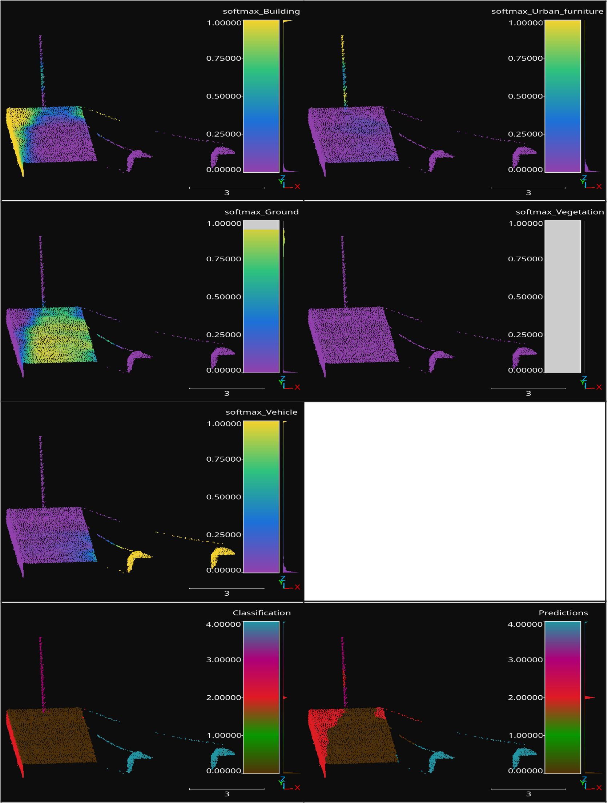
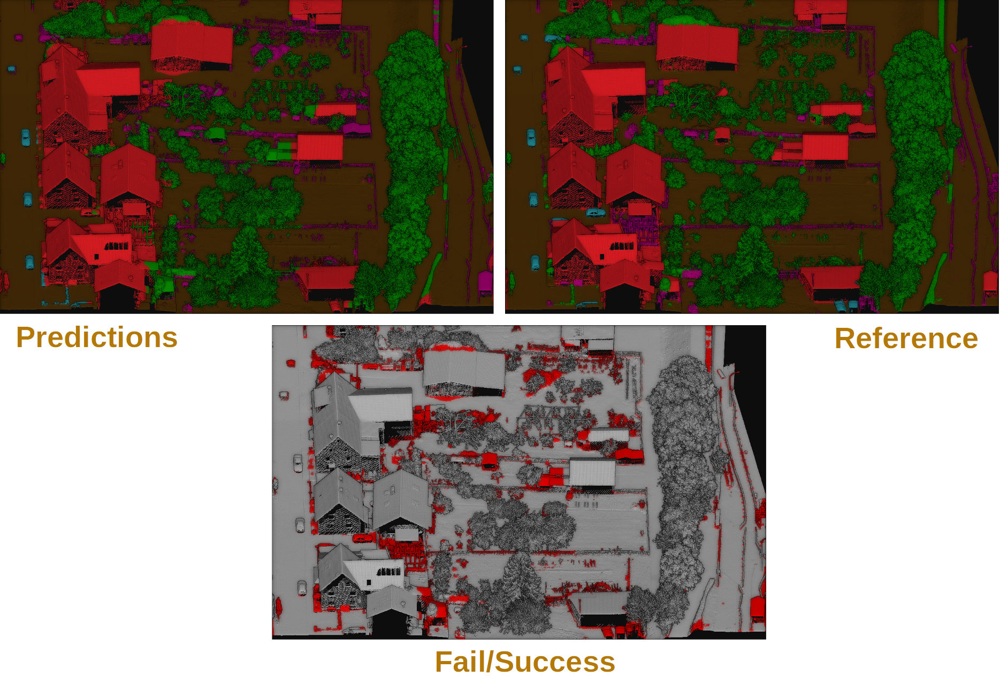

.. _Deep learning page:

Deep learning
*****************

Deep learning models can be seen as a subset of machine learning models,
typically based on artificial neural networks. Using deep learning models
for point cloud processing often demands top-level hardware. Users interested
in these models are strongly encouraged to have a computer with no less than
:math:`128\,\mathrm{GB}` of RAM, a manycore processor (with many **real**
cores for efficient parallel processing), and a top-level coprocessor like a
GPU or a TPU. It is worth mentioning that training deep learning models for
dense point clouds is not feasible with a typical CPU, so the coprocessor is a
must. However, using an already trained deep learning model might be possible
without a coprocessor, provided the system has a top-level CPU and high amounts
of RAM.

The VL3D framework uses `Keras <https://keras.io/api/>`_ and
`TensorFlow <https://www.tensorflow.org/api_docs/python/tf>`_ as the deep
learning backend. The usage of deep learning models is documented below.
However, for this documentation users are expected to be already familiar
with the framework, especially with how to define pipelines. If that is not
the case, we strongly encourage you to read the
:ref:`documentation about pipelines <Pipelines page>` before.

Models
========

PointNet-based point-wise classifier
---------------------------------------

The :class:`PointNetPwiseClassifier`.

.. code-block:: json

    {
        "train": "PointNetPwiseClassifier",
        "fnames": ["AUTO"],
        "training_type": "base",
        "random_seed": null,
        "model_args": {
            "num_classes": 5,
            "class_names": ["Ground", "Vegetation", "Building", "Urban furniture", "Vehicle"],
            "num_pwise_feats": 16,
            "pre_processing": {
                "pre_processor": "furthest_point_subsampling",
                "support_chunk_size": 2000,
                "_training_class_distribution": [1000, 1000, 1000, 1000, 1000],
                "center_on_pcloud": true,
                "num_points": 4096,
                "num_encoding_neighbors": 1,
                "fast": false,
                "neighborhood": {
                    "type": "rectangular3D",
                    "radius": 5.0,
                    "separation_factor": 0.8
                },
                "nthreads": 12,
                "training_receptive_fields_distribution_report_path": "*/training_eval/training_receptive_fields_distribution.log",
                "training_receptive_fields_distribution_plot_path": "*/training_eval/training_receptive_fields_distribution.svg",
                "training_receptive_fields_dir": "*/training_eval/training_receptive_fields/",
                "receptive_fields_distribution_report_path": "*/training_eval/receptive_fields_distribution.log",
                "receptive_fields_distribution_plot_path": "*/training_eval/receptive_fields_distribution.svg",
                "receptive_fields_dir": "*/training_eval/receptive_fields/",
                "training_support_points_report_path": "*/training_eval/training_support_points.laz",
                "support_points_report_path": "*/training_eval/support_points.laz"
            },
            "kernel_initializer": "he_normal",
            "pretransf_feats_spec": [
                {
                    "filters": 32,
                    "name": "prefeats32_A"
                },
                {
                    "filters": 32,
                    "name": "prefeats_32B"
                },
                {
                    "filters": 64,
                    "name": "prefeats_64"
                },
                {
                    "filters": 128,
                    "name": "prefeats_128"
                }
            ],
            "postransf_feats_spec": [
                {
                    "filters": 128,
                    "name": "posfeats_128"
                },
                {
                    "filters": 256,
                    "name": "posfeats_256"
                },
                {
                    "filters": 64,
                    "name": "posfeats_end_64"
                }
            ],
            "tnet_pre_filters_spec": [32, 64, 128],
            "tnet_post_filters_spec": [128, 64, 32],
            "model_handling": {
                "summary_report_path": "*/model_summary.log",
                "training_history_dir": "*/training_eval/history",
                "class_weight": [0.25, 0.5, 0.5, 1, 1],
                "training_epochs": 200,
                "batch_size": 16,
                "checkpoint_path": "*/checkpoint.model",
                "checkpoint_monitor": "loss",
                "learning_rate_on_plateau": {
                    "monitor": "loss",
                    "mode": "min",
                    "factor": 0.1,
                    "patience": 2000,
                    "cooldown": 5,
                    "min_delta": 0.01,
                    "min_lr": 1e-6
                },
                "early_stopping": {
                    "monitor": "loss",
                    "mode": "min",
                    "min_delta": 0.01,
                    "patience": 5000
                }
            },
            "compilation_args": {
                "optimizer": {
                    "algorithm": "SGD",
                    "_learning_rate": 1e-3,
                    "learning_rate": {
                        "schedule": "exponential_decay",
                        "schedule_args": {
                            "initial_learning_rate": 1e-2,
                            "decay_steps": 2000,
                            "decay_rate": 0.96,
                            "staircase": false
                        }
                    }
                },
                "loss": {
                    "function": "class_weighted_categorical_crossentropy"
                },
                "metrics": [
                    "categorical_accuracy"
                ]
            },
            "architecture_graph_path": "*/model_graph.png",
            "architecture_graph_args": {
                "show_shapes": true,
                "show_dtype": true,
                "show_layer_names": true,
                "rankdir": "TB",
                "expand_nested": true,
                "dpi": 300,
                "show_layer_activations": true
            }
        },
        "autoval_metrics": ["OA", "P", "R", "F1", "IoU", "wP", "wR", "wF1", "wIoU", "MCC", "Kappa"],
        "training_evaluation_metrics": ["OA", "P", "R", "F1", "IoU", "wP", "wR", "wF1", "wIoU", "MCC", "Kappa"],
        "training_class_evaluation_metrics": ["P", "R", "F1", "IoU"],
        "training_evaluation_report_path": "*/training_eval/evaluation.log",
        "training_class_evaluation_report_path": "*/training_eval/class_evaluation.log",
        "training_confusion_matrix_report_path": "*/training_eval/confusion.log",
        "training_confusion_matrix_plot_path": "*/training_eval/confusion.svg",
        "training_class_distribution_report_path": "*/training_eval/class_distribution.log",
        "training_class_distribution_plot_path": "*/training_eval/class_distribution.svg",
        "training_classified_point_cloud_path": "*/training_eval/classified_point_cloud.laz",
        "training_activations_path": "*/training_eval/activations.laz"
    }

Receptive fields
===================

Grid
-------

Furthest point sampling
-------------------------

Optimizers
=============

Losses
========

Callbacks
============

Further training
==================

Working example
==================

Training pipeline
--------------------

.. csv-table::
    :file: ../csv/dl_pnetclassif_train_class_distrib.csv
    :widths: 20 20 20 20 20
    :header-rows: 1

        classifier on training data.

    Visualization of a receptive field from a trained PointNet-based
    classifier. The softmax representation uses a color map from zero
    (violet) to one (yellow). The classification (reference labels) and
    predictions use the same color code for the classes.

Predictive pipeline
---------------------

.. csv-table::
    :file: ../csv/dl_pnetclassif_predict_class_eval.csv
    :widths: 20 20 20 20 20
    :header-rows: 1

            classifier on previously unseen data.

    Visualization of the semantic segmentation model applied to previously
    unseen data. The bottom image shows correct classified points in gray and
    misclassified points in red. The predictions and reference images use the
    same color code for the classes.

