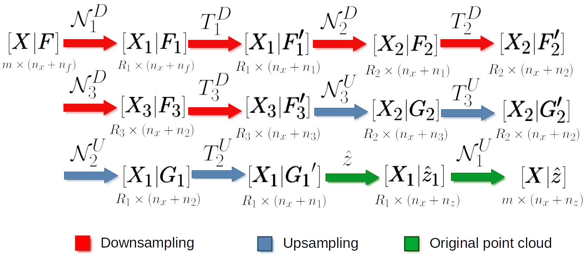

.. _Deep learning page:

Deep learning
*****************

Deep learning models can be seen as a subset of machine learning models,
typically based on artificial neural networks. Using deep learning models
for point cloud processing often demands top-level hardware. Users interested
in these models are strongly encouraged to have a computer with no less than
:math:`128\,\mathrm{GB}` of RAM, a manycore processor (with many **real**
cores for efficient parallel processing), and a top-level coprocessor like a
GPU or a TPU. It is worth mentioning that training deep learning models for
dense point clouds is not feasible with a typical CPU, so the coprocessor is a
must. However, using an already trained deep learning model might be possible
without a coprocessor, provided the system has a top-level CPU and high amounts
of RAM.

The deep learning models in the VL3D framework are based on the strategy
represented in the figure below. First, it is necessary to **select** a set of
neighborhoods that represents the input point cloud. These can overlap between
themselves, i.e., the same point can be in more than one neighborhood.
The neighborhoods can be defined as spheres, voxels, cylinders, or many more.
Now, note that each neighborhood can contain a different number of points.
In the VL3D framework, the input neighborhoods must be transformed into
**fixed-size** representations (in terms of the number of points) that will be
later grouped into batches to be **fed into the neural network**.

Once the neural network has computed the output, it will be **propagated** back
from the fixed-size receptive fields to the original neighborhoods, for
example, through a nearest-neighbor strategy. As there might be many outputs
for the same point, the values in the neighborhoods are **aggregated** (also
reduced), so there is one final value per point in the original point cloud
(provided that the input neighborhoods cover the entire point cloud).

        framework.

    Visualization of the deep learning strategy used by the VL3D framework.

The VL3D framework uses `Keras <https://keras.io/api/>`_ and
`TensorFlow <https://www.tensorflow.org/api_docs/python/tf>`_ as the deep
learning backend. The usage of deep learning models is documented below.
However, for this documentation users are expected to be already familiar
with the framework, especially with how to define pipelines. If that is not
the case, we strongly encourage you to read the
:ref:`documentation about pipelines <Pipelines page>` before.

Models
========

PointNet-based point-wise classifier
---------------------------------------

The :class:`PointNetPwiseClassif` can be used to solve point-wise classification
tasks. This model is based on the PointNet architecture and it can be defined
as shown in the JSON below:

.. code-block:: json

    {
        "train": "PointNetPwiseClassifier",
        "fnames": ["AUTO"],
        "training_type": "base",
        "random_seed": null,
        "model_args": {
            "num_classes": 5,
            "class_names": ["Ground", "Vegetation", "Building", "Urban furniture", "Vehicle"],
            "num_pwise_feats": 16,
            "pre_processing": {
                "pre_processor": "furthest_point_subsampling",
                "to_unit_sphere": false,
                "support_strategy": "grid",
                "support_chunk_size": 2000,
                "support_strategy_fast": false,
                "_training_class_distribution": [1000, 1000, 1000, 1000, 1000],
                "center_on_pcloud": true,
                "num_points": 4096,
                "num_encoding_neighbors": 1,
                "fast": false,
                "neighborhood": {
                    "type": "rectangular3D",
                    "radius": 5.0,
                    "separation_factor": 0.8
                },
                "nthreads": 12,
                "training_receptive_fields_distribution_report_path": "*/training_eval/training_receptive_fields_distribution.log",
                "training_receptive_fields_distribution_plot_path": "*/training_eval/training_receptive_fields_distribution.svg",
                "training_receptive_fields_dir": "*/training_eval/training_receptive_fields/",
                "receptive_fields_distribution_report_path": "*/training_eval/receptive_fields_distribution.log",
                "receptive_fields_distribution_plot_path": "*/training_eval/receptive_fields_distribution.svg",
                "receptive_fields_dir": "*/training_eval/receptive_fields/",
                "training_support_points_report_path": "*/training_eval/training_support_points.laz",
                "support_points_report_path": "*/training_eval/support_points.laz"
            },
            "kernel_initializer": "he_normal",
            "pretransf_feats_spec": [
                {
                    "filters": 32,
                    "name": "prefeats32_A"
                },
                {
                    "filters": 32,
                    "name": "prefeats_32B"
                },
                {
                    "filters": 64,
                    "name": "prefeats_64"
                },
                {
                    "filters": 128,
                    "name": "prefeats_128"
                }
            ],
            "postransf_feats_spec": [
                {
                    "filters": 128,
                    "name": "posfeats_128"
                },
                {
                    "filters": 256,
                    "name": "posfeats_256"
                },
                {
                    "filters": 64,
                    "name": "posfeats_end_64"
                }
            ],
            "tnet_pre_filters_spec": [32, 64, 128],
            "tnet_post_filters_spec": [128, 64, 32],
            "final_shared_mlps": [512, 256, 128],
            "skip_link_features_X": false,
            "include_pretransf_feats_X": false,
            "include_transf_feats_X": true,
            "include_postransf_feats_X": false,
            "include_global_feats_X": true,
            "skip_link_features_F": false,
            "include_pretransf_feats_F": false,
            "include_transf_feats_F": true,
            "include_postransf_feats_F": false,
            "include_global_feats_F": true,
            "model_handling": {
                "summary_report_path": "*/model_summary.log",
                "training_history_dir": "*/training_eval/history",
                "class_weight": [0.25, 0.5, 0.5, 1, 1],
                "training_epochs": 200,
                "batch_size": 16,
                "checkpoint_path": "*/checkpoint.model",
                "checkpoint_monitor": "loss",
                "learning_rate_on_plateau": {
                    "monitor": "loss",
                    "mode": "min",
                    "factor": 0.1,
                    "patience": 2000,
                    "cooldown": 5,
                    "min_delta": 0.01,
                    "min_lr": 1e-6
                },
                "early_stopping": {
                    "monitor": "loss",
                    "mode": "min",
                    "min_delta": 0.01,
                    "patience": 5000
                }
            },
            "compilation_args": {
                "optimizer": {
                    "algorithm": "SGD",
                    "learning_rate": {
                        "schedule": "exponential_decay",
                        "schedule_args": {
                            "initial_learning_rate": 1e-2,
                            "decay_steps": 2000,
                            "decay_rate": 0.96,
                            "staircase": false
                        }
                    }
                },
                "loss": {
                    "function": "class_weighted_categorical_crossentropy"
                },
                "metrics": [
                    "categorical_accuracy"
                ]
            },
            "architecture_graph_path": "*/model_graph.png",
            "architecture_graph_args": {
                "show_shapes": true,
                "show_dtype": true,
                "show_layer_names": true,
                "rankdir": "TB",
                "expand_nested": true,
                "dpi": 300,
                "show_layer_activations": true
            }
        },
        "training_evaluation_metrics": ["OA", "P", "R", "F1", "IoU", "wP", "wR", "wF1", "wIoU", "MCC", "Kappa"],
        "training_class_evaluation_metrics": ["P", "R", "F1", "IoU"],
        "training_evaluation_report_path": "*/training_eval/evaluation.log",
        "training_class_evaluation_report_path": "*/training_eval/class_evaluation.log",
        "training_confusion_matrix_report_path": "*/training_eval/confusion.log",
        "training_confusion_matrix_plot_path": "*/training_eval/confusion.svg",
        "training_class_distribution_report_path": "*/training_eval/class_distribution.log",
        "training_class_distribution_plot_path": "*/training_eval/class_distribution.svg",
        "training_classified_point_cloud_path": "*/training_eval/classified_point_cloud.laz",
        "training_activations_path": "*/training_eval/activations.laz"
    }

The JSON above defines a :class:`.PointNetPwiseClassif` that uses a
furthest point subsampling strategy with a 3D rectangular neighborhood. The
optimization algorithm to train the neural network is stochastic gradient
descent (SGD). The loss function is a categorical cross-entropy that accounts
for class weights. The class weights can be used to handle data imbalance.

.. _PointNet arguments:

**Arguments**

-- ``fnames``
    The names of the features that must be considered by the neural network.

-- ``training_type``
    Typically it should be ``"base"`` for neural networks. For further
    details, read the :ref:`training strategies section <Training strategies>`.

-- ``random_seed``
    Can be used to specify an integer like seed for any randomness-based
    computation. Mostly to be used for reproducibility purposes. Note that
    the initialization of a neural network is often based on random
    distributions. This parameter does not affect those distributions, so
    it will not guarantee reproducibility for of deep learning models.

-- ``model_args``
    The model specification.

    -- ``num_classess``
        An integer specifying the number of classes involved in the
        point-wise classification tasks.

    -- ``class_names``
        The names of the classes involved in the classification task. Each
        string corresponds to the class associated to its index in the list.

    -- ``num_pwise_feats``
        How many point-wise features must be computed.

    -- ``pre_processing``
        How the **select** and **fix** stages of the deep learning strategy
        must be handled. See the
        :ref:`receptive fields section <Receptive fields section>` for further
        details.

    -- ``kernel_initializer``
        The name of the kernel initialization method. See
        `Keras documentation on layer initializers <https://keras.io/api/layers/initializers/>`_
        for further details.

    -- ``pretransf_feats_spec``
        A list of dictionaries where each dictionary defines a layer to be placed
        before the transformation block in the middle. Each dictionary must
        contain ``filters`` (an integer specifying the output dimensionality of
        the layer) and ``name`` (a string representing the layer's name).

    -- ``postransf_feats_spec``
        A list of dictionaries where each dictionary defines a layer to be placed
        after the transformation block in the middle. Each dictionary must
        contain ``filters`` (an integer specifying the output dimensionality of
        the layer) and ``name`` (a string representing the layer's name).

    -- ``tnet_pre_filters_spec``
        A list of integers where each integer specifies the output dimensionality
        of a convolutional layer placed before the global pooling.

    -- ``tnet_post_filters_spec``
        A list of integers where each integer specifies the output dimensionality
        of a dense layer (MLP) placed after the global pooling.

    -- ``final_shared_mlps``
        A list of integers where each integer specifies the output dimensionality
        of the shared MLP (i.e., 1D Conv with unitary window and stride). These
        are called final because they are applied immediately before the
        convolution that reduces the number of point-wise features that
        constitute the input of the final layer.

    -- ``skip_link_features_X``
        Whether to propagate the input structure space to the final
        concatenation of features (True) or not (False).

    -- ``include_pretransf_feats_X``
        Whether to propagate the values of the hidden layers that processed
        the structure space before the second transformation block to the final
        concatenation of features (True) or not (False).

    -- ``include_transf_feats_X``
        Whether to propagate the values of the hidden layers that processed the
        structure space in the second transformation block to the final
        concatenation of features (True) or not (False).

    -- ``include_postransf_feats_X``
        Whether to propagate the values of the hidden layers that processed
        the structure space after the second transformation block to the
        final concatenation of features (True) or not (False).

    -- ``include_global_feats_X``
        Whether to propagate the global features derived from the structure
        space to the final concatenation of features (True) or not (False).

    -- ``skip_link_features_F``
        Whether to propagate the input feature space to the final
        concatenation of features (True) or not (False).

    -- ``include_pretransf_feats_F``
        Whether to propagate the values of the hidden layers that processed
        the feature space before the second transformation block to the final
        concatenation of features (True) or not (False).

    -- ``include_transf_feats_F``
        Whether to propagate the values of the hidden layers that processed the
        feature space in the second transformation block to the final
        concatenation of features (True) or not (False).

    -- ``include_postransf_feats_F``
        Whether to propagate the values of the hidden layers that processed
        the feature space after the second transformation block to the
        final concatenation of features (True) or not (False).

    -- ``include_global_feats_F``
        Whether to propagate the global features derived from the feature
        space to the final concatenation of features (True) or not (False).

    -- ``features_structuring_layer``  **EXPERIMENTAL**
        Specification for the :class:`.FeaturesStructuringLayer` that uses
        radial basis functions to transform the features. This layer is
        experimental and it is not part of typical PointNet-like architectures.
        Users are strongly encouraged to avoid using this layer. At the moment
        it is experimental and should only be used for development and research
        purposes.

    -- ``architecture_graph_path``
        Path where the plot representing the neural network's architecture wil be
        exported.

    -- ``architecture_graph_args``
        Arguments governing the architecture's graph. See
        `Keras documentation on plot_model <https://keras.io/api/utils/model_plotting_utils/#plotmodel-function>`_
        for further details.

.. _PointNet model handling:

    -- ``model_handling``
        Define how to handle the model, i.e., not the architecture itself but
        how it must be used.

        -- ``summary_report_path``
            Path where a text describing the built network's architecture must
            be exported.

        -- ``training_history_dir``
            Path where the data (plots and text) describing the training
            process must be exported.

        -- ``class_weight``
            The class weights for the model's loss. It can be ``null`` in which
            case no class weights will be considered. Alternatively, it can be
            ``"AUTO"`` to automatically compute the class weights based on
            `TensorFlow's imbalanced data tutorial <https://www.tensorflow.org/tutorials/structured_data/imbalanced_data>`_.
            It can also be a list with as many elements as classes where each
            element governs the class weight for the corresponding class.

        -- ``training_epochs``
            How many epochs must be considered to train the model.

        -- ``batch_size``
            How many receptive fields per batch must be grouped together as
            input for the neural network.

        -- ``checkpoint_path``
            Path where a checkpoint of the model's current status can be
            exported. When given, it will be used during training to keep
            the best model.

        -- ``checkpoint_monitor``
            What metric must be analyzed to decide what is the best model when
            using the checkpoint strategy. See the
            `Keras documentation on ModelCheckpoint <https://keras.io/api/callbacks/model_checkpoint/>`_
            for more information.

        -- ``learning_rate_on_plateau``
            When given, it can be used to configure the learning rate on
            plateau callback. See the
            `Keras documentation on ReduceLROnPlateau <https://keras.io/api/callbacks/reduce_lr_on_plateau/>`_
            for more information.

        -- ``early_stopping``
            When given, it can be used to configure the early stopping
            callback. See the
            `Keras documentation on EarlyStopping <https://keras.io/api/callbacks/early_stopping/>`_
            for more information.

    -- ``compilation_args``
        The arguments governing the model's compilation. They include the
        optimizer, the loss function and the metrics to be monitored during
        training. See the :ref:`optimizers section <Optimizers section>` and
        :ref:`losses section <Losses section>` for further details.

-- ``training_evaluation_metrics``
    What metrics must be considered to evaluate the model on the training data.

    * ``"OA"`` Overall accuracy.
    * ``"P"`` Precision.
    * ``"R"`` Recall.
    * ``"F1"`` F1 score (harmonic mean of precision and recall).
    * ``"IoU"`` Intersection over union (also known as Jaccard index).
    * ``"wP"`` Weighted precision (weights by the number of true instances for each class).
    * ``"wR"`` Weighted recall (weights by the number of true instances for each class).
    * ``"wF1"`` Weighted F1 score (weights by the number of true instances for each class).
    * ``"wIoU"`` Weighted intersection over union (weights by the number of true instances for each class).
    * ``"MCC"`` Matthews correlation coefficient.
    * ``"Kappa"`` Cohen's kappa score.

-- ``training_class_evaluation_metrics``
    What class-wose metrics must be considered to evaluate the model on the
    training data.

    * ``"P"`` Precision.
    * ``"R"`` Recall.
    * ``"F1"`` F1 score (harmonic mean of precision and recall).
    * ``"IoU"`` Intersection over union (also known as Jaccard index).

-- ``training_evaluation_report_path``
    Path where the report about the model evaluated on the training data
    must be exported.

-- ``training_class_evaluation_report_path``
    Path where the report about the model's class-wise evaluation on the
    training data must be exported.

-- ``training_confusion_matrix_report_path``
    Path where the confusion matrix must be exported (in text format).

-- ``training_confusion_matrix_plot_path``
    Path where the confusion matrix must be exported (in image format).

-- ``training_class_distribution_report_path``
    Path where the analysis of the classes distribution must be exported
    (in text format).

-- ``training_class_distribution_plot_path``
    Path where the analysis of the classes distribution must be exported
    (in image format).

-- ``training_classifier_point_cloud_path``
    Path where the training data with the model's predictions must be exported.

-- ``training_activations_path``
    Path where a point cloud representing the point-wise activations of the
    model must be exported. It might demand a lot of memory. However, it can be
    useful to understand, debug, and improve the model.

Hierarchical autoencoder point-wise classifier
------------------------------------------------
Hierarchical autoencoders for point-wise classification are available in the
framework through the :class:`.ConvAutoencPwiseClassif` architecture. They are
also referred to in the documentation as convolutional autoencoders. The figure
below summarized the main logic of hierarchical autoencoders for point clouds.

        clouds based on hierarchical receptive fields.

    Representation of the main logic governing hierarchical autoencoders for
    point clouds based on hierarchical receptive fields.

Initially, we have a 3D structure space
:math:`\pmb{X} \in \mathbb{R}^{m \times 3}` with :math:`m` points and the
corresponding feature space :math:`\pmb{F} \in \mathbb{R}^{m \times n_f}`
with :math:`n_f` features. For a given depth, for example for depth three
(as illustrated in the figure above), there is a set of downsampling stages
followed by a set of upsampling stages.

At a given depth :math:`d`, there is
a non downsampled structrue space
:math:`\pmb{X_{d-1}} \in \mathbb{R}^{R_{d-1} \times 3}` and its corresponding
:math:`\pmb{X_{d}} \in \mathbb{R}^{R_d \times 3}` downsampled version.
The neighborhood :math:`\mathcal{N}_d^D` can be represented with an indexing
matrix :math:`\pmb{N}_{d}^{D} \in \mathbb{Z}^{R_d \times \kappa_d^D}` that
defines for each of the :math:`R_d` points in the downsampled space its
:math:`\kappa_d^D` closest neighbors in the non downsampled space.

Once in the downsampling space, a transformation :math:`T_d^D` is applied to
downsampled feature space to obtain a new set of features. This transformation
can be done using different operators like PointNet or Kernel Point
Convolution (KPConv). Further details about them will be given below in the
:ref:`hierarchical autoencoder with PointNet <Hierarchical PNet>` and the
:ref:`hierarchical autoencoder with KPConv <Hierarchical KPConv>` sections.

After finishing the downsampling and feature extraction operations, it is
time to restore the original dimensionality through upsampling. First, the
:math:`\mathcal{N}_d^U` neighborhood is reresented by an indexing matrix
:math:`\pmb{N}_{d}^U \in \mathbb{Z}^{R_{d-1} \times \kappa_d^U}` that defines
for each of the :math:`R_{d-1}` points in the upsampled space its
:math:`\kappa_d^U` closest neighbors in the non upsampled space. Then, the
:math:`T_d^U` upsampling operation is applied. Typically, it is a SharedMLP
(i.e., a unitary 1D discrete convolution).

Note that the last upsampling operation is not applied inside the neural
network. Instead, the estimations of the network are computed on the first
receptive field with structure space
:math:`\pmb{X_1} \in \mathbb{R}^{R_1 \times 3}` (the one
with more points, and thus, closer to the original neighborhood). Finally,
the last upsampling is computed to transform the predictions of the neural
network (:math:`\hat{z}`) back to the original input neighborhood (with an arbitrary number
of points).

.. _Hierarchical PNet:

Hierarchical autoencoder with PointNet
^^^^^^^^^^^^^^^^^^^^^^^^^^^^^^^^^^^^^^^^^^

The :class:`.ConvAutoencPwiseClassif` architecture can be configured with
PointNet for feature extraction operations. The downsampling strategy can be
defined through the :class:`.FeaturesDownsamplingLayer`, the upsampling
strategy through the :class:`.FeaturesUpsamplingLayer`, and the feature
extraction through the :class:`.GroupingPointNetLayer`. The JSON below
illustrates how to configure PointNet++-like hierarchical autoencoders
using the VL3D framework. For further details on the original PointNet++
architecture, readers are referred to
`the PointNet++ paper (Qi et al., 2017) <https://proceedings.neurips.cc/paper/7095-pointnet-deep-hierarchical-feature-learning-on-point-sets-in-a-metric-space.pdf>`_
.

.. code-block:: json

    {
      "in_pcloud": [
        "/mnt/netapp2/Store_uscciaep/lidar_data/hessigheim/data/Mar18_train.laz"
      ],
      "out_pcloud": [
        "/mnt/netapp2/Store_uscciaep/lidar_data/hessigheim/vl3d/hae_X_FPS50K/T1/*"
      ],
      "sequential_pipeline": [
        {
            "train": "ConvolutionalAutoencoderPwiseClassifier",
            "training_type": "base",
            "fnames": ["AUTO"],
            "random_seed": null,
            "model_args": {
                "num_classes": 11,
                "class_names": ["LowVeg", "ImpSurf", "Vehicle", "UrbanFurni", "Roof", "Facade", "Shrub", "Tree", "Soil/Gravel", "VertSurf", "Chimney"],
                "pre_processing": {
                    "pre_processor": "hierarchical_fps",
                    "support_strategy_num_points": 50000,
                    "to_unit_sphere": false,
                    "support_strategy": "fps",
                    "support_chunk_size": 2000,
                    "support_strategy_fast": true,
                    "center_on_pcloud": true,
                    "neighborhood": {
                        "type": "rectangular3D",
                        "radius": 3.0,
                        "separation_factor": 0.8
                    },
                    "num_points_per_depth": [512, 256, 128, 64, 32],
                    "fast_flag_per_depth": [false, false, false, false, false],
                    "num_downsampling_neighbors": [1, 16, 8, 8, 4],
                    "num_pwise_neighbors": [32, 16, 16, 8, 4],
                    "num_upsampling_neighbors": [1, 16, 8, 8, 4],
                    "nthreads": 12,
                    "training_receptive_fields_distribution_report_path": "*/training_eval/training_receptive_fields_distribution.log",
                    "training_receptive_fields_distribution_plot_path": "*/training_eval/training_receptive_fields_distribution.svg",
                    "training_receptive_fields_dir": null,
                    "receptive_fields_distribution_report_path": "*/training_eval/receptive_fields_distribution.log",
                    "receptive_fields_distribution_plot_path": "*/training_eval/receptive_fields_distribution.svg",
                    "receptive_fields_dir": null,
                    "training_support_points_report_path": "*/training_eval/training_support_points.laz",
                    "support_points_report_path": "*/training_eval/support_points.laz"
                },
                "feature_extraction": {
                    "type": "PointNet",
                    "operations_per_depth": [2, 1, 1, 1, 1],
                    "feature_space_dims": [64, 64, 128, 256, 512, 1024],
                    "bn": true,
                    "bn_momentum": 0.0,
                    "H_activation": ["relu", "relu", "relu", "relu", "relu", "relu"],
                    "H_initializer": ["glorot_uniform", "glorot_uniform", "glorot_uniform", "glorot_uniform", "glorot_uniform", "glorot_uniform"],
                    "H_regularizer": [null, null, null, null, null, null],
                    "H_constraint": [null, null, null, null, null, null],
                    "gamma_activation": ["relu", "relu", "relu", "relu", "relu", "relu"],
                    "gamma_kernel_initializer": ["glorot_uniform", "glorot_uniform", "glorot_uniform", "glorot_uniform", "glorot_uniform", "glorot_uniform"],
                    "gamma_kernel_regularizer": [null, null, null, null, null, null],
                    "gamma_kernel_constraint": [null, null, null, null, null, null],
                    "gamma_bias_enabled": [true, true, true, true, true, true],
                    "gamma_bias_initializer": ["zeros", "zeros", "zeros", "zeros", "zeros", "zeros"],
                    "gamma_bias_regularizer": [null, null, null, null, null, null],
                    "gamma_bias_constraint": [null, null, null, null, null, null]
                },
                "_structure_alignment": {
                    "tnet_pre_filters_spec": [64, 128, 256],
                    "tnet_post_filters_spec": [128, 64, 32],
                    "kernel_initializer": "glorot_normal"
                },
                "features_alignment": null,
                "downsampling_filter": "gaussian",
                "upsampling_filter": "mean",
                "upsampling_bn": true,
                "upsampling_momentum": 0.0,
                "conv1d_kernel_initializer": "glorot_normal",
                "output_kernel_initializer": "glorot_normal",
                "model_handling": {
                    "summary_report_path": "*/model_summary.log",
                    "training_history_dir": "*/training_eval/history",
                    "features_structuring_representation_dir": "*/training_eval/feat_struct_layer/",
                    "class_weight": [1, 1, 1, 1, 1, 1, 1, 1, 1, 1, 1],
                    "training_epochs": 200,
                    "batch_size": 16,
                    "checkpoint_path": "*/checkpoint.model",
                    "checkpoint_monitor": "loss",
                    "learning_rate_on_plateau": {
                        "monitor": "loss",
                        "mode": "min",
                        "factor": 0.1,
                        "patience": 2000,
                        "cooldown": 5,
                        "min_delta": 0.01,
                        "min_lr": 1e-6
                    }
                },
                "compilation_args": {
                    "optimizer": {
                        "algorithm": "SGD",
                        "learning_rate": {
                            "schedule": "exponential_decay",
                            "schedule_args": {
                                "initial_learning_rate": 1e-2,
                                "decay_steps": 15000,
                                "decay_rate": 0.96,
                                "staircase": false
                            }
                        }
                    },
                    "loss": {
                        "function": "class_weighted_categorical_crossentropy"
                    },
                    "metrics": [
                        "categorical_accuracy"
                    ]
                },
                "architecture_graph_path": "*/model_graph.png",
                "architecture_graph_args": {
                    "show_shapes": true,
                    "show_dtype": true,
                    "show_layer_names": true,
                    "rankdir": "TB",
                    "expand_nested": true,
                    "dpi": 300,
                    "show_layer_activations": true
                }
            },
            "autoval_metrics": ["OA", "P", "R", "F1", "IoU", "wP", "wR", "wF1", "wIoU", "MCC", "Kappa"],
            "training_evaluation_metrics": ["OA", "P", "R", "F1", "IoU", "wP", "wR", "wF1", "wIoU", "MCC", "Kappa"],
            "training_class_evaluation_metrics": ["P", "R", "F1", "IoU"],
            "training_evaluation_report_path": "*/training_eval/evaluation.log",
            "training_class_evaluation_report_path": "*/training_eval/class_evaluation.log",
            "training_confusion_matrix_report_path": "*/training_eval/confusion.log",
            "training_confusion_matrix_plot_path": "*/training_eval/confusion.svg",
            "training_class_distribution_report_path": "*/training_eval/class_distribution.log",
            "training_class_distribution_plot_path": "*/training_eval/class_distribution.svg",
            "training_classified_point_cloud_path": "*/training_eval/classified_point_cloud.laz",
            "training_activations_path": null
        },
        {
          "writer": "PredictivePipelineWriter",
          "out_pipeline": "*pipe/HAE_T1.pipe",
          "include_writer": false,
          "include_imputer": false,
          "include_feature_transformer": false,
          "include_miner": false,
          "include_class_transformer": false
        }
      ]
    }

The JSON above defines a :class:`.ConvAutoencPwiseClassif` that uses a
hierarchical furthest point sampling strategy with a 3D rectangular
neighborhood and the PointNet operator for feature extraction. It is expected
to work only on the structure space, i.e., the input feature space will be a
single column of ones.

**Arguments**

-- ``training_type``
    Typically it should be ``"base"`` for neural networks. For further details,
    read the :ref:`training strategies section <Training strategies>`.

-- ``fnames``
    The name of the features that must be given as input to the neural network.
    For hierarchical autoencoders this list can contain ``"ones"`` to specify
    whether to include a column of ones in the input space matrix. This
    architecture does not support empty feature spaces as input, thus, when
    no features are given, the input feature space must be represented with a
    column of ones.

-- ``random_seed``
    Can be used to specify an integer like seed for any randomness-based
    computation. Mostly to be used for reproducibility purposes. Note that
    the initialization of a neural network is often based on random
    distributions. This parameter does not affect those distributions, so
    it will not guarantee reproducibility for of deep learning models.

-- ``model_args``
    The model specification.

    -- ``num_classess``
        An integer specifying the number of classes involved in the
        point-wise classification tasks.

    -- ``class_names``
        The names of the classes involved in the classification task. Each
        string corresponds to the class associated to its index in the list.

    -- ``pre_processing``
        How the **select** and **fix** stages of the deep learning strategy
        must be handled. Note that hierarchical autoencoders demand
        hierarchical receptive fields. See the
        :ref:`receptive fields <Receptive fields section>` and
        :ref:`hierarchical FPS receptive field <Hierarchical FPS receptive field>`
        sections for further details.

    -- ``feature_extraction``
        The definition of the feature extraction operator. A detailed
        description of the case when ``"type": "PointNet"`` is given below.
        For a description of the case when ``"type": "KPConv"`` see
        :ref:`the KPConv operator documentation <Hierarchical KPConv>`.

        -- ``operations_per_depth``
            A list specifying how many operations per depth level. The i-th
            element of the list gives the number of feature extraction
            operations at depth i.

        -- ``feature_space_dims``
            A list specifying the output dimensionality of the feature space
            after each feature extraction operation. The i-th element of the
            list gives the dimensionality of the i-th feature extraction
            operation.

        -- ``bn``
            Boolean flag to decide whether to enable batch normalization for
            feature extraction.

        -- ``bn_momentum``
            Momentum for the moving average of the batch normalization, such
            that
            ``new_mean = old_mean * momentum + batch_mean * (1 - momentum)``.
            See the
            `Keras documentation on batch normalization <https://keras.io/api/layers/normalization_layers/batch_normalization/>`_
            for more details.

        -- ``H_activation``
            The activation function for the SharedMLP of each feature
            extraction operation.
            See
            `the keras documentation on activations <https://keras.io/api/layers/activations/>`_
            for more details.

        -- ``H_initializer``
            The initialization method for the SharedMLP of each feature
            extraction operation.
            See
            `the keras documentation on initializers <https://keras.io/2.15/api/layers/initializers/>`_
            for more details.

        -- ``H_regularizer``
            The regularization strategy for the SharedMLP of each feature
            extraction operation.
            See
            `the keras documentation on regularizers <https://keras.io/api/layers/regularizers/>`_
            for more details.

        -- ``H_constraint``
            The constraints for the SharedMLP of each feature extraction
            operation.
            See
            `the keras documentation on constraints <https://keras.io/api/layers/constraints/>`_
            for more details.

        -- ``gamma_activation``
            The constraints for the MLP of each feature extraction
            operation.
            See
            `the keras documentation on activations <https://keras.io/api/layers/activations/>`_
            for more details.

        -- ``gamma_kernel_initializer``
            The initialization method for the MLP of each feature extraction
            operation (ignoring the bias term).
            See
            `the keras documentation on initializers <https://keras.io/2.15/api/layers/initializers/>`_
            for more details.

        -- ``gamma_kernel_regularizer``
            The regularization strategy for the MLP of each feature
            extraction operation (ignoring the bias term).
            See
            `the keras documentation on regularizers <https://keras.io/api/layers/regularizers/>`_
            for more details.

        -- ``gamma_kernel_constraint``
            The constraints for the MLP of each feature extraction operation
            (ignoring the bias term).
            See
            `the keras documentation on constraints <https://keras.io/api/layers/constraints/>`_
            for more details.

        -- ``gamma_bias_enabled``
            Whether to enable the bias term for the MLP of each feature
            extraction operation.

        -- ``gamma_bias_initializer``
            The initialization method for the bias term of the MLP of each
            feature extraction operation.
            See
            `the keras documentation on initializers <https://keras.io/2.15/api/layers/initializers/>`_
            for more details.

        -- ``gamma_bias_regularizer``
            The regularization strategy for the bias term of the MLP of each
            feature extraction operation.
            See
            `the keras documentation on regularizers <https://keras.io/api/layers/regularizers/>`_
            for more details.

        -- ``gamma_bias_constraint``
            The constraints for the bias term of the MLP of each feature
            extraction operation.
            See
            `the keras documentation on constraints <https://keras.io/api/layers/constraints/>`_
            for more details.

    -- ``structure_alignment``
        When given, this specification will govern the alignment of the
        structure space.

        -- ``tnet_pre_filters_spec``
            List defining the number of pre-transformation filters at
            each depth.

        -- ``tnet_post_filters_spec``
            List defining the number of post-transformation filters at
            each depth.

        -- ``kernel_initializer``
            The kernel initialization method for the structure alignment
            layers.
            See
            `the keras documentation on initializers <https://keras.io/2.15/api/layers/initializers/>`_
            for more details.

    -- ``features_alignment``
        When given, this specification will govern the alignment of the
        feature space. It is like the ``structure_alignment`` dictionary
        but it is applied to the features instead of the structure space.

    -- ``downsampling_filter``
        The type of downsampling filter. See
        :class:`.FeaturesDownsamplingLayer` for more details.

    -- ``upsampling_filter``
        The type of upsampling filter. See
        :class:`.FeaturesUpsamplingLayer` for more details.

    -- ``upsampling_bn``
        Boolean flag to decide whether to enable batch normalization for
        upsampling transformations.

    -- ``upsampling_momentum``
        Momentum for the moving average of the upsampling batch normalization,
        such that
        ``new_mean = old_mean * momentum + batch_mean * (1-momentum)``.
        See the
        `Keras documentation on batch normalization <https://keras.io/api/layers/normalization_layers/batch_normalization/>`_
        for more details.

    -- ``conv1d_kernel_initializer``
        The initialization method for the 1D convolutions during upsampling.
        See
        `the keras documentation on initializers <https://keras.io/2.15/api/layers/initializers/>`_
        for more details.

    -- ``output_kernel_initializer``
        The initialization method for the final 1D convolution that computes
        the point-wise outputs of the neural network.
        See
        `the keras documentation on initializers <https://keras.io/2.15/api/layers/initializers/>`_
        for more details.

    -- ``model_handling``
        Define how to handle the model, i.e., not the architecture itself but
        how it must be used.
        See the description of
        :ref:`PointNet model handling <PointNet model handling>`
        for more details.

    -- ``compilation_args``
        The arguments governing the model's compilation. They include the
        optimizer, the loss function and the metrics to be monitored during
        training. See the :ref:`optimizers section <Optimizers section>` and
        :ref:`losses section <Losses section>` for further details.

    -- ``training_evaluation_metrics``
        See :ref:`PointNet-like point-wise classifier arguments <PointNet arguments>`.

    -- ``training_class_evaluation_metrics``
        See :ref:`PointNet-like point-wise classifier arguments <PointNet arguments>`.

    -- ``training_evaluation_report_path``
        See :ref:`PointNet-like point-wise classifier arguments <PointNet arguments>`.

    -- ``training_class_evaluation_report_path``
        See :ref:`PointNet-like point-wise classifier arguments <PointNet arguments>`.

    -- ``training_confusion_matrix_report_path``
        See :ref:`PointNet-like point-wise classifier arguments <PointNet arguments>`.

    -- ``training_confusion_matrix_report_plot``
        See :ref:`PointNet-like point-wise classifier arguments <PointNet arguments>`.

    -- ``training_class_distribution_report_path``
        See :ref:`PointNet-like point-wise classifier arguments <PointNet arguments>`.

    -- ``training_classified_point_cloud_path``
        See :ref:`PointNet-like point-wise classifier arguments <PointNet arguments>`.

    -- ``training_activations_path``
        See :ref:`PointNet-like point-wise classifier arguments <PointNet arguments>`.

.. _Hierarchical KPConv:

Hierarchical autoencoder with KPConv
^^^^^^^^^^^^^^^^^^^^^^^^^^^^^^^^^^^^^^^^^

The :class:`.ConvAutoencPwiseClassif` architecture can be configured with
Kernel Point Convolution (KPConv) for feature extraction operations. The
downsampling strategy can be defined through the
:class:`.FeaturesDownsamplingLayer` or the :class:`.StridedKPConvLayer`,
the upsampling strateg through the :class:`.FeaturesUpsamplingLayer`, and
the feature extraction through the :class:`.KPConvLayer`. The JSON below
illustrates how to configure KPConv-based hierarchical autoencoders using
the VL3D framework. For further details on the original KPConv architecture,
readers are referred to
`the KPConv paper (Thomas et al., 2019) <https://ieeexplore.ieee.org/document/9010002>`_
.

.. code-block:: json

    {
      "in_pcloud": [
        "/mnt/netapp2/Store_uscciaep/lidar_data/hessigheim/vl3d/mined/Mar18_train_hsv_std.laz"
      ],
      "out_pcloud": [
        "/mnt/netapp2/Store_uscciaep/lidar_data/hessigheim/vl3d/kpconv_R/T1/*"
      ],
      "sequential_pipeline": [
        {
            "train": "ConvolutionalAutoencoderPwiseClassifier",
            "training_type": "base",
            "fnames": ["Reflectance", "ones"],
            "random_seed": null,
            "model_args": {
                "fnames": ["Reflectance", "ones"],
                "num_classes": 11,
                "class_names": ["LowVeg", "ImpSurf", "Vehicle", "UrbanFurni", "Roof", "Facade", "Shrub", "Tree", "Soil/Gravel", "VertSurf", "Chimney"],
                "pre_processing": {
                    "pre_processor": "hierarchical_fps",
                    "support_strategy_num_points": 60000,
                    "to_unit_sphere": false,
                    "support_strategy": "fps",
                    "support_chunk_size": 2000,
                    "support_strategy_fast": true,
                    "center_on_pcloud": true,
                    "neighborhood": {
                        "type": "sphere",
                        "radius": 3.0,
                        "separation_factor": 0.8
                    },
                    "num_points_per_depth": [512, 256, 128, 64, 32],
                    "fast_flag_per_depth": [false, false, false, false, false],
                    "num_downsampling_neighbors": [1, 16, 8, 8, 4],
                    "num_pwise_neighbors": [32, 16, 16, 8, 4],
                    "num_upsampling_neighbors": [1, 16, 8, 8, 4],
                    "nthreads": 12,
                    "training_receptive_fields_distribution_report_path": "*/training_eval/training_receptive_fields_distribution.log",
                    "training_receptive_fields_distribution_plot_path": "*/training_eval/training_receptive_fields_distribution.svg",
                    "training_receptive_fields_dir": null,
                    "receptive_fields_distribution_report_path": "*/training_eval/receptive_fields_distribution.log",
                    "receptive_fields_distribution_plot_path": "*/training_eval/receptive_fields_distribution.svg",
                    "receptive_fields_dir": null,
                    "training_support_points_report_path": "*/training_eval/training_support_points.laz",
                    "support_points_report_path": "*/training_eval/support_points.laz"
                },
                "feature_extraction": {
                    "type": "KPConv",
                    "operations_per_depth": [2, 1, 1, 1, 1],
                    "feature_space_dims": [64, 64, 128, 256, 512, 1024],
                    "bn": true,
                    "bn_momentum": 0.0,
                    "activate": true,
                    "sigma": [3.0, 3.0, 3.0, 3.0, 3.0, 3.0],
                    "kernel_radius": [3.0, 3.0, 3.0, 3.0, 3.0, 3.0],
                    "num_kernel_points": [15, 15, 15, 15, 15, 15],
                    "deformable": [false, false, false, false, false, false],
                    "W_initializer": ["glorot_uniform", "glorot_uniform", "glorot_uniform", "glorot_uniform", "glorot_uniform", "glorot_uniform"],
                    "W_regularizer": [null, null, null, null, null, null],
                    "W_constraint": [null, null, null, null, null, null]
                },
                "structure_alignment": null,
                "features_alignment": null,
                "downsampling_filter": "strided_kpconv",
                "upsampling_filter": "mean",
                "upsampling_bn": true,
                "upsampling_momentum": 0.0,
                "conv1d_kernel_initializer": "glorot_normal",
                "output_kernel_initializer": "glorot_normal",
                "model_handling": {
                    "summary_report_path": "*/model_summary.log",
                    "training_history_dir": "*/training_eval/history",
                    "kpconv_representation_dir": "*/training_eval/kpconv_layers/",
                    "skpconv_representation_dir": "*/training_eval/skpconv_layers/",
                    "class_weight": [1, 1, 1, 1, 1, 1, 1, 1, 1, 1, 1],
                    "training_epochs": 300,
                    "batch_size": 16,
                    "checkpoint_path": "*/checkpoint.model",
                    "checkpoint_monitor": "loss",
                    "learning_rate_on_plateau": {
                        "monitor": "loss",
                        "mode": "min",
                        "factor": 0.1,
                        "patience": 2000,
                        "cooldown": 5,
                        "min_delta": 0.01,
                        "min_lr": 1e-6
                    }
                },
                "compilation_args": {
                    "optimizer": {
                        "algorithm": "SGD",
                        "learning_rate": {
                            "schedule": "exponential_decay",
                            "schedule_args": {
                                "initial_learning_rate": 1e-2,
                                "decay_steps": 15000,
                                "decay_rate": 0.96,
                                "staircase": false
                            }
                        }
                    },
                    "loss": {
                        "function": "class_weighted_categorical_crossentropy"
                    },
                    "metrics": [
                        "categorical_accuracy"
                    ]
                },
                "architecture_graph_path": "*/model_graph.png",
                "architecture_graph_args": {
                    "show_shapes": true,
                    "show_dtype": true,
                    "show_layer_names": true,
                    "rankdir": "TB",
                    "expand_nested": true,
                    "dpi": 300,
                    "show_layer_activations": true
                }
            },
            "autoval_metrics": ["OA", "P", "R", "F1", "IoU", "wP", "wR", "wF1", "wIoU", "MCC", "Kappa"],
            "training_evaluation_metrics": ["OA", "P", "R", "F1", "IoU", "wP", "wR", "wF1", "wIoU", "MCC", "Kappa"],
            "training_class_evaluation_metrics": ["P", "R", "F1", "IoU"],
            "training_evaluation_report_path": "*/training_eval/evaluation.log",
            "training_class_evaluation_report_path": "*/training_eval/class_evaluation.log",
            "training_confusion_matrix_report_path": "*/training_eval/confusion.log",
            "training_confusion_matrix_plot_path": "*/training_eval/confusion.svg",
            "training_class_distribution_report_path": "*/training_eval/class_distribution.log",
            "training_class_distribution_plot_path": "*/training_eval/class_distribution.svg",
            "training_classified_point_cloud_path": "*/training_eval/classified_point_cloud.laz",
            "training_activations_path": null
        },
        {
          "writer": "PredictivePipelineWriter",
          "out_pipeline": "*pipe/KPC_T1.pipe",
          "include_writer": false,
          "include_imputer": false,
          "include_feature_transformer": false,
          "include_miner": false,
          "include_class_transformer": false
        }
      ]
    }

The JSON above defines a :class:`.ConvAutoencPwiseClassif` that uses a
hierarchical furthest point sampling strategy with a 3D spherical neighborhood
and the KPConv operator for feature extraction. It is expected to work on a
feature space with a column of ones (for feature-unbiased geometric features)
and another of reflectances.

**Arguments**

-- ``training_type``
    Typically it should be ``"base"`` for neural networks. For further details,
    read the :ref:`training strategies section <Training strategies>`.

-- ``fnames``
    The name of the features that must be given as input to the neural network.
    For hierarchical autoencoders this list can contain ``"ones"`` to specify
    whether to include a column of ones in the input space matrix. This
    architecture does not support empty feature spaces as input, thus, when
    no features are given, the input feature space must be represented with a
    column of ones. **NOTE** that, for technical reasons, the feature names
    should also be given inside the ``model_args`` dictionary.

-- ``random_seed``
    Can be used to specify an integer like seed for any randomness-based
    computation. Mostly to be used for reproducibility purposes. Note that
    the initialization of a neural network is often based on random
    distributions. This parameter does not affect those distributions, so
    it will not guarantee reproducibility for of deep learning models.

-- ``model_args``
    The model specification.

    -- ``fnames``
        The feature names must be given again inside the ``model_args``
        dictionary due to technical reasons.

    -- ``num_classess``
        An integer specifying the number of classes involved in the
        point-wise classification tasks.

    -- ``class_names``
        The names of the classes involved in the classification task. Each
        string corresponds to the class associated to its index in the list.

    -- ``pre_processing``
        How the **select** and **fix** stages of the deep learning strategy
        must be handled. Note that hierarchical autoencoders demand
        hierarchical receptive fields. See the
        :ref:`receptive fields <Receptive fields section>` and
        :ref:`hierarchical FPS receptive field <Hierarchical FPS receptive field>`
        sections for further details.

    -- ``feature_extraction``
        The definition of the feature extraction operator. A detailed
        description of the case when ``"type": "KPConv"`` is given below.
        For a description of the case when ``"type": "PointNet"`` see
        :ref:`the PointNet operator documentation <Hierarchical PNet>`.

        -- ``operations_per_depth``
            A list specifying how many operations per depth level. The i-th
            element of the list gives the number of feature extraction
            operations at depth i.

        -- ``feature_space_dims``
            A list specifying the output dimensionality of the feature space
            after each feature extration operation. The i-th element of the
            list gives the dimensionality of the i-th feature extraction
            operation.

        -- ``bn``
            Boolean flag to decide whether to enable batch normalization for
            feature extraction.

        -- ``bn_momentum``
            Momentum for the moving average of the batch normalization, such
            that
            ``new_mean = old_mean * momentum + batch_mean * (1 - momentum)``.
            See the
            `Keras documentation on batch normalization <https://keras.io/api/layers/normalization_layers/batch_normalization/>`_
            for more details.

        -- ``activate``
            ``True`` to activate the output of the KPConv, ``False`` otherwise.

        -- ``sigma``
            The influence distance of the kernel points for each KPConv.

        -- ``kernel_radius``
            The radius of the ball where the kernel points belong for each
            KPConv.

        -- ``num_kernel_points``
            The number of points (i.e., structure space dimensionality) for
            each KPConv kernel.

        -- ``deformable``
            Whether the structure space of the KPConv will be optimized
            (``True``) or not (``False``), for each KPConv.

        -- ``W_initializer``
            The initialization method for the weights of each KPConv.
            See
            `the keras documentation on initializers <https://keras.io/2.15/api/layers/initializers/>`_
            for more details.

        -- ``W_regularizer``
            The regularization strategy for weights of each KPConv.
            See
            `the keras documentation on regularizers <https://keras.io/api/layers/regularizers/>`_
            for more details.

        -- ``W_constraint``
            The constraints of the weights of each KPConv.
            See
            `the keras documentation on constraints <https://keras.io/api/layers/constraints/>`_
            for more details.

    -- ``structure_alignment``
        When given, this specification will govern the alignment of the
        structure space.

        -- ``tnet_pre_filters_spec``
            List defining the number of pre-transformation filters at
            each depth.

        -- ``tnet_post_filters_spec``
            List defining the number of post-transformation filters at
            each depth.

        -- ``kernel_initializer``
            The kernel initialization method for the structure alignment
            layers.
            See
            `the keras documentation on initializers <https://keras.io/2.15/api/layers/initializers/>`_
            for more details.

    -- ``features_alignment``
        When given, this specification will govern the alignment of the
        feature space. It is like the ``structure_alignment`` dictionary
        but it is applied to the features instead of the structure space.

    -- ``downsampling_filter``
        The type of downsampling filter. See
        :class:`.StridedKPConvLayer` and
        :class:`.FeaturesDownsamplingLayer` for more details.

    -- ``upsampling_filter``
        The type of upsampling filter. See
        :class:`.FeaturesUpsamplingLayer` for more details.

    -- ``upsampling_bn``
        Boolean flag to decide whether to enable batch normalization for
        upsampling transformations.

    -- ``upsampling_momentum``
        Momentum for the moving average of the upsampling batch normalization,
        such that
        ``new_mean = old_mean * momentum + batch_mean * (1-momentum)``.
        See the
        `Keras documentation on batch normalization <https://keras.io/api/layers/normalization_layers/batch_normalization/>`_
        for more details.

    -- ``conv1d_kernel_initializer``
        The initialization method for the 1D convolutions during upsampling.
        See
        `the keras documentation on initializers <https://keras.io/2.15/api/layers/initializers/>`_
        for more details.

    -- ``output_kernel_initializer``
        The initialization method for the final 1D convolution that computes
        the point-wise outputs of the neural network.
        See
        `the keras documentation on initializers <https://keras.io/2.15/api/layers/initializers/>`_
        for more details.

    -- ``model_handling``
        Define how to handle the model, i.e., not the architecture itself but
        how it must be used.
        See the description of
        :ref:`PointNet model handling <PointNet model handling>`
        for more details.
        The main difference for hierarchical autoencoders using KPConv are:

        -- ``kpconv_representation_dir``
            Path where the plots and CSV data representing the KPConv kernels
            will be stored.

        -- ``skpconv_representation_dir``
            Path where the plots and CSV data representing the strided KPConv
            kernels will be stored.

    -- ``compilation_args``
        The arguments governing the model's compilation. They include the
        optimizer, the loss function and the metrics to be monitored during
        training. See the :ref:`optimizers section <Optimizers section>` and
        :ref:`losses section <Losses section>` for further details.

    -- ``training_evaluation_metrics``
        See :ref:`PointNet-like point-wise classifier arguments <PointNet arguments>`.

    -- ``training_class_evaluation_metrics``
        See :ref:`PointNet-like point-wise classifier arguments <PointNet arguments>`.

    -- ``training_evaluation_report_path``
        See :ref:`PointNet-like point-wise classifier arguments <PointNet arguments>`.

    -- ``training_class_evaluation_report_path``
        See :ref:`PointNet-like point-wise classifier arguments <PointNet arguments>`.

    -- ``training_confusion_matrix_report_path``
        See :ref:`PointNet-like point-wise classifier arguments <PointNet arguments>`.

    -- ``training_confusion_matrix_report_plot``
        See :ref:`PointNet-like point-wise classifier arguments <PointNet arguments>`.

    -- ``training_class_distribution_report_path``
        See :ref:`PointNet-like point-wise classifier arguments <PointNet arguments>`.

    -- ``training_classified_point_cloud_path``
        See :ref:`PointNet-like point-wise classifier arguments <PointNet arguments>`.

    -- ``training_activations_path``
        See :ref:`PointNet-like point-wise classifier arguments <PointNet arguments>`.

.. _Receptive fields section:

Receptive fields
===================

The receptive fields can be as important as the model's architecture. They
define the input to the neural network. If a receptive field is poorly
configured it can be impossible for the neural network to converge to a
satisfactory solution. Thus, understanding receptive fields is key to
successfully configure a neural network for point cloud processing. The
sections below explain how to use the available receptive field definitions
in the VL3D framework.

Grid
-------

Grid subsampling is one of the simpler receptive fields. It consists of
dividing the input neighborhood into a fixed number of cells. Receptive fields
based on grid subsampling are implemented through
:class:`.GridSubsamplingPreProcessor` and
:class:`.ReceptiveFieldGS`. They can be configured as shown in the JSON below:

.. code-block:: json

    "pre_processing": {
        "pre_processor": "grid_subsampling",
        "sphere_radius": 0.2,
        "separation_factor": 0.86,
        "cell_size": [0.1, 0.1, 0.1],
        "interpolate": false,
        "nthreads": 6,
        "receptive_fields_dir": "out/PointnetPwiseClassifier_GSfill_weighted/eval/receptive_fields/"
    }

In the JSON above a grid-based receptive field is configured. The input
neighborhood will be a sphere of :math:`20\,\mathrm{cm}`. There will be as
many spheres as possible to cover the entire input point cloud with a
separation factor of :math:`0.86`, i.e., the spheres will be seperated in
:math:`0.86` times the radius. The built grid will be the smaller one
containing the sphere. Each cell of the grid will have edges
with length :math:`10\%` of the radius. In case of missing centroids in the
grid, the corresponding cells will not be interpolated. Instead, the
coordinate-wise mean value will be considered for each empty cell to have a
fixed-size input. The generated receptive fields will be exported to the
directory given at ``receptive_fields_dir``.

.. _FPS receptive field:

Furthest point sampling
-------------------------

Furthest point sampling (FPS) starts by considering an initial point. Then, the
second point will be the one that is furthest from the first. The third point
will be the one that is furthest from the first and the second, and so on
until the last point is selected. A receptive field based on FPS provides a
good coverage of the space occupied by points. The FPS receptive fields are
implemented through :class:`.FurthestPointSubsamplingPreProcessor` and
:class:`.ReceptiveFieldFPS`. They can be configured as shown in the JSON
below:

.. code-block:: json

    "pre_processing": {
        "pre_processor": "furthest_point_subsampling",
        "to_unit_sphere": false,
        "support_strategy": "grid",
        "support_chunk_size": 2000,
        "support_strategy_fast": false,
        "training_class_distribution": [10000, 10000],
        "center_on_pcloud": true,
        "num_points": 8192,
        "num_encoding_neighbors": 1,
        "fast": false,
        "neighborhood": {
            "type": "rectangular3D",
            "radius": 1.5,
            "separation_factor": 0.5
        },
        "nthreads": 12,
        "training_receptive_fields_distribution_report_path": "training_eval/training_receptive_fields_distribution.log",
        "training_receptive_fields_distribution_plot_path": "training_eval/training_receptive_fields_distribution.svg",
        "training_receptive_fields_dir": "training_eval/training_receptive_fields/",
        "receptive_fields_distribution_report_path": "training_eval/receptive_fields_distribution.log",
        "receptive_fields_distribution_plot_path": "training_eval/receptive_fields_distribution.svg",
        "receptive_fields_dir": "training_eval/receptive_fields/",
        "training_support_points_report_path": "training_eval/training_support_points.laz",
        "support_points_report_path": "training_eval/support_points.laz"
    }

The JSON above defines a FPS receptive field on 3D rectangular neighborhoods
with edges of length :math:`3\,\mathrm{m}`. Each receptive field will contain
8192 different points and it will be centered on a point from the input point
cloud.

**Arguments**

-- ``to_unit_sphere``
    Whether to transform the structure space (spatial coordinates) of each
    receptive field (True) to the unit sphere (i.e., the distance between the center
    point and its furthest neighbor must be one) or not (False).

-- ``support_chunk_size``
    When given and distinct than zero, it will define the chunk size. The
    chunk size will be used to group certain tasks into chunks with a max
    size to prevent memory exhaustion.

-- ``support_strategy``
    Either ``"grid"`` to find the support points as the closest neighbors to
    the nodes of a grid, or ``"fps"`` to select the support points through
    furthest point subsampling. The grid covers the space inside the minimum
    axis-aligned bounding box representing the point cloud's boundary.

-- ``support_strategy_num_points``
    When using the ``"fps"`` support strategy, this parameter governs the
    number of furthest points that must be considered.

-- ``support_strategy_fast``
    When using the ``"fps"`` support strategy, setting this parameter to true
    will use a significantly faster random sampling-based approximation of the
    furthest point subsampling strategy. Note that this approximation is only
    reliable for high enough values of ``"support_strategy_num_points"``
    (at least thousands).

-- ``training_class_distribution``
    When given, the support points to be considered as the centers of the
    neighborhoods will be taken by randomly selecting as many points per class
    as specified. This list must have as many elements as classes. Then, each
    element can be understood as the number of samples centered on a point
    of the class that must be considered.

-- ``center_on_pcloud``
    When ``true`` the neighborhoods will be centered on a point from the
    input point cloud. Typically by finding the nearest neighbor of a support
    point in the input point cloud.

-- ``num_points``
    How many points must be in the receptive field.

-- ``num_encoding_neighbors``
    How many neighbors must be considered when encoding the values for a
    point in the receptive field. If one, then the values of the point will be
    preserved, otherwise they will be interpolated from its k nearest
    neighbors.

-- ``fast``
    When ``true`` the FPS computation will be accelerated using a uniform point
    sampling strategy. It is recommended only when the number of points is
    too high to be computed deterministically.

.. _FPS neighborhood:

-- ``neighborhood``
    Define the neighborhood to be used.

    -- ``type``
        The type of neighborhood. Supported types are:

        -- ``"sphere"``
            Consider a spherical neighborhood where the radius is the radius
            of the sphere.

        -- ``"cylinder"``
            Consider a cylindrical neighborhood where the radius is the radius
            of the cylinder's disk.

        -- ``"rectangular3d"``
            Consider a rectangular 3D neighorbhood where the radius is half of
            the cell size. Alternatively, the radius can be given as a list
            of three decimal numbers. In this case, each number will define a
            different radius for each axis understood as :math:`(x, y, z)`.

        -- ``"rectangular2d"``
            Consider a rectangular 2D neighborhood where the radius is defined
            for the horizontal plane on :math:`(x, y)` while the :math:`z`
            coordinate is considered unbounded.

    -- ``radius``
        A decimal number governing the size of the neighborhood. Note that a
        neighborhood of radius zero means to consider the entire point cloud
        as input.

    -- ``separation_factor``
        A decimal number governing the separation between neighborhoods.
        Typically, it can be read as "how many times the radius" must be
        considered as the separation between neighborhoods.

-- ``nthreads``
    How many threads must be used to compute the receptive fields. If -1 is
    given, then as many parallel threads as possible will be used. Note that
    in most Python backends processes will be used instead of threads due to
    the GIL issue.

-- ``training_receptive_fields_distribution_report_path``
    Path where a text report about the distribution of classes among the
    receptive fields will be exported. It considers the receptive fields used
    during training.

-- ``training_receptive_fields_distribution_plot_path``
    Path where a plot about the distribution of classes among the receptive
    fields will be exported. It considers the receptive fields used during
    training.

-- ``training_receptive_fields_dir``
    Path to the directory where the point clouds representing each receptive
    field will be written. It considers the receptive fields used during
    training.

-- ``receptive_fields_distribution_report_path``
    Path where a text report about the distribution of classes among the
    receptive fields will be exported.

-- ``receptive_fields_distribution_plot_path``
    Path where a plot about the distribution of classes among the receptive
    fields will be exported.

-- ``receptive_fields_dir``
    Path to the directory where the point clouds representing each receptive
    field will be written.

-- ``training_support_points_report_path``
    Path to the directory where the point cloud representing the training
    support points (those used as the centers of the input neighborhoods) will
    be exported.

-- ``support_points_report_path``
    Path to the directory where the point cloud representing the support
    points (those used as the centers of the input neighborhoods) will be
    exported.

.. _Hierarchical FPS receptive field:

Hierarchical furthest point sampling
-----------------------------------------

Hierarchical furthest point sampling applies FPS many consecutive times up to a
max depth. More details about FPS can be read in the
:ref:`furthest point sampling receptive field documentation <FPS receptive field>`.
The hierarchical FPS is implemented through
:class:`.HierarchicalFPSPreProcessor` and
:class:`.ReceptiveFieldHierarchicalFPS`. They can be configured as shown in the
JSON below:

.. code-block:: json

    "pre_processing": {
        "pre_processor": "hierarchical_fps",
        "support_strategy_num_points": 60000,
        "to_unit_sphere": false,
        "support_strategy": "fps",
        "support_chunk_size": 2000,
        "support_strategy_fast": true,
        "center_on_pcloud": true,
        "neighborhood": {
            "type": "sphere",
            "radius": 3.0,
            "separation_factor": 0.8
        },
        "num_points_per_depth": [512, 256, 128, 64, 32],
        "fast_flag_per_depth": [false, false, false, false, false],
        "num_downsampling_neighbors": [1, 16, 8, 8, 4],
        "num_pwise_neighbors": [32, 16, 16, 8, 4],
        "num_upsampling_neighbors": [1, 16, 8, 8, 4],
        "nthreads": 12,
        "training_receptive_fields_distribution_report_path": "*/training_eval/training_receptive_fields_distribution.log",
        "training_receptive_fields_distribution_plot_path": "*/training_eval/training_receptive_fields_distribution.svg",
        "training_receptive_fields_dir": null,
        "receptive_fields_distribution_report_path": "*/training_eval/receptive_fields_distribution.log",
        "receptive_fields_distribution_plot_path": "*/training_eval/receptive_fields_distribution.svg",
        "receptive_fields_dir": null,
        "training_support_points_report_path": "*/training_eval/training_support_points.laz",
        "support_points_report_path": "*/training_eval/support_points.laz"
    }

The JSON above defines a hierarchical FPS receptive field on 3D spherical
neighborhoods with radius :math:`3\,\mathrm{m}`. It has depth five with
512 points in the first neighborhood and 32 in the last and it is centered
on points from the input point cloud.

**Arguments**

-- ``support_strategy_num_points``
    When using the ``"fps"`` support strategy, this parameter governs the
    number of furthest points that must be considered.

-- ``to_unit_sphere``
    Whether to transform the structure space (spatial coordinates) of each
    receptive field (True) to the unit sphere (i.e., the distance between the center
    point and its furthest neighbor must be one) or not (False).

-- ``support_strategy``
    Either ``"grid"`` to find the support points as the closest neighbors to
    the nodes of a grid, or ``"fps"`` to select the support points through
    furthest point subsampling. The grid covers the space inside the minimum
    axis-aligned bounding box representing the point cloud's boundary.

-- ``support_chunk_size``
    When given and distinct than zero, it will define the chunk size. The
    chunk size will be used to group certain tasks into chunks with a max
    size to prevent memory exhaustion.

-- ``support_strategy_fast``
    When using the ``"fps"`` support strategy, setting this parameter to true
    will use a significantly faster random sampling-based approximation of the
    furthest point subsampling strategy. Note that this approximation is only
    reliable for high enough values of ``"support_strategy_num_points"``
    (at least thousands).

-- ``center_on_pcloud``
    When ``true`` the neighborhoods will be centered on a point from the
    input point cloud. Typically by finding the nearest neighbor of a support
    point in the input point cloud.

-- ``neighborhood``
    Define the neighborhood to be used. For further details on neighborhood
    definitino, see
    :ref:`the FPS neighborhood specification <FPS neighborhood>`.

-- ``num_points_per_depth``
    The number of points defining the receptive field at each depth level.

-- ``fast_flag_per_depth``
    Whether to use a faster random sampling-based approximation for the FPS
    at each depth level.

-- ``num_downsampling_neighbors``
    How many closest neighbors consider for the downsampling neighborhoods at
    each depth level.

-- ``num_pwise_neighbors``
    How many closest neighbors consider in the downsampled space that will be
    the input of a feature extraction operator, for each depth level.

-- ``num_usampling_neighbors``
    How many closest neighbors consider for the upsampling neighborhoods at
    each depth level.

-- ``nthreads``
    How many threads must be used to compute the receptive fields. If -1 is
    given, then as many parallel threads as possible will be used. Note that
    in most Python backends processes will be used instead of threads due to
    the GIL issue.

-- ``training_receptive_fields_distribution_report_path``
    Path where a text report about the distribution of classes among the
    receptive fields will be exported. It considers the receptive fields used
    during training.

-- ``training_receptive_fields_distribution_plot_path``
    Path where a plot about the distribution of classes among the receptive
    fields will be exported. It considers the receptive fields used during
    training.

-- ``training_receptive_fields_dir``
    Path to the directory where the point clouds representing each receptive
    field will be written. It considers the receptive fields used during
    training.

-- ``receptive_fields_distribution_report_path``
    Path where a text report about the distribution of classes among the
    receptive fields will be exported.

-- ``receptive_fields_distribution_plot_path``
    Path where a plot about the distribution of classes among the receptive
    fields will be exported.

-- ``receptive_fields_dir``
    Path to the directory where the point clouds representing each receptive
    field will be written.

-- ``training_support_points_report_path``
    Path to the directory where the point cloud representing the training
    support points (those used as the centers of the input neighborhoods) will
    be exported.

-- ``support_points_report_path``
    Path to the directory where the point cloud representing the support
    points (those used as the centers of the input neighborhoods) will be
    exported.

.. _Optimizers section:

Optimizers
=============

The optimizers, as well as the loss functions, can be configured through the
``compilation_args`` JSON specification. More concretely, the optimizers can
be configured through the ``optimizer`` element of a ``compilation_args``. See
the JSON below as an example:

.. code-block:: json

    "optimizer": {
        "algorithm": "SGD",
        "learning_rate": {
            "schedule": "exponential_decay",
            "schedule_args": {
                "initial_learning_rate": 1e-2,
                "decay_steps": 2000,
                "decay_rate": 0.96,
                "staircase": false
            }
        }
    }

The supported optimization algorithms are those from Keras (see
`Keras documentation on optimizers <https://keras.io/api/optimizers/#available-optimizers>`_).
The ``learning_rate`` can be given both as an initial value or as an
scheduling. You can see the
`Keras learning rate schedules API <https://keras.io/api/optimizers/learning_rate_schedules/>`_
for more information.

.. _Losses section:

Losses
========

The loss functions, as well as the optimizers, can be configured through the
``compilation_args`` JSON specification. More concretely, the loss functions
can be configured through the ``loss`` element of a ``compilation_args``. See
the JSON below as an example:

.. code-block:: json

    "loss": {
        "function": "class_weighted_categorical_crossentropy"
    }

The supported loss functions are those from Keras (see
`Keras documentation on losses <https://keras.io/api/losses/>`_).
On top of that, the VL3D framework provides some custom loss functions.

-- ``"class_weighted_binary_crossentropy"``
    A binary loss that supports class weights. It can be useful to mitigate
    class imbalance in binary point-wise classification tasks.

-- ``"class_weighted_categorical_crossentropy"``
    A loss that supports class weights for more than two classes. It can be
    useful to mitigate class imbalance in multiclass point-wise classification
    tasks.

Further training
==================

Once a model has been trained, it might be the case that we want to train it
using a different dataset. Using more training data on a model is likely to
improve its generalization capabilities. In the VL3D framework, further
training of a pretrained model is quite simple. Using the ``pretrained_model``
element inside a training component to specify the path to a pretrained
model is enough, as shown in the JSON below:

.. code-block:: json

    {
        "train": "PointNetPwiseClassifier",
        "pretrained_model": "out/my_model/pipe/MyModel.model"
    }

The JSON above loads a pretrained :class:`.PointNetPwiseClassif` model for
further training. Note that model parameters are available. For example,
it is possible to change the optimization of the model through the
``compilation_args`` element. This can be used to start the training
at a lower learning rate than the original model to avoid losing what
has been learned before, as typical in fine-tuning.

Working example
==================

This example shows how to define two different pipelines, one to train a model
and export it as a :class:`.PredictivePipeline`, the other to use the
predictive pipeline to compute a semantic segmentation on a previously unseen
point cloud. Readers are referred to the
:ref:`pipelines documentation <Pipelines page>` to read more
about how pipelines work and to see more examples.

Training pipeline
--------------------

The training pipeline will train a :class:`.PointNetPwiseClassif` to classify
the points depending on whether they represent the ground, vegetation,
buildings, urban furniture, or vehicles. The training point cloud is generated
from the March 2018 training point cloud in the
`Hessigheim dataset <https://ifpwww.ifp.uni-stuttgart.de/benchmark/hessigheim/default.aspx>`_
by reducing
the original classes to the five categories mentioned before.

The receptive fields are computed following a furthest point subsampling
strategy such that each receptive field has :math:`8192` points. The receptive
fields are built from rectangular neighborhoods with a half size (radius) of
:math:`5\,\mathrm{m}`, i.e., voxels with edge length :math:`10\,\mathrm{m}`.
Furthermore, a class weighting strategy is used to modify the loss function so
it accounts for the class imbalance. In this case, the ground class has a weight
of :math:`\frac{1}{4}`, the vegetation and building classes a weight of
:math:`\frac{1}{2}`, and the urban furniture and vehicle classes a weight of
one.

The learning rate on plateau strategy is configured with a highly enough
patience so it will never trigger. However, as it is enabled, the learning
rate will be traced by the training history and included in the plots.
The optimizer is a stochastic gradient descent (SGD) initialized with a
learning rate of :math:`10^{-2}`. The learning rate will be exponentially
reduced with a decay rate of :math:`0.96` each :math:`2000` steps. Once the
training has been finished, the model will be exported to a predictive
pipeline that includes the class transformation so it can be directly applied
later to the corresponding validation point cloud in the
`Hessigheim dataset <https://ifpwww.ifp.uni-stuttgart.de/benchmark/hessigheim/default.aspx>`_.

The JSON below corresponds to the described training pipeline.

.. code-block:: json

    {
      "in_pcloud": [
        "/data/Hessigheim_Benchmark/Epoch_March2018/LiDAR/Mar18_train.laz"
      ],
      "out_pcloud": [
        "/data/Hessigheim_Benchmark/Epoch_March2018/vl3d/out/Rect3D_alt_5m_T1/*"
      ],
      "sequential_pipeline": [
        {
            "class_transformer": "ClassReducer",
            "on_predictions": false,
            "input_class_names": ["Low vegetation", "Impervious surface", "Vehicle", "Urban furniture", "Roof", "Facade", "Shrub", "Tree", "Soil/Gravel", "Vertical surface", "Chimney"],
            "output_class_names": ["Ground", "Vegetation", "Building", "Urban furniture", "Vehicle"],
            "class_groups": [["Low vegetation", "Impervious surface", "Soil/Gravel"], ["Shrub", "Tree"], ["Roof", "Facade", "Vertical surface", "Chimney"], ["Urban furniture"], ["Vehicle"]],
            "report_path": "*class_reduction.log",
            "plot_path": "*class_reduction.svg"
        },
        {
          "train": "PointNetPwiseClassifier",
          "fnames": ["AUTO"],
          "training_type": "base",
          "random_seed": null,
          "model_args": {
            "num_classes": 5,
            "class_names": ["Ground", "Vegetation", "Building", "Urban furniture", "Vehicle"],
            "num_pwise_feats": 20,
            "pre_processing": {
                "pre_processor": "furthest_point_subsampling",
                "to_unit_sphere": false,
            	"support_strategy": "grid",
            	"support_chunk_size": 2000,
            	"support_strategy_fast": false,
                "center_on_pcloud": true,
                "num_points": 8192,
                "num_encoding_neighbors": 1,
                "fast": false,
                "neighborhood": {
                    "type": "rectangular3D",
                    "radius": 5.0,
                    "separation_factor": 0.8
                },
                "nthreads": 12,
                "training_receptive_fields_distribution_report_path": "*/training_eval/training_receptive_fields_distribution.log",
                "training_receptive_fields_distribution_plot_path": "*/training_eval/training_receptive_fields_distribution.svg",
                "training_receptive_fields_dir": "*/training_eval/training_receptive_fields/",
                "receptive_fields_distribution_report_path": "*/training_eval/receptive_fields_distribution.log",
                "receptive_fields_distribution_plot_path": "*/training_eval/receptive_fields_distribution.svg",
                "receptive_fields_dir": "*/training_eval/receptive_fields/",
                "training_support_points_report_path": "*/training_eval/training_support_points.laz",
                "support_points_report_path": "*/training_eval/support_points.laz"
            },
            "kernel_initializer": "he_normal",
            "pretransf_feats_spec": [
                {
                    "filters": 64,
                    "name": "prefeats64_A"
                },
                {
                    "filters": 64,
                    "name": "prefeats_64B"
                },
                {
                    "filters": 128,
                    "name": "prefeats_128"
                },
                {
                    "filters": 192,
                    "name": "prefeats_192"
                }
            ],
            "postransf_feats_spec": [
                {
                    "filters": 128,
                    "name": "posfeats_128"
                },
                {
                    "filters": 192,
                    "name": "posfeats_192"
                },
                {
                    "filters": 256,
                    "name": "posfeats_end_64"
                }
            ],
            "tnet_pre_filters_spec": [64, 128, 192],
            "tnet_post_filters_spec": [192, 128, 64],
            "final_shared_mlps": [256, 192, 128],
            "skip_link_features_X": false,
            "include_pretransf_feats_X": false,
            "include_transf_feats_X": true,
            "include_postransf_feats_X": false,
            "include_global_feats_X": true,
            "skip_link_features_F": false,
            "include_pretransf_feats_F": false,
            "include_transf_feats_F": false,
            "include_postransf_feats_F": false,
            "include_global_feats_F": false,
            "model_handling": {
                "summary_report_path": "*/model_summary.log",
                "training_history_dir": "*/training_eval/history",
                "features_structuring_representation_dir": "*/training_eval/feat_struct_layer/",
                "class_weight": [0.25, 0.5, 0.5, 1, 1],
                "training_epochs": 200,
                "batch_size": 16,
                "checkpoint_path": "*/checkpoint.model",
                "checkpoint_monitor": "loss",
                "learning_rate_on_plateau": {
                    "monitor": "loss",
                    "mode": "min",
                    "factor": 0.1,
                    "patience": 2000,
                    "cooldown": 5,
                    "min_delta": 0.01,
                    "min_lr": 1e-6
                }
            },
            "compilation_args": {
                "optimizer": {
                    "algorithm": "SGD",
                    "learning_rate": {
                        "schedule": "exponential_decay",
                        "schedule_args": {
                            "initial_learning_rate": 1e-2,
                            "decay_steps": 2000,
                            "decay_rate": 0.96,
                            "staircase": false
                        }
                    }
                },
                "loss": {
                    "function": "class_weighted_categorical_crossentropy"
                },
                "metrics": [
                    "categorical_accuracy"
                ]
            },
            "architecture_graph_path": "*/model_graph.png",
            "architecture_graph_args": {
                "show_shapes": true,
                "show_dtype": true,
                "show_layer_names": true,
                "rankdir": "TB",
                "expand_nested": true,
                "dpi": 300,
                "show_layer_activations": true
            }
          },
          "autoval_metrics": ["OA", "P", "R", "F1", "IoU", "wP", "wR", "wF1", "wIoU", "MCC", "Kappa"],
          "training_evaluation_metrics": ["OA", "P", "R", "F1", "IoU", "wP", "wR", "wF1", "wIoU", "MCC", "Kappa"],
          "training_class_evaluation_metrics": ["P", "R", "F1", "IoU"],
          "training_evaluation_report_path": "*/training_eval/evaluation.log",
          "training_class_evaluation_report_path": "*/training_eval/class_evaluation.log",
          "training_confusion_matrix_report_path": "*/training_eval/confusion.log",
          "training_confusion_matrix_plot_path": "*/training_eval/confusion.svg",
          "training_class_distribution_report_path": "*/training_eval/class_distribution.log",
          "training_class_distribution_plot_path": "*/training_eval/class_distribution.svg",
          "training_classified_point_cloud_path": "*/training_eval/classified_point_cloud.laz",
          "training_activations_path": "*/training_eval/activations.laz"
        },
        {
          "writer": "PredictivePipelineWriter",
          "out_pipeline": "*pipe/Rect3D_5m_T1.pipe",
          "include_writer": false,
          "include_imputer": false,
          "include_feature_transformer": false,
          "include_miner": false,
          "include_class_transformer": true
        }
      ]
    }

The table below represents the distribution of reference and predicted labels
on the training dataset. The class imbalance can be clearly observed.
Nevertheless, thanks to the class weights, the model gives more importance to
the less populated classes, so they have an appreciable impact on the weight
updates during the gradient descent iterations.

.. csv-table::
    :file: ../csv/dl_pnetclassif_train_class_distrib.csv
    :widths: 20 20 20 20 20
    :header-rows: 1

The figure below represents the receptive fields. The top rows represent the
outputs of the softmax layer that describe from zero to one how likely a given
point is to belong to the corresponding class. The bottom row represents the
reference (classification) and predicted (predictions) labels inside the
receptive field.

        classifier on training data.

    Visualization of a receptive field from a trained PointNet-based
    classifier. The softmax representation uses a color map from zero
    (violet) to one (yellow). The classification (reference labels) and
    predictions use the same color code for the classes.

Predictive pipeline
---------------------

The predictive pipeline will use the model trained on the first point cloud to
compute an urban semantic segmentation on a validation point cloud.
More concretely, the validation point cloud corresponds to the March 2018
epoch of the
`Hessigheim dataset <https://ifpwww.ifp.uni-stuttgart.de/benchmark/hessigheim/default.aspx>`_.

The predictions will be exported through the :class:`.ClassifiedPcloudWriter`,
which means the boolean mask on success and fail will be available. Also, the
:class:`.ClassificationEvaluator` will be used to quantify the quality of the
predictions through many evaluation metrics.

The JSON below corresponds to the described predictive pipeline.

.. code-block:: json

    {
      "in_pcloud": [
        "/data/Hessigheim_Benchmark/Epoch_March2018/LiDAR/Mar18_val.laz"
      ],
      "out_pcloud": [
        "/data/Hessigheim_Benchmark/Epoch_March2018/vl3d/out/Rect3D_alt_5m_T1/validation_rfsep0_4/*"
      ],
      "sequential_pipeline": [
        {
          "predict": "PredictivePipeline",
          "model_path": "/data/Hessigheim_Benchmark/Epoch_March2018/vl3d/out/Rect3D_alt_5m_T1/pipe/Rect3D_5m_T1.pipe"
        },
        {
            "writer": "ClassifiedPcloudWriter",
            "out_pcloud": "*predicted.laz"
        },
        {
          "writer": "PredictionsWriter",
          "out_preds": "*predictions.lbl"
        },
        {
          "eval": "ClassificationEvaluator",
          "class_names": ["Ground", "Vegetation", "Building", "Urban furniture", "Vehicle"],
          "metrics": ["OA", "P", "R", "F1", "IoU", "wP", "wR", "wF1", "wIoU", "MCC", "Kappa"],
          "class_metrics": ["P", "R", "F1", "IoU"],
          "report_path": "*report/global_eval.log",
          "class_report_path": "*report/class_eval.log",
          "confusion_matrix_report_path" : "*report/confusion_matrix.log",
          "confusion_matrix_plot_path" : "*plot/confusion_matrix.svg",
          "class_distribution_report_path": "*report/class_distribution.log",
          "class_distribution_plot_path": "*plot/class_distribution.svg"
        }
      ]
    }

The table below represents the class-wise evaluation metrics. It shows the
precision, recall, F1-score, and intersection over union (IoU) for each class.
It can be seen that the more populated classes, ground, vegetation, and
building yield the best results, while the less frequent classes yield worse
results, as expected.

.. csv-table::
    :file: ../csv/dl_pnetclassif_predict_class_eval.csv
    :widths: 20 20 20 20 20
    :header-rows: 1

The figure below shows the reference and predicted labels, as well as the
fail/success boolean mask representing correctly classified (gray) and
misclassified (red) points.

.. figure:: ../img/pnetclassif_unseen.png
    :scale: 35
    :alt: Figure representing the semantic segmentation of a PointNet-based
            classifier on previously unseen data.

    Visualization of the semantic segmentation model applied to previously
    unseen data. The bottom image shows correctly classified points in gray and
    misclassified points in red. The predictions and reference images use the
    same color code for the classes.

