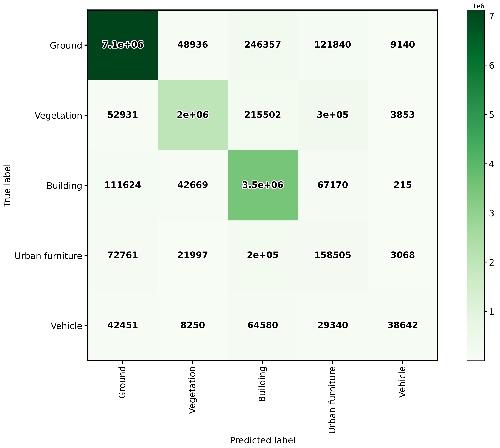
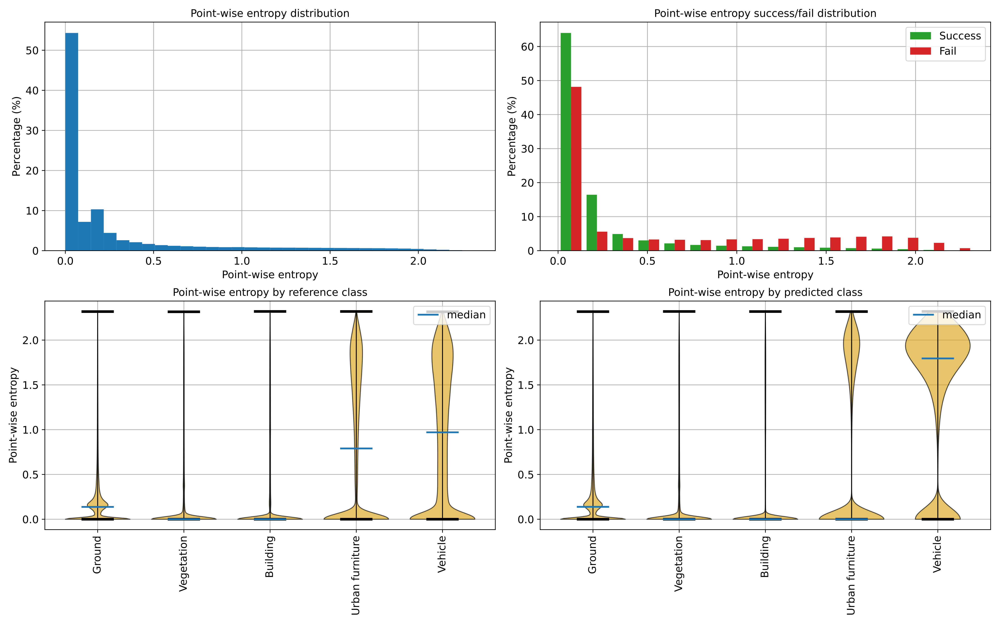
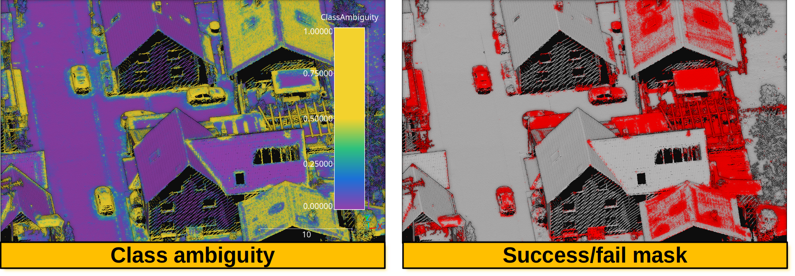
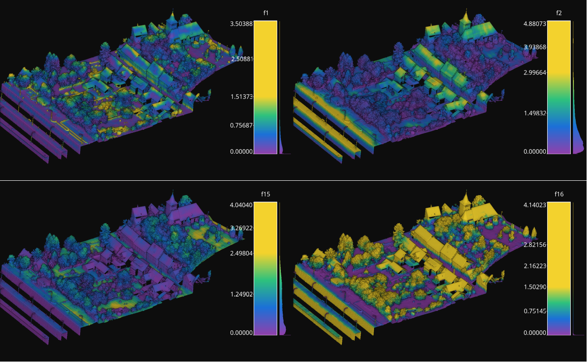

.. _Evaluators page:

Evaluators
************

Evaluators are components that can be used to evaluate the data, the model, or
the predictions. The evaluations are typically represented through
text reports, point clouds, and plots. An :class:`.Evaluator` component is
typically used inside pipelines to assess the performance of a machine learning
model or to understand the insights of a neural network. Readers should be
familiar with :ref:`pipelines <Pipelines page>` to understand how to include
evaluators in their workflows.

Classification evaluator
=========================

The :class:`.ClassificationEvaluator` assumes there is a labeled point cloud
and that some predictions have been computed for that point cloud. It will
consider the predictions and reference labels at the current pipeline's state
and will evaluate them in different ways. A :class:`.ClassificationEvaluator`
can be defined inside a pipeline using the JSON below:

.. code-block:: json

    {
        "eval": "ClassificationEvaluator",
        "class_names": ["Ground", "Vegetation", "Building", "Urban furniture", "Vehicle"],
        "metrics": ["OA", "P", "R", "F1", "IoU", "wP", "wR", "wF1", "wIoU", "MCC", "Kappa"],
        "class_metrics": ["P", "R", "F1", "IoU"],
        "report_path": "*report/global_eval.log",
        "class_report_path": "*report/class_eval.log",
        "confusion_matrix_report_path" : "confusion_matrix.log",
        "confusion_matrix_plot_path" : "confusion_matrix.svg",
        "class_distribution_report_path": "class_distribution.log",
        "class_distribution_plot_path": "class_distribution.svg"
    }

The JSON above defines a :class:`.ClassificationEvaluator` that will consider
many metrics, from the overall accuracy to the Cohen's kappa score, to evaluate
the predicted point clouds. Some metrics will also be considered to compute
class-wise scores. On top of that, the confusion matrix and the distribution of
the points among the classes will be analyzed. All the evaluations can be
exported as a report, typically a text file containing the data or a plot for
quick visualization.

**Arguments**

-- ``class_names``
    A list with the names for the classes. These names will be used to
    represent the classes in the plots and the reports.

-- ``metrics``
    The metrics to evaluate the classification.
    Supported class metrics are:

    * ``"OA"`` Overall accuracy.
    * ``"P"`` Precision.
    * ``"R"`` Recall.
    * ``"F1"`` F1 score (harmonic mean of precision and recall).
    * ``"IoU"`` Intersection over union (also known as Jaccard index).
    * ``"wP"`` Weighted precision (weights by the number of true instances for each class).
    * ``"wR"`` Weighted recall (weights by the number of true instances for each class).
    * ``"wF1"`` Weighted F1 score (weights by the number of true instances for each class).
    * ``"wIoU"`` Weighted intersection over union (weights by the number of true instances for each class).
    * ``"MCC"`` Matthews correlation coefficient.
    * ``"Kappa"`` Cohen's kappa score.

-- ``class_metrics``
    The metrics to evaluate the classification in a class-wise way.
    Supported class metrics are:

    * ``"P"`` Precision.
    * ``"R"`` Recall.
    * ``"F1"`` F1 score (harmonic mean of precision and recall).
    * ``"IoU"`` Intersection over union (also known as Jaccard index).

-- ``report_path``
    Path to write the evaluation of the classification to a text file.

-- ``class_report_path``
    Path to write the class-wise evaluation of the classification to a text
    file.

-- ``confusion_matrix_report_path``
    Path to write the confusion matrix to a text file.

-- ``confusion_matrix_plot_path``
    Path to write the plot representing a confusion matrix to a file.

-- ``class_distribution_report_path``
    Path to write the class distribution report to a text file.

-- ``class_distribution_plot_path``
    Path to write the plot representing the class distribution to a text file.

**Output**

The output is illustrated considering the March 2018 point clouds from the
`Hessigheim dataset <https://ifpwww.ifp.uni-stuttgart.de/benchmark/hessigheim/default.aspx>`_
to compute the classification's evaluation.

The table below represents the confusion matrix exported as a CSV report. The
rows represent the true labels, while the cloumns represent the predictions.

.. csv-table::
    :file: ../csv/classif_eval_confmat.csv
    :widths: 20 20 20 20 20
    :header-rows: 1

The image below represents the confusion matrix as a figure. The information
in the image is the same than the one in the table but in a different format.

    The confusion matrix exported by the classification evaluator.

Classification uncertainty evaluator
======================================
The :class:`.ClassificationUncertaintyEvaluator` can be used to get insights on
what points are more problematic for a given model when solving a particular
point-wise classification task. The evaluation will be more detailed when
there is more data available (e.g., reference labels) but it can also be
computed solely from the predicted probabilities. A
:class:`.ClassificationUncertaintyEvaluator` can be defined inside a pipeline
using the JSON below:

.. code-block:: json

    {
        "eval": "ClassificationUncertaintyEvaluator",
        "class_names": ["Ground", "Vegetation", "Building", "Urban furniture", "Vehicle"],
        "include_probabilities": true,
        "include_weighted_entropy": true,
        "include_clusters": true,
        "weight_by_predictions": false,
        "num_clusters": 10,
        "clustering_max_iters": 128,
        "clustering_batch_size": 1000000,
        "clustering_entropy_weights": true,
        "clustering_reduce_function": "mean",
        "gaussian_kernel_points": 256,
        "report_path": "uncertainty/uncertainty.laz",
        "plot_path": "uncertainty/"
    }

The JSON above defines a :class:`.ClassificationUncertaintyEvaluator` that will
export a point cloud and many plots to the `uncertainty` directory.

**Arguments**

-- ``class_names``
    A list with the names for the classes. These names will be used to
    represent the classes in the plots and the reports.

-- ``include_probabilities``
    Whether to include the probabilities in the output point cloud (True) or
    not (False).

-- ``include_weighted_entropy``
    Whether to include the weighted entropy in the evaluation (True) or not
    (False). The weighted entropy considers either the distribution of
    reference or predicted labels to compensate for unbalanced class
    distributions.

-- ``include_clusters``
    Whether to include the cluster-wise entropy in the evaluation (True) or
    not (False). Note that the cluster-wise entropy might take too long to
    compute depending on how it is configured.

-- ``weight_by_predictions``
    Whether to compute the weighted entropy considering the predictions
    instead of the reference labels (True) or not (False, by default).

-- ``num_clusters``
    How many clusters must be computed for the cluster-wise entropy.

-- ``clustering_max_iters``
    How many iterations are allowed at most when computing the clustering
    algorithm (KMeans).

-- ``clustering_batch_size``
    How many points per batch must be considered when computing the batch
    KMeans.

-- ``clustering_entropy_weights``
    Whether to use point-wise entropy as the sample weights for the KMeans
    clustering (True) or not (False).

-- ``clustering_reduce_function``
    What function must be used to reduce all the entropies in a given cluster
    to a single one that will be assigned to all points in the cluster.
    Supported reduce functions are:

    * ``"mean"`` Select the mean entropy value.
    * ``"median"`` Select the median of the entropy distribution.
    * ``"Q1"`` Select the first quartile of the entropy distribution.
    * ``"Q3"`` Select the third quartile of the entropy distribution.
    * ``"min"`` Select the min entropy value.
    * ``"max"`` Select the max entropy value.

-- ``gaussian_kernel_points``
    How many points will be considered to evaluate each gaussian kernel
    density estimation.

-- ``report_path``
    Path to write the point cloud with the computed uncertainty metrics.

-- ``plot_path``
    Path to the directory where the many plots representing the computed
    uncertainty metrics will be written.

**Output**

The output is illustrated considering the March 2018 point clouds from the
`Hessigheim dataset <https://ifpwww.ifp.uni-stuttgart.de/benchmark/hessigheim/default.aspx>`_
to compute the classification's uncertainty evaluation.

Below, an example of one of the figures that can be generated with the
:class:`.ClassificationUncertaintyEvaluator`. It clearly illustrates that the
point-wise classification of vehicles is problematic.

    Visualization of the point-wise entropy outside the point cloud.

Below, an example of the point cloud representing the uncertainty metrics. In
the general case, it can be seen that a high class ambiguity is associated with
misclassified points. Thus, even in the absence of labeled point clouds, the
uncertainty metrics can be used to understand the problems of a model when
classifying previously unseen data.

        point-wise mask in the 3D point cloud.

    Visualization of a point cloud representing the class ambiguity and the
    success/fail point-wise mask on previously unseen data, respectively.
    Red means failed classification and gray means successfully classified.

Deep learning model evaluator
==============================

The :class:`.DLModelEvaluator` assumes there is a deep learning at the current
pipeline's state that can be used to process the point cloud at the current
pipeline's state. Instead of returning the output point-wise predictions,
the values of the output layer and some internal feature representation will be
returned to be visualized directly in the point cloud. Note that the internal
feature representation might need an enormous amount of memory as it scales
depending on how many features are generated by the architecture at the studied
layer. A :class:`.DLModelEvaluator` can be defined inside a pipeline using the
JSON below:

.. code-block:: json

    {
        "eval": "DLModelEvaluator",
        "pointwise_model_output_path": "pwise_out.laz",
        "pointwise_model_activations_path": "pwise_activations.laz"
    }

The JSON above defines a :class:`.DLModelEvaluator` that will export the
values of the output layer to the file `pwise_out.laz` and a representation
of the features in the hidden layers to the file `pwise_activations.laz`.

**Arguments**

-- ``pointwise_model_output_path``
    Where to export the point cloud with the point-wise outputs of the neural
    network.

-- ``pointwise_model_activations_path``
    Where to export the point cloud with the internal features of the neural
    network.

**Output**

The output is illustrated considering the March 2018 point clouds from the
`Hessigheim dataset <https://ifpwww.ifp.uni-stuttgart.de/benchmark/hessigheim/default.aspx>`_
to compute the deep learning model evaluation. The figure below illustrates
four different features extracted by the neural network. They are taken as the
activated outputs of the last layer before the softmax .

        in the point cloud.

    Visualization of some features used by a PointNet-based neural network for
    point-wise classification.

