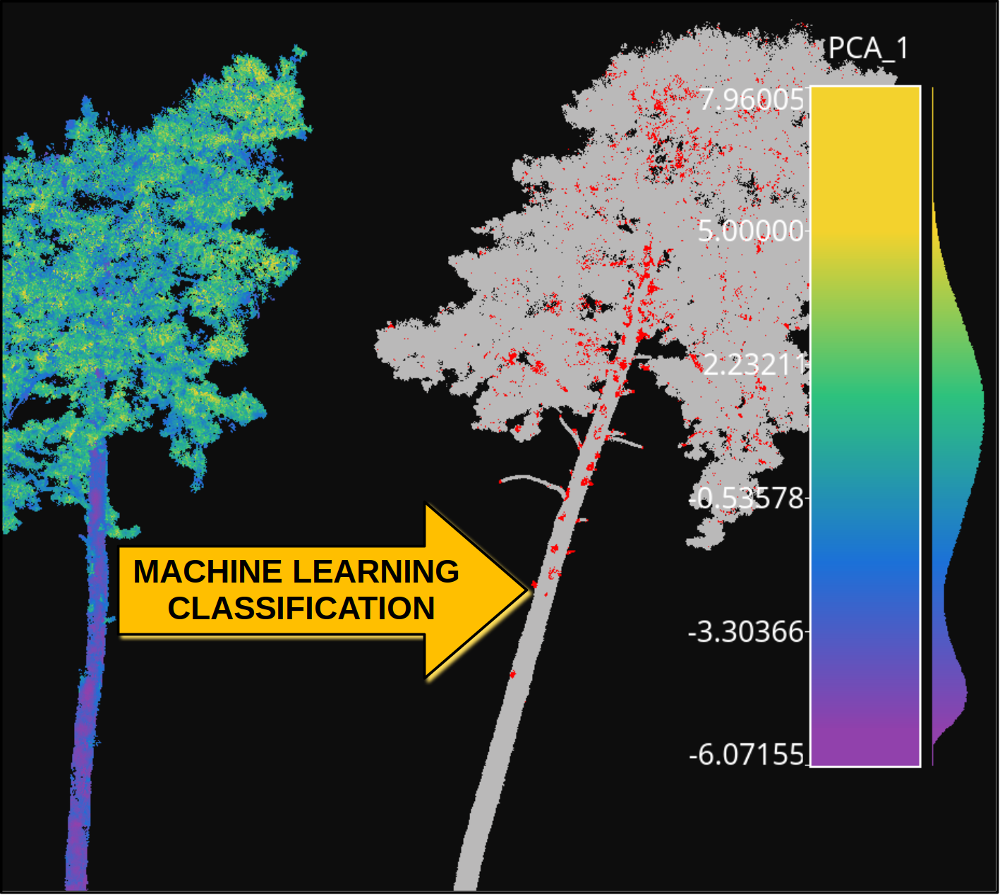

.. _Introduction page:

Introduction
**************

The VirtuaLearn3D (VL3D) framework is a software for point-wise classification and regression on 3D point clouds. It handles the training and prediction operations of the many implemented models. On top of that, it provides useful tools for transforming the point clouds and for automatic feature extraction. Moreover, it also supports evaluations on the data, the models, and the predictions. These evaluations yield further insights and analysis through automatically generated plots, CSV files, text reports, and point clouds.

The VL3D framework is designed so the user can easily decide about the model configuration and define custom pipelines. To achieve this, the user only needs to manipulate JSON files like the one shown below:

.. code-block:: json

    {
      "in_pcloud": [
        "https://3dweb.geog.uni-heidelberg.de/trees_leafwood/PinSyl_KA10_03_2019-07-30_q2_TLS-on_c_t.laz"
      ],
      "out_pcloud": [
        "out/Geometric_PCA_RF_on_PinSyl_KA10_03/*"
      ],
      "sequential_pipeline": [
        {
          "miner": "GeometricFeatures",
          "radius": 0.05,
          "fnames": ["linearity", "planarity", "surface_variation", "eigenentropy", "omnivariance", "verticality", "anisotropy"]
        },
        {
          "miner": "GeometricFeatures",
          "radius": 0.1,
          "fnames": ["linearity", "planarity", "surface_variation", "eigenentropy", "omnivariance", "verticality", "anisotropy"]
        },
        {
          "miner": "GeometricFeatures",
          "radius": 0.2,
          "fnames": ["linearity", "planarity", "surface_variation", "eigenentropy", "omnivariance", "verticality", "anisotropy"]
        },
        {
          "writer": "Writer",
          "out_pcloud": "*pcloud/geomfeats.laz"
        },
        {
          "imputer": "UnivariateImputer",
          "fnames": ["AUTO"],
          "target_val": "NaN",
          "strategy": "mean",
          "constant_val": 0
        },
        {
          "feature_transformer": "Standardizer",
          "fnames": ["AUTO"],
          "center": true,
          "scale": true
        },
        {
          "feature_transformer": "PCATransformer",
          "out_dim": 0.99,
          "whiten": false,
          "random_seed": null,
          "fnames": ["AUTO"],
          "report_path": "*report/pca_projection.log",
          "plot_path": "*plot/pca_projection.svg"
        },
        {
          "writer": "Writer",
          "out_pcloud": "*pcloud/geomfeats_transf.laz"
        },
        {
          "train": "RandomForestClassifier",
          "fnames": ["AUTO"],
          "training_type": "stratified_kfold",
          "random_seed": null,
          "shuffle_points": true,
          "num_folds": 5,
          "model_args": {
            "n_estimators": 4,
            "criterion": "entropy",
            "max_depth": 20,
            "min_samples_split": 5,
            "min_samples_leaf": 1,
            "min_weight_fraction_leaf": 0.0,
            "max_features": "sqrt",
            "max_leaf_nodes": null,
            "min_impurity_decrease": 0.0,
            "bootstrap": true,
            "oob_score": false,
            "n_jobs": 4,
            "warm_start": false,
            "class_weight": null,
            "ccp_alpha": 0.0,
            "max_samples": 0.8
          },
          "autoval_metrics": ["OA", "P", "R", "F1", "IoU", "wP", "wR", "wF1", "wIoU", "MCC", "Kappa"],
          "stratkfold_report_path": "*report/RF_stratkfold_report.log",
          "stratkfold_plot_path": "*plot/RF_stratkfold_plot.svg",
          "hyperparameter_tuning": {
            "tuner": "GridSearch",
            "hyperparameters": ["n_estimators", "max_depth", "max_samples"],
            "nthreads": -1,
            "num_folds": 5,
            "pre_dispatch": 8,
            "grid": {
                "n_estimators": [2, 4, 8, 16],
                "max_depth": [15, 20, 27],
                "max_samples": [0.6, 0.8, 0.9]
            },
            "report_path": "*report/RF_hyper_grid_search.log"
          },
          "importance_report_path": "*report/LeafWood_Training_RF_importance.log",
          "importance_report_permutation": true,
          "decision_plot_path": "*plot/LeafWood_Training_RF_decission.svg",
          "decision_plot_trees": 3,
          "decision_plot_max_depth": 5
        },
        {
          "writer": "PredictivePipelineWriter",
          "out_pipeline": "*pipe/LeafWood_Training_RF.pipe",
          "include_writer": false,
          "include_imputer": true,
          "include_feature_transformer": true,
          "include_miner": true
        }
      ]
    }

The JSON above defines a pipeline to train random forest models. It will
download a labeled point cloud representing the PinSyl_KA10 tree to train a
machine learning model. First, three sets of geometric features are computed
with different radii. The generated features are then written to an
output point cloud **geomfeats.laz** to visualize them
(see the :ref:`geometric features miner documentation <Geometric features miner>`).
The mean value of the feature will replace any feature with an invalid
numerical value through the univariate imputer
(see the :ref:`univariate imputer documentation <Univariate imputer>`).
Afterward, the features are
standardized to have mean zero and standard deviation one
(see the :ref:`standardizer documentation <Standardizer>`).
Then, the dimensionality of the feature space is transformed through PCA
(see the :ref:`PCA transformer documentation <PCA transformer>`), and the
resulting transformed features are exported to **geomfeats_transf.laz**
for visualization.

At this point, the features are used to train a random forest classifier
(see the
:ref:`random forest classifier documentation <Random forest classifier>`).
Using a stratified K-folding training strategy with :math:`K=5`
(see the :ref:`stratified K-folding documentation <Stratified K-folding>`).
The trained model is evaluated through metrics like Overall Accuracy (OA) or
Matthews Correlation Coefficient (MCC). Some model hyperparameters, like the
number of estimators or the max depth of each decision tree,
are explored using a grid search algorithm
(see the :ref:`grid search documentation <Grid search>`).
The best combination of hyperparameters is automatically selected to
train the final model. Finally, the data mining, imputation, and feature
transformation components are assembled with the random forest classifier,
and serialized to a file **LeafWood_Training_RF.pipe** that can be later loaded
to be used as a leaf-wood segmentation model.

Once a predictive pipeline has been exported
(see the :ref:`predictive pipeline documentation <Predictive pipeline section>`)
it can be used as shown in the JSON below:

.. code-block:: json

    {
      "in_pcloud": [
        "https://3dweb.geog.uni-heidelberg.de/trees_leafwood/PinSyl_KA09_T048_2019-08-20_q1_TLS-on_c_t.laz"
      ],
      "out_pcloud": [
        "out/Geometric_PCA_RF_on_PinSyl_KA10_03/prediction/*"
      ],
      "sequential_pipeline": [
        {
          "predict": "PredictivePipeline",
          "model_path": "out/Geometric_PCA_RF_on_PinSyl_KA10_03/pipe/LeafWood_Training_RF.pipe"
        },
        {
          "writer": "ClassifiedPcloudWriter",
          "out_pcloud": "*predicted.laz"
        },
        {
          "eval": "ClassificationEvaluator",
          "class_names": ["Wood", "Leaf"],
          "metrics": ["OA", "P", "R", "F1", "IoU", "wP", "wR", "wF1", "wIoU", "MCC", "Kappa"],
          "class_metrics": ["P", "R", "F1", "IoU"],
          "report_path": "*report/global_eval.log",
          "class_report_path": "*report/class_eval.log",
          "confusion_matrix_report_path" : "*report/confusion_matrix.log",
          "confusion_matrix_plot_path" : "*plot/confusion_matrix.svg",
          "class_distribution_report_path": "*report/class_distribution.log",
          "class_distribution_plot_path": "*plot/class_distribution.svg"
        },
        {
            "eval": "ClassificationUncertaintyEvaluator",
            "class_names": ["Wood", "Leaf"],
            "include_probabilities": true,
            "include_weighted_entropy": true,
            "include_clusters": true,
            "weight_by_predictions": false,
            "num_clusters": 10,
            "clustering_max_iters": 128,
            "clustering_batch_size": 1000000,
            "clustering_entropy_weights": true,
            "clustering_reduce_function": "mean",
            "gaussian_kernel_points": 256,
            "report_path": "*uncertainty/uncertainty.laz",
            "plot_path": "*uncertainty/"
        }
      ]
    }

The JSON above defines a pipeline to compute a leaf-wood segmentation based
on a random forest model. It will download the PinSyl KA10 tree to compute
the predictive pipeline. The predictions will be exported to the
`predicted.laz` point cloud. Furthermore, the point-wise classification can be
evaluated because there are available labels on that tree
(see the :ref:`classification evaluator documentation <Classification evaluator section>`).
Afterward, the uncertainty of the classification is also evaluated
(see the :ref:`classification uncertainty evaluator documentation <Classification uncertainty evaluator section>`).

The figure below represents the previous process. It shows the training tree
colored by the PCA-transformed feature which explains the highest variance
ratio. It also shows the previously unseen tree as segmented by the model,
with points colored gray if correctly classified or red if misclassified.

        classification.

    Visualization of a point-wise leaf-wood segmentation. The tree on the left
    side represents the training data, while the tree on the right side
    represents the leaf-wood segmentation computed on a previously unseen tree.
    The gray points are successful classifications, the red ones are
    misclassifications.

The table below represents the precision (P), recall (R), F1-score (F1), and
the intersection over union or Jaccard index (IoU) of the leaf-wood
segmentation represented in the figure above. The overall accuracy (OA) of the
classification is around :math:`93\%`.

.. csv-table::
    :file: ../csv/intro_demo_class_eval.csv
    :widths: 20 20 20 20 20
    :header-rows: 1

You can automatically reproduce the explained model with the JSON
specifications provided as a demo together with the source code in our
`GitHub repository <https://github.com/3dgeo-heidelberg/virtualearn3d>`_.
The first step is to get into the software directory. Then, for training
you can run:

.. code-block:: bash

    python vl3d.py --pipeline spec/demo/mine_transform_and_train_pipeline_pca_from_url.json

Finally, you can compute the point-wise segmentation on a previously unseen
tree using:

.. code-block:: bash

    python vl3d.py --pipeline spec/demo/predict_and_eval_pipeline_from_url.json

