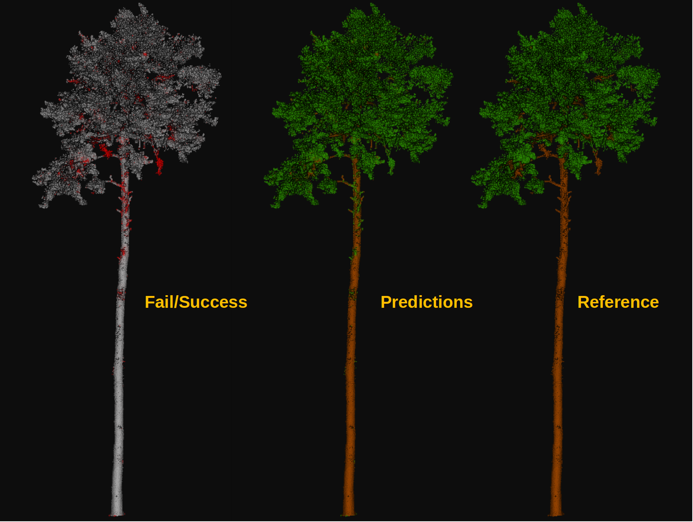

.. _Machine learning page:

Machine learning
******************

Machine learning was defined by Tom Mitchell in 1997 as computer programs
that learn from experience :math:`E` with respect to some task :math:`T`
and some performance measure :math:`P`. Here we will explain how machine
learning can be used to solve tasks related to point clouds.

Note that applying machine learning models to point clouds requires point-wise
features because machine learning models will classify the points from the
features. The features can typically be specified through the ``fnames`` in
the JSON as a list of string where each string is the name of an attribute
in the input LAS/LAZ point cloud. Alternatively, features can also be mined
using the data mining methods in the VL3D framework. See
:ref:`data mining documentation <Data mining page>`.

Models
===========

.. _Random forest classifier:

Random forest classifier
---------------------------

The :class:`.RandomForestClassificationModel` can be used to solve point-wise
classification tasks. The random forest is an ensemble of decision trees such
that each individual decision tree is trained on a different random subset of
the training dataset. The final prediction of a random forest model for
classification is computed as the most frequent prediction considering all the
trees in the ensemble. In the VL3D framework,
`scikit learn (sklearn) <https://scikit-learn.org/stable/modules/generated/sklearn.ensemble.RandomForestClassifier.html>`_
is used as the backend for the random forest implementation. A
:class:`.RandomForestClassificationModel` can be defined as shown in the JSON
below:

.. code-block:: json

    {
        "train": "RandomForestClassifier",
        "fnames": ["AUTO"],
        "training_type": "base",
        "random_seed": null,
        "shuffle_points": false,
        "model_args": {
            "n_estimators": 4,
            "criterion": "entropy",
            "max_depth": 20,
            "min_samples_split": 5,
            "min_samples_leaf": 1,
            "min_weight_fraction_leaf": 0.0,
            "max_features": "sqrt",
            "max_leaf_nodes": null,
            "min_impurity_decrease": 0.0,
            "bootstrap": true,
            "oob_score": false,
            "n_jobs": 4,
            "warm_start": false,
            "class_weight": null,
            "ccp_alpha": 0.0,
            "max_samples": 0.8
        },
        "hyperparameter_tuning": null,
        "importance_report_path": "RF_importance.log",
        "importance_report_permutation": true,
        "decision_plot_path": "RF_decision.svg",
        "decision_plot_trees": 3,
        "decision_plot_max_depth": 5
    }

The JSON above defines a :class:`.RandomForestClassificationModel` made of
four decision trees. It is trained in a straightforward way with no
hyperparameter tuning. Once the model is trained. the feature importance for
each feature is written to a text file called `RF_importance.log`, while three
decision trees in the ensemble are graphically represented up to depth five.
The graphical representation of the decision trees is exported to the
`RF_decision.svg` file.

**Arguments**

-- ``fnames``
    The names of the features to be considered to train the model. If
    ``"AUTO"``, the features considered by the last component that operated
    over the features will be selected.

-- ``training_type``
    Either ``"base"``, ``"autoval"``, or ``"stratified_kfold"``. For further
    details, read the :ref:`training strategies section <Training strategies>`.

-- ``random_seed``
    Can be used to specify an integer like seed for any randomness-based
    computation. Mostly to be used for reproducibility purposes.

-- ``shuffle_points``
    Whether to randomly shuffle the points (True) or not (False). It only has
    an effect when using the ``"autoval"`` or ``"stratified_kfold"`` training
    strategies.

-- ``model_args``
    The arguments governing the Random Forest model. See the
    `sklearn documentation on Random Forest <https://scikit-learn.org/stable/modules/generated/sklearn.ensemble.RandomForestClassifier.html>`_
    for further details.

-- ``hyperparameter_tuning``
    This argument can be used to specify an hyperparameter tuning strategy
    using automated machine learning (AutoML) methods. For further details,
    read the :ref:`hyperparameter tuning section <Hyperparameter tuning>`.

-- ``importance_report_path``
    Path to a file where the computed feature importances will be exported.

-- ``importance_report_permutation``
    True to enable permutation invariance, false to ignore it. Permutation
    invariance importance is more robust than the straightforward importance.
    However, it increases the computational cost since it computes feature-wise
    permutations many times. See the
    `sklearn documentation on permutation importance <https://scikit-learn.org/stable/modules/permutation_importance.html>`_
    for further details.

-- ``decision_plot_path``
    Path to a file where the requested plots representing the decision
    trees in the ensemble will be written. The path refers to the base file.
    Many files will be named the same but appending a ``"_n"`` at the
    end, where n is the number of the tree.

-- ``decision_plot_trees``
    How many decision trees must be plotted. Using ``-1`` implies plotting
    all the decision trees in the ensemble.

-- ``decision_plot_max_depth``
    The max depth to consider for the graphical representation of the trees.

**Output**

The table below is an example of the reported feature importances on a dataset
where the geometric features have been transformed through PCA. The
"PERM. IMP." columns refer to the permutation invariance feature importance
(mean and standard deviation, respectively).

.. csv-table::
    :file: ../csv/ml_rfclassif_importances.csv
    :widths: 15 20 20 20
    :header-rows: 1

.. _Training strategies:

Training strategies
=====================

The VL3D framework supports three different strategies when training machine
learning models. They are base, auto-validation, and
stratified K-folding. The **base** strategy is a straightforward training
of the model. The **auto-validation** strategy extracts a subset of the
training dataset for later evaluation. The **stratified K-folding** combines
stratification and K-folding to have an initial quantification of the model's
variance.

Base training
---------------

Base training is simple. The model is trained considering the input training
dataset in a straightforward way. It is enough with setting
:code:`"training_type": "base"` in the JSON file, nothing else needs to be done.

Auto-validation
-----------------

In auto-validation training, a subset of the training dataset is explicitly
avoided during training so it represents previously unseen data. As this subset
is not used during training, it can be used to compute a reasonable initial
estimation of the generalization capabilities of the model. While this
validation is not enough because, typically, the validation data comes from a
very similar distribution to the training data, it yields valuable information
directly inside the training pipeline. After all, if a model does not present a
good generalization on a similar data distribution, it is not likely to
generalize well to datasets with different characteristics.

To use an auto-validation training strategy one must set
:code:`"training_type: "autoval"` in the model training component. On top of
that, the arguments detailed below can be used to configure the
auto-validation.

.. code-block:: json

    {
        "training_type": "autoval",
        "autoval_metrics": ["OA", "MCC"],
        "autoval_size": 0.2,
        "shuffle_points": true
    }

-- ``autoval_metrics``
    A list of strings representing the metrics to compute for the
    auto-validation. The following can be used:

    * ``"OA"`` Overall accuracy.
    * ``"P"`` Precision.
    * ``"R"`` Recall.
    * ``"F1"`` F1 score (harmonic mean of precision and recall).
    * ``"IoU"`` Intersection over union (also known as Jaccard index).
    * ``"wP"`` Weighted precision (weights by the number of true instances for each class).
    * ``"wR"`` Weighted recall (weights by the number of true instances for each class).
    * ``"wF1"`` Weighted F1 score (weights by the number of true instances for each class).
    * ``"wIoU"`` Weighted intersection over union (weights by the number of true instances for each class).
    * ``"MCC"`` Matthews correlation coefficient.
    * ``"Kappa"`` Cohen's kappa score.

-- ``autoval_size``
    How many training data consider for the auto validation subset. It must
    be given as a number inside :math:`(0, 1]` when given as a float (ratio) or
    inside :math:`(0, m]` when given as an int (number of points).

-- ``shuffle_points``
    Whether to randomly shuffle the points (True) or not (False).

.. _Stratified K-folding:

Stratified K-folding
----------------------

Understanding the stratified K-folding strategy for training requires
understanding stratification and K-folding.

Stratification consists of dividing the data into
subsets (stratum). Then, a subset of test points is built by selecting
points from each stratum. The idea is that they follow a class distribution
approximately proportional to the distribution in the original dataset.
Therefore, the test points are expected to offer a reliable representation of
the input dataset.

K-folding consists of dividing the data into :math:`K` different subsets
called folds. Then, :math:`K` iterations are computed such that each one
considers a different fold as the test set and the other :math:`K-1` folds
as the training dataset.

Stratified K-folding is K-folding with stratified folds, i.e., each fold is
also considered a stratum, and therefore, it does better preserve the
proportionality of the original class distribution.

To use a stratified K-folding strategy one must set
``"training_type": "stratified_kfold"`` in the model training component. On top
of that, the arguments detailed below can be used to configure the
stratified K-folding.

.. code-block:: json

    {
        "training_type": "stratified_kfold",
        "autoval_metrics": ["OA", "MCC"],
        "num_folds": 5,
        "shuffle_points": true,
        "stratkfold_report_path": "stratkfold_report.log",
        "stratfold_plot_path": "startkfold_plot.svg"
    }

-- ``autoval_metrics``
    A list of strings representing the metrics to compute on the test subsets
    during the stratified K-folding. The following can be used:

    * ``"OA"`` Overall accuracy.
    * ``"P"`` Precision.
    * ``"R"`` Recall.
    * ``"F1"`` F1 score (harmonic mean of precision and recall).
    * ``"IoU"`` Intersection over union (also known as Jaccard index).
    * ``"wP"`` Weighted precision (weights by the number of true instances for each class).
    * ``"wR"`` Weighted recall (weights by the number of true instances for each class).
    * ``"wF1"`` Weighted F1 score (weights by the number of true instances for each class).
    * ``"wIoU"`` Weighted intersection over union (weights by the number of true instances for each class).
    * ``"MCC"`` Matthews correlation coefficient.
    * ``"Kappa"`` Cohen's kappa score.

-- ``num_folds``
    How many folds. Note that stratified K-folding only makes sense for two or
    more folds.

-- ``shuffle_points``
    When true, the points will be randomly sampled before computing the
    subsets. However, points in the same split are not shuffled.

-- ``stratkfold_report_path``
    The path where a text report summarizing the stratified K-folding will
    be exported.

-- ``stratkfold_plot_path``
    The path where a plot representing the results of the stratified K-folding
    will be written.

.. _Hyperparameter tuning:

Hyperparameter tuning
========================

The model's parameters are automatically derived from the data when training
the model. However, the model's hyperparameters are not handled by the training
algorithm. Instead, they must be handled by the data scientist. However, it
is possible to use AutoML methods to ease the process of hyperparameter
optimization. These methods enable the data scientist to define automatic
search procedures to automatically find an adequate set of hyperparameters.

The hyperparameter strategies can be included into any training component
based on machine learning. To achieve this, simply give the specification
of the hyperparameter strategy associated to the ``"hyperparameter_tuning"``
key.

.. _Grid search:

Grid search
--------------

Grid search can be used to automatically find the best combination for a set
of hyperparameters. More concretely, a set family must be given such that
its elements are sets, each defining the values for a given hyperparamter. The
grid search algorithm will explore all the potential combinations derived from
the Cartesian product between these sets. For example, a grid of two
hyperparameters can be defined in JSON with
``"criterion": ["gini", "entropy"]`` and
``"max_depth": [5, 10, 15]``. The :class:`.HyperGridSearch` component will
explore the combinations given by the Cartesian product, i.e.,
``[("gini", 5), ("gini", 10), ("gini", 15), ("entropy", 5), ("entropy", 10), ("entropy", 15)]``.

The arguments detailed below can be used to configure an arbitrary grid search
on the hyperparameters of the machine learning model.

.. code-block:: json

    "hyperparameter_tuning": {
        "tuner": "GridSearch",
        "hyperparameters": ["n_estimators", "max_depth", "max_samples"],
        "num_folds": 5,
        "grid": {
            "n_estimators": [2, 4, 8, 16],
            "max_depth": [15, 20, 27],
            "max_samples": [0.6, 0.8, 0.9]
        },
        "nthreads": -1,
        "pre_dispatch": 8,
        "report_path": "hyper_grid_search.log"
    }

-- ``hyperparameters``
    A list with the names of the hyperparameters to be considered.

-- ``num_folds``
    How many folds consider to validate the model following a K-folding
    strategy for each node explored during the grid search.

-- ``grid``
    A key-value specification of the search space. Each key must be the
    name of a feature and each value must be a list of the values to be
    explored during the grid search.

-- ``nthreads``
    How many threads use when computing the grid search. Note that the model
    might be run in parallel too. In that case, it is important to consider
    the sum between the threads used by the model and the threads used by the
    grid search.

-- ``pre_dispatch``
    How many jobs will be dispatched during the parallel execution. It can be
    used to prevent dispatching more jobs than desired, e.g., to avoid
    resource exhaustion.

-- ``report_path``
    When given, a text report about the grid search will be exported to the
    file pointed by the path.

Random search
---------------

Random search can be used to automatically find the best combination for some
given hyperparameters. A :class:`.HyperRandomSearch` will run many iterations
and at each one it will compute a random value for each hyperparameter. The
arguments detailed below can be used to configure an arbitrary random search on
the hyperparameters of the machine learning model.

.. code-block:: json

    "hyperparameter_tuning": {
        "tuner": "RandomSearch",
        "hyperparameters": ["n_estimators", "max_depth", "ccp_alpha", "min_impurity_decrease", "criterion"],
        "iterations": 32,
        "num_folds": 5,
        "distributions": {
            "n_estimators": {
                "distribution": "randint",
                "start": 2,
                "end": 17
            },
            "max_depth": {
                "distribution": "randint",
                "start": 10,
                "end": 31
            },
            "ccp_alpha": {
                "distribution": "uniform",
                "start": 0.0,
                "offset": 0.05
            },
            "min_impurity_decrease": {
                "distribution": "normal",
                "mean": 0.01,
                "stdev": 0.001
            },
            "criterion": ["gini", "entropy", "log_loss"]
        },
        "report_path": "random_search.log",
        "nthreads": -1,
        "pre_dispatch": 8
    }

-- ``hyperparameters``
    A list with the names of the hyperparameters to be considered.

-- ``iterations``
    How many iterations of random search must be computed. At each iteration
    a random value is taken for each tuned hyperparameter.

-- ``num_folds``
    How many folds consider to validate the model following a K-folding
    strategy for each node explored during the random search.

-- ``distributions``
    The specification of the random distributions to take the values at each
    random search iteration. Distributions can be specified in four different
    ways:

    #. List
        In this case, the elements of the list will be uniformly sampled.

    #. Uniform discrete random variable
        In this case, the values will be taken from a uniform discrete random
        distribution. The ``start`` value is included, the ``end`` value is
        excluded.

    #. Uniform continuous random variable
        In this case, the values will be taken from a uniform continuous random
        distribution. The included values range from ``start`` to
        ``start + offset`` (inclusive).

    #. Normal continuous random variable
        In this case, the values will be taken from a normal continuous random
        distribution with given mean and standard deviation.

-- ``nthreads``
    How many threads use when computing the random search. Note that the model
    might be run in parallel too. In that case, it is important to consider
    the sum between the threads used by the model and the threads used by the
    grid search.

-- ``pre_dispatch``
    How many jobs will be dispatched during the parallel execution. It can be
    used to prevent dispatching more jobs than desired, e.g., to avoid
    resource exhaustion.

-- ``report_path``
    When given, a text report about the random search will be exported to the
    file pointed by the path.

Working example
=================

This example shows how to define two different pipelines, one to train a model
and export it as a :class:`.PredictivePipeline`, the other to use the
predictive pipeline to compute a leaf-wood segmentation on another point cloud.
Readers are referred to the :ref:`pipelines documentation <Pipelines page>` to
read more about how pipelines work and to see more examples.

Training pipeline
--------------------

The training pipeline will train two models, each on a different input point
cloud. In this case, the input point clouds are specified using a URL format,
i.e., the framework will automatically download them, providing the given links
point to a valid and accessible LAS/LAZ file. The output for each model will be
written to a different directory.

The pipeline starts computing the geometric features on many different radii.
Then, the geometric features are exported to a file inside the `pcloud` folder
in the corresponding output directory (see the
:ref:`sequential pipeline documentation <Sequential pipeline>` to understand
how the ``*`` works when specifying output paths). Then, an univariate
imputation is applied to NaN values, followed by a standardization. Afterward,
a PCA transformer takes as many principal components as necessary to project
the features on an orthogonal basis that explains at least :math:`99\%` of
the variance. These transformed features are exported to the
`geomfeats_transf.laz` file before training a random forest classifier on them.
The random forest model is trained using stratified K-folding to assess its
variance and potential generalization. On top of that, grid search is used
as a hyperparameter tuning strategy to automatically find a good combination
of max tree depth, max number of samples per tree, and the number of decision
trees in the ensemble. Finally, the model is exported to a predictive pipeline
that can later be used to compute predictions on previously unseen models.

.. code-block:: json

    {
        "in_pcloud": [
            "https://3dweb.geog.uni-heidelberg.de/trees_leafwood/PinSyl_KA09_T048_2019-08-20_q1_TLS-on_c_t.laz",
            "https://3dweb.geog.uni-heidelberg.de/trees_leafwood/PinSyl_KA10_03_2019-07-30_q2_TLS-on_c_t.laz"
        ],
        "out_pcloud": [
            "out/training/PinSyl_KA09_T048_pca_RF/*",
            "out/training/PinSyl_KA10_03_pca_RF/*"
        ],
        "sequential_pipeline": [
            {
                "miner": "GeometricFeatures",
                "radius": 0.05,
                "fnames": ["linearity", "planarity", "surface_variation", "eigenentropy", "omnivariance", "verticality", "anisotropy"]
            },
            {
                "miner": "GeometricFeatures",
                "radius": 0.1,
                "fnames": ["linearity", "planarity", "surface_variation", "eigenentropy", "omnivariance", "verticality", "anisotropy"]
            },
            {
                "miner": "GeometricFeatures",
                "radius": 0.2,
                "fnames": ["linearity", "planarity", "surface_variation", "eigenentropy", "omnivariance", "verticality", "anisotropy"]
            },
            {
                "writer": "Writer",
                "out_pcloud": "*pcloud/geomfeats.laz"
            },
            {
                "imputer": "UnivariateImputer",
                "fnames": ["AUTO"],
                "target_val": "NaN",
                "strategy": "mean",
                "constant_val": 0
            },
            {
                "feature_transformer": "Standardizer",
                "fnames": ["AUTO"],
                "center": true,
                "scale": true
            },
            {
                "feature_transformer": "PCATransformer",
                "out_dim": 0.99,
                "whiten": false,
                "random_seed": null,
                "fnames": ["AUTO"],
                "report_path": "*report/pca_projection.log",
                "plot_path": "*plot/pca_projection.svg"
            },
            {
                "writer": "Writer",
                "out_pcloud": "*pcloud/geomfeats_transf.laz"
            },
            {
                "train": "RandomForestClassifier",
                "fnames": ["AUTO"],
                "training_type": "stratified_kfold",
                "random_seed": null,
                "shuffle_points": true,
                "num_folds": 5,
                "model_args": {
                    "n_estimators": 4,
                    "criterion": "entropy",
                    "max_depth": 20,
                    "min_samples_split": 5,
                    "min_samples_leaf": 1,
                    "min_weight_fraction_leaf": 0.0,
                    "max_features": "sqrt",
                    "max_leaf_nodes": null,
                    "min_impurity_decrease": 0.0,
                    "bootstrap": true,
                    "oob_score": false,
                    "n_jobs": 4,
                    "warm_start": false,
                    "class_weight": null,
                    "ccp_alpha": 0.0,
                    "max_samples": 0.8
                },
                "autoval_metrics": ["OA", "P", "R", "F1", "IoU", "wP", "wR", "wF1", "wIoU", "MCC", "Kappa"],
                "stratkfold_report_path": "*report/RF_stratkfold_report.log",
                "stratkfold_plot_path": "*plot/RF_stratkfold_plot.svg",
                "hyperparameter_tuning": {
                    "tuner": "GridSearch",
                    "hyperparameters": ["n_estimators", "max_depth", "max_samples"],
                    "nthreads": -1,
                    "num_folds": 5,
                    "pre_dispatch": 8,
                    "grid": {
                        "n_estimators": [2, 4, 8, 16],
                        "max_depth": [15, 20, 27],
                        "max_samples": [0.6, 0.8, 0.9]
                    },
                    "report_path": "*report/RF_hyper_grid_search.log"
                },
                "importance_report_path": "*report/LeafWood_Training_RF_importance.log",
                "importance_report_permutation": true,
                "decision_plot_path": "*plot/LeafWood_Training_RF_decision.svg",
                "decision_plot_trees": 3,
                "decision_plot_max_depth": 5
            },
            {
                "writer": "PredictivePipelineWriter",
                "out_pipeline": "*pipe/LeafWood_Training_RF.pipe",
                "include_writer": false,
                "include_imputer": true,
                "include_feature_transformer": true,
                "include_miner": true
            }
        ]
    }

The table below is the report describing the findings of the grid search
strategy. On the left side of the table, the columns correspond to the
optimized hyperparameters. On the right side, the mean and standard deviation
of the accuracy (percentage), and the mean and standard deviation of the
training time (seconds).

.. csv-table::
    :file: ../csv/ml_rfclassif_hypergridsearch.csv
    :widths: 10 10 10 10 10 10 10
    :header-rows: 1

Predictive pipeline
----------------------

The predictive pipeline will use the model trained on the first point cloud to
compute leaf-wood segmentation on the second point cloud. The input point cloud
will be downloaded from the given URL. The classified point cloud will be
written including some extra information like the fail/success point-wise mask
(because :class:`.ClassifiedPcloudWriter` is used instead of :class:`.Writer`)
to the `predicted.laz` file. The predicted labels will also be exported to
the single-column file `predictions.lbl`. Finally, the
:class:`.ClassificationEvaluator` component is used to analyze the predictions
with respect to the expected values. In doing so, many reports and plots
are generated including confusion matrices, and the requested evaluation
metrics.

.. code-block:: json

    {
        "in_pcloud": [
            "https://3dweb.geog.uni-heidelberg.de/trees_leafwood/PinSyl_KA10_03_2019-07-30_q2_TLS-on_c_t.laz"
        ],
        "out_pcloud": [
            "out/prediction/PinSyl_KA09_T048_pca_RF/PinSyl_KA10_03/*"
        ],
        "sequential_pipeline": [
            {
                "predict": "PredictivePipeline",
                "model_path": "out/training/PinSyl_KA09_T048_pca_RF/pipe/LeafWood_Training_RF.pipe"
            },
            {
                "writer": "ClassifiedPcloudWriter",
                "out_pcloud": "*predicted.laz"
            },
            {
                "writer": "PredictionsWriter",
                "out_preds": "*predictions.lbl"
            },
            {
                "eval": "ClassificationEvaluator",
                "class_names": ["wood", "leaf"],
                "metrics": ["OA", "P", "R", "F1", "IoU", "wP", "wR", "wF1", "wIoU", "MCC", "Kappa"],
                "class_metrics": ["P", "R", "F1", "IoU"],
                "report_path": "*report/global_eval.log",
                "class_report_path": "*report/class_eval.log",
                "confusion_matrix_report_path" : "*report/confusion_matrix.log",
                "confusion_matrix_plot_path" : "*plot/confusion_matrix.svg",
                "class_distribution_report_path": "*report/class_distribution.log",
                "class_distribution_plot_path": "*plot/class_distribution.svg"
            }
        ]
    }

The table below exemplifies the evaluation metrics describing how good the
predictions are with respect to the expected values.

.. csv-table::
    :file: ../csv/ml_rfclassif_predict_global_eval.csv
    :widths: 9 9 9 9 9 9 9 9 9 9 9
    :header-rows: 1

The figure below represents the computed leaf-wood segmentation directly
visualized in the point cloud.

        cloud with previously unseen data.

    Visualization of the output obtained after computing a leaf-wood
    segmentation on a dataset containing a previously unseen tree.
    On the left, the red points represent misclassified points while the
    gray points represent successfully classified points. In the middle, the
    point-wise predicted labels (green for leaf, brown for wood). In the
    right, the point-wise reference labels.
