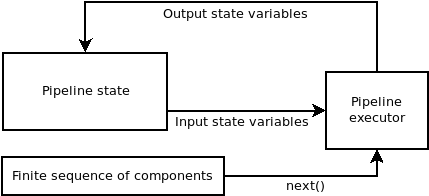
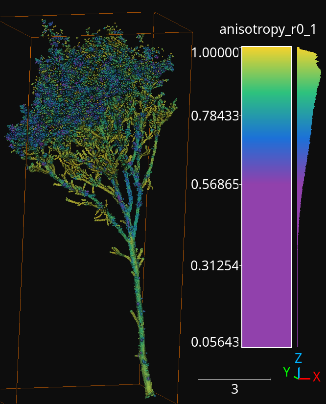
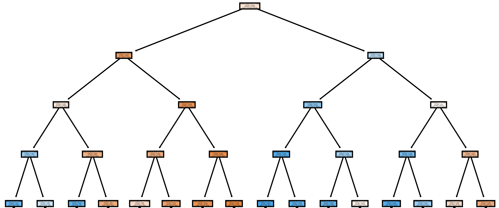
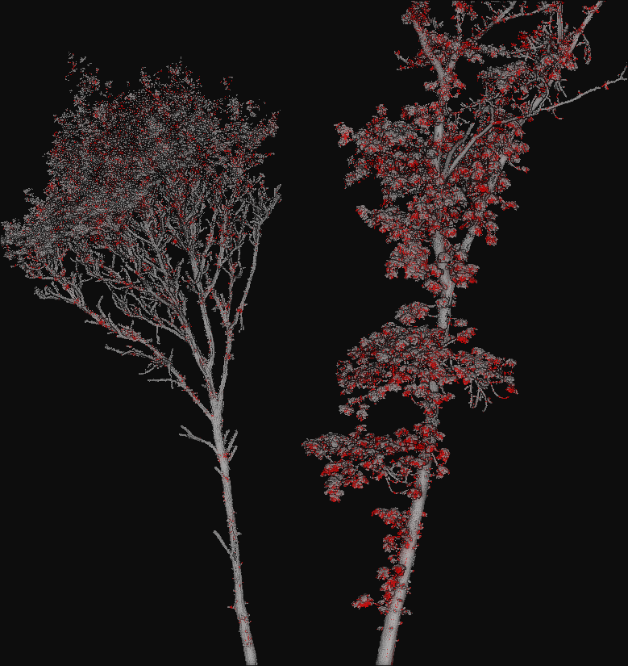

.. _Pipelines page:

Pipelines
***********

The VirtuaLearn3D (VL3D) framework supports the definition of pipelines
combining different components into an ordered sequence of steps. Thus, it is
possible to define a pipeline that mines features, selects the most convenient
ones, and trains a machine learning model for point-wise classification tasks.
Then, this pipeline can be exported as a predictive pipeline that can be
applied to different point clouds.

.. _Sequential pipeline

Sequential pipeline
======================

A sequential pipeline is a connected sequence of components such that the
component at :math:`t+1` is executed on the state of the pipeline at :math:`t`
and potentially transforms it (depending on the component type).

    Diagram representing the logic of the sequential pipeline. The components
    are taken from the finite sequence until it has finished.

A sequential pipeline can be defined using JSON. First, let us start by how to
specify the input and the output.

.. code-block:: json

    {
        "in_pcloud": ["/my/input/pcloud1.laz", "/my/input/pcloud2.laz"],
        "out_pcloud": ["/my/output/pcloud1/*", "/my/output/pcloud2/*"],
        "sequential_pipeline": []
    }

In the JSON above, the ``in_pcloud`` key defines a list of input paths. In
general, these are expected to be point clouds in LAS or LAZ format. The
pipeline will be run independently one time for each point cloud in the input
list. Furthermore, the ``out_pcloud`` key defines a list of output paths. The
final asterisk '*' at the end of these paths specifies that they will be
considered output prefixes. In other words, components that write some type
of output will append the output prefix to their paths (when they start by
another asterisk '*'). The interpretation of the JSON is that the output
generated by the pipeline when running on `pcloud1.laz` will be written to
`/my/output/pcloud1/`, while the output for `pcloud2.laz` will be written to
`/my/output/pcloud2/`.

Now, it is time to look at the ``sequential_pipeline`` specification. It must
be a list of components such that they will be executed in the same order
they are given. For example, it can be a sequence of two feature mining
components, followed by a writer to export the point cloud with features, an
imputer to handle numeric problems in the computed features, and
a Random Forest classifier, as shown in the JSON below:

.. code-block:: json

    {
      "in_pcloud": [
        "test_data/QuePet_BR01_01_2019-07-03_q2_TLS-on_c.laz",
        "test_data/test_tree.laz"
      ],
      "out_pcloud": [
        "out/training/sphinx/QuePet_BR01_kbest_RF/*",
        "out/training/sphinx/test_tree_kbest_RF/*"
      ],
      "sequential_pipeline": [
        {
          "miner": "GeometricFeatures",
          "radius": 0.05,
          "fnames": ["linearity", "planarity", "surface_variation", "eigenentropy", "omnivariance", "verticality", "anisotropy"],
          "frenames": ["linearity_r0_05", "planarity_r0_05", "surface_variation_r0_05", "eigenentropy_r0_05", "omnivariance_r0_05", "verticality_r0_05", "anisotropy_r0_05"]
        },
        {
          "miner": "GeometricFeatures",
          "radius": 0.1,
          "fnames": ["linearity", "planarity", "surface_variation", "eigenentropy", "omnivariance", "verticality", "anisotropy"],
          "frenames": ["linearity_r0_1", "planarity_r0_1", "surface_variation_r0_1", "eigenentropy_r0_1", "omnivariance_r0_1", "verticality_r0_1", "anisotropy_r0_1"]
        },
        {
          "writer": "Writer",
          "out_pcloud": "*pcloud/geomfeats.laz"
        },
        {
          "imputer": "RemovalImputer",
          "target_val": "NaN",
          "fnames": ["AUTO"]
        },
        {
          "train": "RandomForestClassifier",
          "fnames": ["AUTO"],
          "training_type": "base",
          "random_seed": null,
          "model_args": {
            "n_estimators": 4,
            "criterion": "entropy",
            "max_depth": 20,
            "min_samples_split": 5,
            "min_samples_leaf": 1,
            "min_weight_fraction_leaf": 0.0,
            "max_features": "sqrt",
            "max_leaf_nodes": null,
            "min_impurity_decrease": 0.0,
            "bootstrap": true,
            "oob_score": false,
            "n_jobs": 4,
            "warm_start": false,
            "class_weight": null,
            "ccp_alpha": 0.0,
            "max_samples": 0.8
          }
        },
        {
          "writer": "PredictivePipelineWriter",
          "out_pipeline": "*pipe/LeafWood_Training_RF.pipe",
          "include_writer": false,
          "include_imputer": true,
          "include_miner": true
        }
      ]
    }

Finally, we can run the pipeline with a simple command (assuming our JSON file
is named `my_pipeline.json`):

.. code-block:: bash

    python3 vl3d.py --pipepline my_pipeline.json

As a result, we will obtain a predictive pipeline that can be used to
compute point-wise leaf-wood segmentation on input point clouds. We will also
obtain a point cloud that we can use to visualize the generated features. For
example, the image below offers a visualization of the anisotropy for spherical
negibhorhoods of :math:`10\,\mathrm{cm}` radius.

    The anisotropy geometric feature computed during the execution of the
    pipeline for a radius of :math:`10\,\mathrm{cm}`.

Working example
----------------

The JSON below provides an example of a sequential pipeline to train a
random forest for leaf-wood segmentation with more components. Pipelines like
this one are more likely to arise during real data processing.

.. code-block:: json

    {
      "in_pcloud": [
        "test_data/QuePet_BR01_01_2019-07-03_q2_TLS-on_c.laz",
        "test_data/test_tree.laz"
      ],
      "out_pcloud": [
        "out/training/QuePet_BR01_kbest_RF/*",
        "out/training/test_tree_kbest_RF/*"
      ],
      "sequential_pipeline": [
        {
          "miner": "GeometricFeatures",
          "radius": 0.05,
          "fnames": ["linearity", "planarity", "surface_variation", "eigenentropy", "omnivariance", "verticality", "anisotropy"],
          "frenames": ["linearity_r0_05", "planarity_r0_05", "surface_variation_r0_05", "eigenentropy_r0_05", "omnivariance_r0_05", "verticality_r0_05", "anisotropy_r0_05"]
        },
        {
          "miner": "GeometricFeatures",
          "radius": 0.1,
          "fnames": ["linearity", "planarity", "surface_variation", "eigenentropy", "omnivariance", "verticality", "anisotropy"],
          "frenames": ["linearity_r0_1", "planarity_r0_1", "surface_variation_r0_1", "eigenentropy_r0_1", "omnivariance_r0_1", "verticality_r0_1", "anisotropy_r0_1"]
        },
        {
          "writer": "Writer",
          "out_pcloud": "*pcloud/geomfeats.laz"
        },
        {
          "imputer": "RemovalImputer",
          "target_val": "NaN",
          "fnames": ["AUTO"]
        },
        {
          "feature_transformer": "KBestSelector",
          "type": "classification",
          "k": 5,
          "fnames": ["AUTO"],
          "report_path": "*report/kbest_selection.log"
        },
        {
          "writer": "Writer",
          "out_pcloud": "*geomfeats_transf.laz"
        },
        {
          "train": "RandomForestClassifier",
          "fnames": ["AUTO"],
          "training_type": "stratified_kfold",
          "random_seed": null,
          "shuffle_points": true,
          "num_folds": 5,
          "model_args": {
            "n_estimators": 4,
            "criterion": "entropy",
            "max_depth": 20,
            "min_samples_split": 5,
            "min_samples_leaf": 1,
            "min_weight_fraction_leaf": 0.0,
            "max_features": "sqrt",
            "max_leaf_nodes": null,
            "min_impurity_decrease": 0.0,
            "bootstrap": true,
            "oob_score": false,
            "n_jobs": 4,
            "warm_start": false,
            "class_weight": null,
            "ccp_alpha": 0.0,
            "max_samples": 0.8
          },
          "autoval_metrics": ["OA", "P", "R", "F1", "IoU", "wP", "wR", "wF1", "wIoU", "MCC", "Kappa"],
          "stratkfold_report_path": "*report/RF_stratkfold_report.log",
          "stratkfold_plot_path": "*plot/RF_stratkfold_plot.svg",
          "hyperparameter_tuning": {
            "tuner": "GridSearch",
            "hyperparameters": ["n_estimators", "max_depth", "max_samples"],
            "nthreads": -1,
            "num_folds": 5,
            "pre_dispatch": 8,
            "grid": {
                "n_estimators": [2, 4, 8, 16],
                "max_depth": [15, 20, 27],
                "max_samples": [0.6, 0.8, 0.9]
            },
            "report_path": "*report/RF_hyper_grid_search.log"
          },
          "importance_report_path": "*report/LeafWood_Training_RF_importance.log",
          "importance_report_permutation": true,
          "decision_plot_path": "*plot/LeafWood_Training_RF_decision.svg",
          "decision_plot_trees": 3,
          "decision_plot_max_depth": 5
        },
        {
          "writer": "PredictivePipelineWriter",
          "out_pipeline": "*pipe/LeafWood_Training_RF.pipe",
          "include_writer": false,
          "include_imputer": true,
          "include_feature_transformer": true,
          "include_miner": true
        }
      ]
    }

The above JSON can be explained through its ordered components such that:

#.  Compute the point-wise geometric features with :math:`5\,\mathrm{cm}`
    radius.

#.  Compute the point-wise geometric features with :math:`10\,\mathrm{cm}`
    radius.

#.  Write point cloud with geometric features to `pcloud/geomfeats.laz` using
    the corresponding output prefix from ``out_pcloud``.

#.  Use an imputation strategy that consists of removing all the points with
    Not a Number (NaN) values in their features.

#.  Select the :math:`K=5` best features considering the ANOVA F-value, i.e.,
    select the :math:`K=5` features with the highest ANOVA F-value.
    Also, write the output
    to a text file `report/kbest_selection.log` using the corresponding
    output prefix from ``out_pcloud``.

#.  Write the point cloud at the current pipeline's state, i.e., considering
    only the best :math:`K=5` features for each point.

#.  Train a RandomForest classifier using a stratified kfolding strategy.
    Also, use a grid search algorithm to select the best configuration for
    the ``n_estimators``, ``max_depth``, and ``max_samples`` hyperparamters.
    Finally, export a plot representing three trees from the random forest and
    the feature importance.

#.  Export a predictive pipeline considering the trained random forest model
    and all the imputation, feature transform, and data mining components (but
    not the writers).

The image below shows one of the plotted decision trees. It can be useful to
understand what features are used to decide on the classes. For instance, the
example below shows that surface variation computed with a
:math:`10\,\mathrm{cm}` radius can be used to split the points in two distinct
subsets. In this case, distinct means that one subset contains clearly more
leaf points and the other one more wood points, hence the blue and orange
colors.

    Representation of the first decision tree in the random forest.

The table below shows the results of the random forest classifier through the
stratified kfolding for :math:`K=5`. The output is automatically generated
when executing the pipeline and exported to the corresponding files. It can
also be visualized in the log file that can be printed in real time during
execution to monitor the pipeline's processing.

.. list-table::
    :widths: 12 8 8 8 8 8 8 8 8 8 8 8
    :header-rows: 1

    * -
      - OA
      - P
      - R
      - F1
      - IoU
      - wP
      - wR
      - wF1
      - wIoU
      - MCC
      - Kappa
    * - mean
      - 83.212
      - 82.959
      - 82.893
      - 82.925
      - 70.891
      - 83.198
      - 83.212
      - 83.203
      - 71.298
      - 65.852
      - 65.850
    * - stdev
      - 0.058
      - 0.054
      - 0.073
      - 0.064
      - 0.091
      - 0.061
      - 0.058
      - 0.060
      - 0.087
      - 0.126
      - 0.127
    * - Q1
      - 83.171
      - 82.925
      - 82.833
      - 82.877
      - 70.823
      - 83.152
      - 83.171
      - 83.159
      - 71.235
      - 65.758
      - 65.754
    * - Q3
      - 83.258
      - 82.997
      - 82.964
      - 82.980
      - 70.971
      - 83.251
      - 83.258
      - 83.254
      - 71.370
      - 65.961
      - 65.961

The working example on predictive pipelines will show how the trained model
can be used to compute leaf-wood segmentation on other point clouds and
automatically compute the evaluation of the predictions when reference data is
available.

.. _Predictive pipeline section:

Predictive pipeline
======================

A predictive pipeline is a pipeline that contains a pipeline that can be used
to compute predictions. Typically, a predictive pipeline wraps a sequential
pipeline that has been used for training but then exported with a
:class:`.PredictivePipelineWriter` component. Predictive pipelines can be
used inside sequential pipelines and they can be combined with other
components, as shown in the JSON below:

.. code-block:: json

    "sequential_pipeline":[
        {
            "predict": "PredictivePipeline",
            "model_path": "/my/pipelines/leaf_wood.pipe"
        },
        {
            "writer": "PredictionsWriter",
            "out_preds": "*predictions.lbl"
        }
    ]

In the JSON example above, the defined sequential pipeline loads a predictive
pipeline from `/my/pipelines/leaf_wood.pipe` and then uses it to compute
a leaf-wood segmentation on the input point cloud. Afterwards, the
computed predictions are exported to a single-column text file representing
the predicted labels `predictions.lbl`.

Working example
-----------------

The JSON below provides an example of a predictive pipeline used inside a
sequential pipeline in a real use-case scenario. The predictions are computed
for two different input point clouds specified in ``in_pcloud`` and exported
using the two output prefixes specified in ``out_pcloud``.

.. code-block:: json

    {
      "in_pcloud": [
        "test_data/QuePet_BR01_01_2019-07-03_q2_TLS-on_c.laz",
        "test_data/QueRub_KA11_09_2019-09-03_q2_TLS-on_c_t.laz"
      ],
      "out_pcloud": [
        "out/prediction/QuePet_BR01_kbest_RF/QuePet_BR01/*",
        "out/prediction/QuePet_BR01_kbest_RF/QueRub_KA11_09/*"
      ],
      "sequential_pipeline": [
        {
          "predict": "PredictivePipeline",
          "model_path": "out/training/QuePet_BR01_kbest_RF/pipe/LeafWood_Training_RF.pipe"
        },
        {
          "writer": "PredictionsWriter",
          "out_preds": "*predictions.lbl"
        },
        {
          "writer": "ClassifiedPcloudWriter",
          "out_pcloud": "*predicted.laz"
        },
        {
          "eval": "ClassificationEvaluator",
          "class_names": ["wood", "leaf"],
          "metrics": ["OA", "P", "R", "F1", "IoU", "wP", "wR", "wF1", "wIoU", "MCC", "Kappa"],
          "class_metrics": ["P", "R", "F1", "IoU"],
          "report_path": "*report/global_eval.log",
          "class_report_path": "*report/class_eval.log",
          "confusion_matrix_report_path" : "*report/confusion_matrix.log",
          "confusion_matrix_plot_path" : "*plot/confusion_matrix.svg",
          "class_distribution_report_path": "*report/class_distribution.log",
          "class_distribution_plot_path": "*plot/class_distribution.svg"
        }
      ]
    }

The sequential pipeline consists of fours components. First, the predictive
pipeline is loaded and used to compute leaf-wood segmentation on the input
point cloud. Then, the predicted labels are exported to a text file named
`predictions.lbl`. Afterwards, a point cloud with the predictions, the
references, and a binary mask (successfully classified or not) is exported.
Finally, an evaluator component is used to evaluate the results. Consequently,
a class-wise evaluation, a confusion matrix, and an analysis of the classes
distribution are exported. The evaluator considers many metrics like the
Overall Accuracy (OA), or the Matthews Correlation Coefficient (MCC).

The figure below represents a visualization of the binary mask that highlights
the successfully classified points in gray color and the misclassified points
in red color. The point cloud with the mask is automatically generated by the
:class:`.ClassifiedPcloudWriter` component.

    The success (gray) and fail (red) color map on two segmented trees.
    The left tree is the same tree used to train the model and yields
    better results. The right tree is from a different specie with
    different vegetation patterns and yields worse results.

