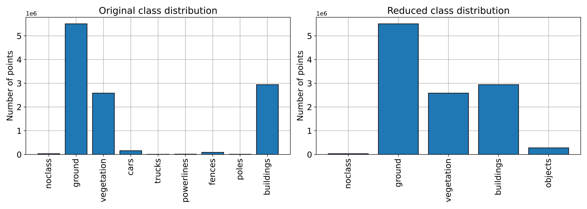
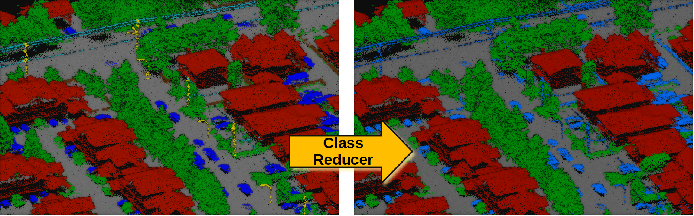
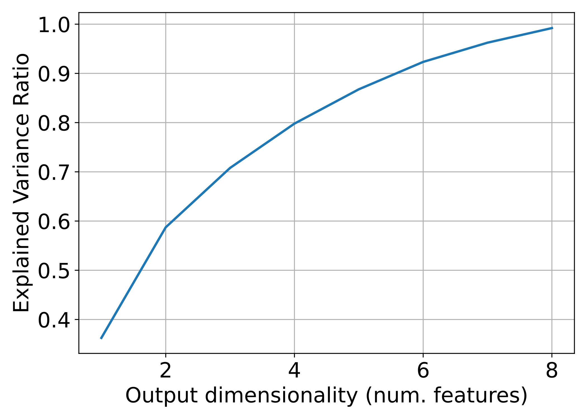
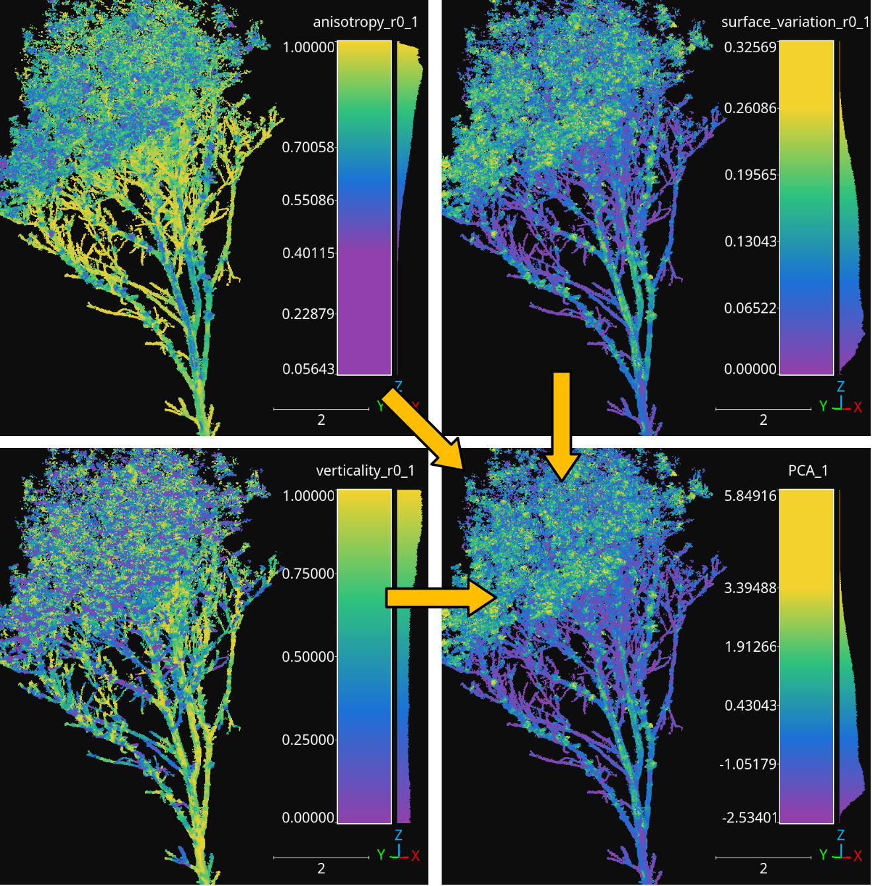

.. _Transformers page:

Transformers
****************

Transformers are components that apply a transformation on the point cloud.
They can be divided into class transformers (:class:`.ClassTransformer`) that
transform the classification and predictions of the point cloud, feature
transformers (:class:`.FeatureTransformer`) that transform the features of
the point cloud, and point transformers (:class:`.PointTransformers`) that
compute an advanced transformation on the point cloud that involves different
information (e.g., spatial coordinates to derive
receptive fields that can be used to reduce or propagate both features and
classes).

Transformers are typically use inside pipelines to apply transformations to
the point cloud at the current pipeline's state. Readers are strongly
encouraged to read the :ref:`Pipelines documentation<Pipelines page>` before
looking further into transformers.

Class transformers
====================

Class reducer
---------------

The :class:`.ClassReducer` takes an original set of :math:`n_I` input classes
and returns :math:`n_O` output classes, where :math:`n_O < n_I`. It can be
applied to the reference classification only or also to the predictions.
On top of that, it supports a text report on the distributions with the
absolute and relative frequencies and a plot of the class distribution before
and after the transformation. A :class:`.ClassReducer` can be defined inside a
pipeline using the JSON below:

.. code-block:: json

	{
		"class_transformer": "ClassReducer",
		"on_predictions": false,
		"input_class_names": ["noclass", "ground", "vegetation", "cars", "trucks", "powerlines", "fences", "poles", "buildings"],
		"output_class_names": ["noclass", "ground", "vegetation", "buildings", "objects"],
		"class_groups": [["noclass"], ["ground"], ["vegetation"], ["buildings"], ["cars", "trucks", "powerlines", "fences", "poles"]],
		"report_path": "class_reduction.log",
		"plot_path": "class_reduction.svg"
	}

The JSON above defines a :class:`.ClassReducer` that will replace the nine
original classes into five reduced classes where many classes are grouped
together as the ``"objects"`` class. Moreover, it will generate a text report
in a file called `class_reduction.log` and a figure representing the class
distribution in `class_reduction.svg`.

**Arguments**

-- ``on_predictions``
	Whether to also reduce the predictions if any (True) or not (False). Note
	that setting ``on_predictions`` to True will only work if there are
	available predictions.

-- ``input_class_names``
	A list with the names of the input classes.

-- ``output_class_names``
	A list with the desired names for the output classes.

-- ``class_groups``
	A list of lists such that the list i defines which classes will be
	considered to obtain the reduced class i. In other words, each sublist
	contains the strings representing the names of the input classes that
	must be mapped to the output class.

-- ``report_path``
	Path where the text report on the class distributions must be written. If
	it is not given, then no report will be generated.

-- ``plot_path``
	Path where the plot of the class distributions must be written. If it is
	not given, then no plot will be generated.

**Output**

The examples in this section come from applying a :class:`.ClassReducer` to the
`5080_54435.laz` point cloud of the
`DALES dataset <https://udayton.edu/engineering/research/centers/vision_lab/research/was_data_analysis_and_processing/dale.php>`_
.

An example of the plot representing how the classes are distributed
before and after the :class:`.ClassReducer` is shown below.

			the class reduction

	Visualization of the class distributions before and after the class
	reduction.

An example of how the classes represented on the point cloud look like before
and after the :class:`.ClassReducer` is shown below.

	Visualization of the original (left) and reduced classification (right).

Feature transformers
=======================

Minmax normalizer
-------------------

The :class:`.MinmaxNormalizer` maps the specified features so they are inside
the :math:`[a, b]` interval. It can be configured to clip values outside the
interval or not. If so, values below :math:`a` will be replaced by :math:`a`
while values above :math:`b` will be replaced by :math:`b`. A
:class:`.MinmaxNormalizer` can be defined inside a piepline using the JSON
below:

.. code-block:: json

    {
        "feature_transformer": "MinmaxNormalizer",
        "fnames": ["AUTO"],
        "target_range": [0, 1],
        "clip": true,
        "report_path": "minmax_normalization.log"
    }

The JSON above defines a :class:`.MinmaxNormalizer` that will map the features
to be inside the :math:`[0, 1]` interval. If this transformer is later applied
to different data, it will make sure that there is not value less than zero
or greater than one. On top of that, a report about the normalization will be
written to the `minmax_normalization.log` text file.

**Arguments**

-- ``fnames``
    The names of the features to be normalized. If ``"AUTO"``, the features
    considered by the last component that operated over the features will be
    used.

-- ``target_range``
    The interval to normalize the features.

-- ``clip``
    When a minmax normalizer has been fit to a dataset, it will find the
    min and max values to compute the normalization. It can be that the
    normalizer is then applied to other dataset with different min and max.
    Under those circumstances, values below :math:`a` or above :math:`b`
    might appear. When clip is set to true, this values will be replaced
    by either :math:`a` or :math:`b` so the normalizer never yields values
    outside the :math:`[a, b]` interval.

-- ``report_path``
    When given, a text report will be exported to the file pointed by the
    path.

**Output**

A transformed point cloud is generated such that its features are normalized
to a [0, 1] interval. The min, the max, and the range are exported through
the logging system (see below for an example corresponding to the minmax
normalization of some geometric features).

.. list-table::
    :widths: 31 23 23 23
    :header-rows: 1

    *   - FEATURE
        - MIN
        - MAX
        - RANGE
    *   - linearity_r0.05
        - 0.00028
        - 1.00000
        - 0.99972
    *   - planarity_r0.05
        - 0.00000
        - 0.97660
        - 0.97660
    *   - surface_variation_r0.05
        - 0.00000
        - 0.32316
        - 0.32316
    *   - eigenentropy_r0.05
        - 0.00006
        - 0.01507
        - 0.01501
    *   - omnivariance_r0.05
        - 0.00000
        - 0.00060
        - 0.00060
    *   - verticality_r0.05
        - 0.00000
        - 1.00000
        - 1.00000
    *   - anisotropy_r0.05
        - 0.06250
        - 1.00000
        - 0.93750
    *   - linearity_r0.1
        - 0.00070
        - 1.00000
        - 0.99930
    *   - planarity_r0.1
        - 0.00000
        - 0.95717
        - 0.95717
    *   - surface_variation_r0.1
        - 0.00000
        - 0.32569
        - 0.32569
    *   - eigenentropy_r0.1
        - 0.00028
        - 0.04501
        - 0.04473
    *   - omnivariance_r0.1
        - 0.00000
        - 0.00241
        - 0.00241
    *   - verticality_r0.1
        - 0.00000
        - 1.00000
        - 1.00000
    *   - anisotropy_r0.1
        - 0.05643
        - 1.00000
        - 0.94357

.. _Standardizer:

Standardizer
--------------

The :class:`.Stantardizer` maps the specified features so they are transformed
to have mean zero :math:`\mu = 0` and standard deviation one
:math:`\sigma = 1`. Alternatively, it is possible to only center (mean zero)
or scale (standard deviation one) the data. A :class:`.Standardizer` can be
defined inside a pipeline using the JSON below:

.. code-block:: json

    {
        "feature_transformer": "Standardizer",
        "fnames": ["AUTO"],
        "center": true,
        "scale": true,
        "report_path": "standardization.log"
    }

The JSON above defines a :class:`.Standardizer` that centers and scales the
data. Besides, it will export a text report with the feature-wise means and
variances to the `standardization.log` file.

**Arguments**

-- ``fnames``
    The names of the features to be standardized. If ``"AUTO"``, the features
    considered by the last component that operated over the features will be
    used.

-- ``center``
    Whether to subtract the mean (true) or not (false).

-- ``scale``
    Whether to divide by the standard deviation (true) or not (false).

-- ``report_path``
    When given, a text report will be exported to the file pointed by the
    path.

**Output**

A transformed point cloud is generated such that its features are
standardized. The mean and standard deviation are exported through the
logging system (see below for an example corresponding to the standardization
of some geometric features).

.. list-table::
    :widths: 40 30 30
    :header-rows: 1

    *   - FEATURE
        - MEAN
        - STDEV.
    *   - linearity_r0.05
        - 0.47259
        - 0.24131
    *   - planarity_r0.05
        - 0.32929
        - 0.22213
    *   - surface_variation_r0.05
        - 0.10697
        - 0.06362
    *   - eigenentropy_r0.05
        - 0.00781
        - 0.00184
    *   - omnivariance_r0.05
        - 0.00025
        - 0.00010
    *   - verticality_r0.05
        - 0.55554
        - 0.30274
    *   - anisotropy_r0.05
        - 0.80188
        - 0.14316
    *   - linearity_r0.1
        - 0.49389
        - 0.24075
    *   - planarity_r0.1
        - 0.29196
        - 0.21008
    *   - surface_variation_r0.1
        - 0.11583
        - 0.06376
    *   - eigenentropy_r0.1
        - 0.02512
        - 0.00533
    *   - omnivariance_r0.1
        - 0.00100
        - 0.00035
    *   - verticality_r0.1
        - 0.57260
        - 0.30121
    *   - anisotropy_r0.1
        - 0.78585
        - 0.14570

Variance selector
--------------------

The variance selection is a simple strategy that consists of discarding all
those features which variance lies below a given threshold. While simple,
the :class:`.VarianceSelector` has a great strength and that is it can be
computed without known classes because it is based only on the variance. A
:class:`.VarianceSelector` can be defined inside a piepline using the JSON
below:

.. code-block:: json

    {
        "feature_transformer": "VarianceSelector",
        "fnames": ["AUTO"],
        "variance_threshold": 0.01,
        "report_path": "variance_selection.log"
    }

The JSON above defines a :class:`.VarianceSelector` that removes all features
which variance is below :math:`10^{-2}`. After that, it will export a text
report describing the process to the `variance_selection.log` file.

**Arguments**

-- ``fnames``
    The names of the features to be transformed. If ``"AUTO"``, the features
    considered by the last component that operated over the features will be
    used.

-- ``variance_threshold``
    Features which variance is below this threshold will be discarded.

-- ``report_path``
    When given, a text report will be exported to the file pointed by the path.

**Output**

A transformed point cloud is generated considering only the features that
passed the variance threshold. On top of that, the feature-wise variances
are exported through the logging system. The selected features are also
explicitly listed (see below for an example corresponding
to a variance selection on some geometric features).

.. list-table::
    :widths: 60 40
    :header-rows: 1

    *   - FEATURE
        - VARIANCE
    *   - omnivariance_r0.05
        - 0.000
    *   - omnivariance_r0.1
        - 0.000
    *   - eigenentropy_r0.05
        - 0.000
    *   - eigenentropy_r0.1
        - 0.000
    *   - surface_variation_r0.05
        - 0.004
    *   - surface_variation_r0.1
        - 0.005
    *   - anisotropy_r0.05
        - 0.020
    *   - anisotropy_r0.1
        - 0.022
    *   - linearity_r0.1
        - 0.051
    *   - linearity_r0.05
        - 0.056
    *   - planarity_r0.1
        - 0.066
    *   - planarity_r0.05
        - 0.075
    *   - verticality_r0.05
        - 0.092
    *   - verticality_r0.1
        - 0.097

.. list-table::
    :widths: 100
    :header-rows: 1

    *   - SELECTED FEATURES
    *   - linearity_r0.05
    *   - planarity_r0.05
    *   - verticality_r0.05
    *   - anisotropy_r0.05
    *   - linearity_r0.1
    *   - planarity_r0.1
    *   - verticality_r0.1
    *   - anisotropy_r0.1

K-Best selector
------------------

The :class:`.KBestSelector` computes the feature-wise ANOVA F-values and use
them to sort the features. Then, only the :math:`K` best features, i.e., those
with highest F-values, will be preserved. A :class:`.KBestSelector` can be
defined inside a pipeline using the JSON below:

.. code-block:: json

    {
        "feature_transformer": "KBestSelector",
        "fnames": ["AUTO"],
        "type": "classification",
        "k": 2,
        "report_path": "kbest_selection.log"
    }

The JSON above defines a :class:`.KBestSelector` that computes the ANOVA
F-Values assuming a classification task. Then, it discards all features
but the two with the highest values. Finally, it writes a text report with
the feature-wise F-Values and the associated p-value for each test to the
file `kbest_selection.log`

**Arguments**

-- ``fnames``
    The names of the features to be transformed. If ``"AUTO"``, the features
    considered by the last component that operated over the features will be
    used.

-- ``type``
    Specify which type of task is going to be computed. Either,
    ``"regression"`` or ``"classification"``. The F-Values computation
    will be carried out to be adequate for one of those tasks. For regression
    tasks the target variable is expected to be numerical, while for
    classification tasks it is expected to be categorical.

-- ``k``
    How many top-features must be preserved.

-- ``report_path``
    When given, a text report will be exported to the file pointed by the path.

**Output**

A transformed point cloud is generated considering only the K-best features
according to the F-values. Moreover, the feature-wise F-Values and their
associated p-value are exported through the logging system. The selected
features are also explicitly listed (see below for an example corresponding to
a K-best selection on some geometric features).

.. csv-table::
    :file: ../csv/kbest_selector_report.csv
    :widths: 40 30 30
    :header-rows: 1

.. list-table::
    :widths: 100
    :header-rows: 1

    *   - SELECTED FEATURES
    *   - surface_variation_r0.1
    *   - anisotropy_r0.1

Percentile selector
----------------------

The :class:`.PercentileSelector` computes the ANOVA F-Values and use them to
sort the features. Then, only a given percentage of the features are preserved.
More concretely, the given percentage of the features with the highest
F-Values will be preserved. A :class:`.PercentileSelector` can be defined
inside a pipeline using the JSON below:

.. code-block:: json

    {
        "feature_transformer": "PercentileSelector",
        "fnames": ["AUTO"],
        "type": "classification",
        "percentile": 20,
        "report_path": "percentile_selection.log"
    }

The JSON above defines a :class:`.PercentileSelector` that computes the
ANOVA F-Values assuming a classification task. Then, it preserves the
:math:`20\%` of the features with the highest F-Values. Finally, it writes
a text report with the feature-wise F-Values and the associated p-value for
each test to the file `percentile_selection.log`.

**Arguments**

-- ``fnames``
    The names of the features to be transformed. If ``"AUTO"``, the features
    considered by the last component that operated over the features will be
    used.

-- ``type``
    Specify which type of task is going to be computed. Either,
    ``"regression"`` or ``"classification"``. The F-Values computation
    will be carried out to be adequate for one of those tasks. For regression
    tasks the target variable is expected to be numerical, while for
    classification tasks it is expected to be categorical.

-- ``percentile``
    An integer from :math:`0` to :math:`100` that specifies the percentage of
    top-features to preserve.

-- ``report_path``
    When given, a text report will be exported to the file pointed by the
    path.

**Output**

A transformed point cloud is generated considering only the requested
percentage of best features according to the F-values. Moreover, the
feature-wise F-Values and their p-value are exported through the logging
system. The selected features are also explicitly listed (see below for an
example corresponding to a percentile selection on some geometric features).

.. csv-table::
    :file: ../csv/percentile_selector_report.csv
    :widths: 40 30 30
    :header-rows: 1

.. list-table::
    :widths: 100
    :header-rows: 1

    *   - SELECTED FEATURES
    *   - surface_variation_r0.1
    *   - verticality_r0.1
    *   - anisotropy_r0.1

.. _Explicit selector:

Explicit selector
---------------------

The :class:`.ExplicitSelector` preserves or discards the requested features,
thus effectively updating the point cloud in the
:ref:`pipeline's state <Pipelines page>` (see :class:`.SimplePipelineState`).
This feature transformation can be especially useful to release memory
resources by discarding features that are not going to be used by other
components later on.
A :class:`.ExplicitSelector` can be defined inside a pipeline using the JSON
below:

.. code-block:: json

    {
        "feature_transformer": "ExplicitSelector",
        "fnames": [
            "floor_distance_r50_0_sep0_35"
            "scan_angle_rank_mean_r5_0",
            "verticality_r25_0"
        ],
        "preserve": true
    },

The JSON above defines a :class:`.ExplicitSelector` that preserves the
floor distance, mean scan angle, and verticality features. In doing so, all the
other features are discarded. After calling this selector, only the preserved
features will be available through the pipeline's state.

**Arguments**

--  ``fnames``
    The names of the features to be either preserved or discarded.

--  ``preserve``
    The boolean flag that governs whether the given features must
    be preserved (``true``) or discarded (``false``).

**Output**

A transformed point cloud is generated considering only the preserved features.

.. _PCA transformer:

PCA transformer
------------------

The :class:`.PCATransformer` can be used to compute a dimensionality reduction
of the feature space. Let :math:`\pmb{F} \in \mathbb{R}^{m \times n_f}` be a
matrix of features such that each row :math:`\pmb{f}_{i} \in \mathbb{R}^{n_f}`
represents the :math:`n_f` features for a given point :math:`i`. After applying
the PCA transformer a new matrix of features will be obtained
:math:`\pmb{Y} \in \mathbb{R}^{m \times n_y}` such that :math:`n_y \leq n_f`.
This dimensionality reduction can help reducing the number of input features
for a machine learning model, and consequently reducing the execution time.

To understand this transformation, simply note the singular value decomposition
of :math:`\pmb{F} = \pmb{U} \pmb{\Sigma} \pmb{V}^\intercal`. The singular
vectors in :math:`\pmb{V}^\intercal` can be ordered in descendant order from
higher to lower singular value, where singular values are given by the diagonal
of :math:`\pmb{\Sigma}`. Alternatively, the basis matrix defined by the
singular vectors can be approximated with the eigenvectors of the centered
covariance matrix. From now on, no matter how it was computed, we will call
this basis matrix :math:`\pmb{B}`. We also assume that we always have enough
linearly independent features for the analysis to be feasible.

When all the basis vectors are considered, it will be that
:math:`\pmb{B} \in \mathbb{R}^{n_f \times n_f}`, i.e., :math:`n_y=n_f`. In this
case we are expressing potentially correlated features in a new basis where
each feature aims to be orthogonal w.r.t. the others (principal components). When
:math:`\pmb{B} \in \mathbb{R}^{n_f \times n_y}` for :math:`n_y<n_f`, and the
basis contains the singular vectors corresponding to the higher singular values
, we are reducing the dimensionality using a subset of the principal
components. This dimensionality reduction transformation will preserve as much
variance as possible in the data while using less orthogonal features.

A :class:`.PCATransformer` can be defined inside a pipeline using the JSON
below:

.. code-block:: json

    {
        "feature_transformer": "PCATransformer",
        "fnames": ["AUTO"],
        "out_dim": 0.99,
        "whiten": false,
        "random_seed": null,
        "report_path": "pca_projection.log",
        "plot_path": "pca_projection.svg"
    }

The JSON above defines a :class:`.PCATransformer` that considers as many
principal components as necessary to explain the :math:`99\%` of the variance.
On top of that, it will export a text report with the aggregated contribution
to the explained variance of the considered principal components (ordered from
most significant to less significant) to a file named `pca_projection.log`.
Finally, it will also export a plot representing the explained variance ratio
as a function of the output dimensionality to a file
named `pca_projection.svg`.

**Arguments**

-- ``fnames``
    The names of the features to be transformed. If ``"AUTO"``, the features
    considered by the last component that operated over the features will be
    used.

-- ``out_dim``
    The ratio of preserved features governing the output dimensionality.
    It is a value in :math:`(0, 1]` where 1 implies :math:`n_y=n_f` and
    less than one governs how small is :math:`n_y` with respect to
    :math:`n_f`.

-- ``whiten``
    When true, the singular vectors will be scaled by the square root of the
    number of points and divided by the corresponding singular value.
    Consequently, the output will consists of features with unit variance.
    When false, nothing will be done.

-- ``random_seed``
    Can be used to specify a seed (as an integer) for reproducibility purposes
    when using randomized solvers for the computations.

-- ``report_path``
    When given, a text report will be exported to the file pointed by the path.

-- ``plot_path``
    When given, a plot representing the explained variance ratio as a function
    of the number of considered principal components will be exported to the
    file pointed by the path.

**Output**

A transformed point cloud is generated with the new features obtained by the
:class:`.PCATransformer`. Moreover, the explained variances will be exported
through the logging system.

.. csv-table::
    :file: ../csv/pca_transformer_report.csv
    :widths: 20 20
    :header-rows: 1

Furthermore, if requested a plot will be exported to a file. This plot
describes the explained variance ratio as a function of the number of
output features (output dimensionality). An example can be see below
where the :class:`.PCATransformer` was used to reduce 14 features into 8
features that explain at least a :math:`99\%` of the variance.

          variance.

    The relationship between the PCA-derived features and the aggregated
    explained variance ratio.

Finally, the image below represents how three different features were reduced
to a single one using PCA. The output point cloud can be exported using a
:class:`.Writer` component (see :ref:`Writer documentation <Writer page>`).

            to a single one using PCA.

    The anisotropy, surface variation, and verticality computed for spherical
    neighborhoods with :math:`10\,\mathrm{cm}` radius reduced to a single
    feature through PCA.

Point transformers
====================

At the moment, point transformers are used in the context of deep learning
models. They are not available as independent components for pipelines.